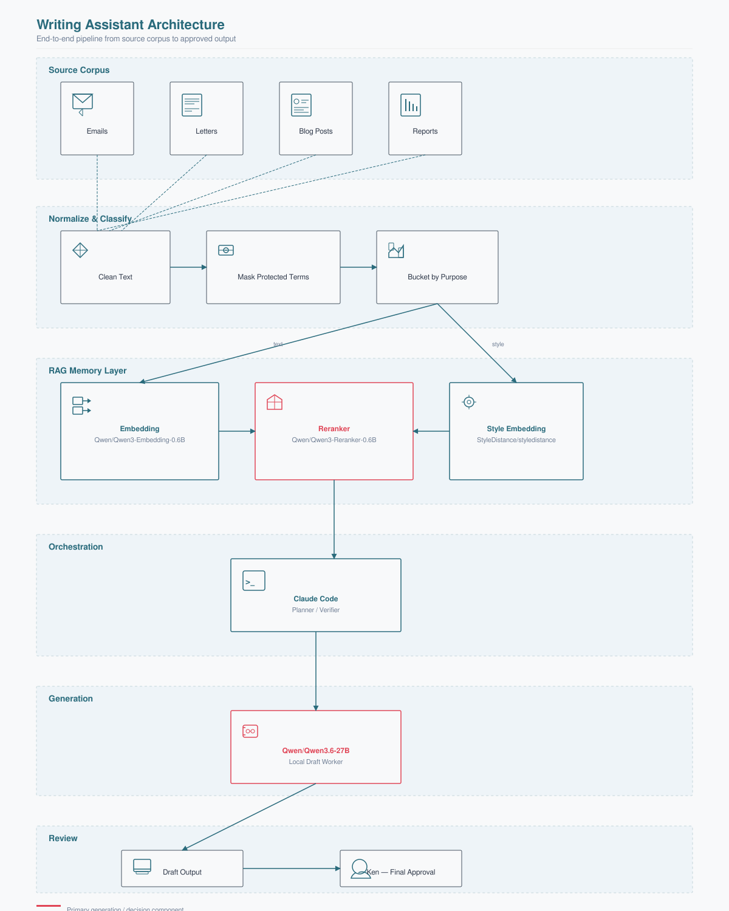
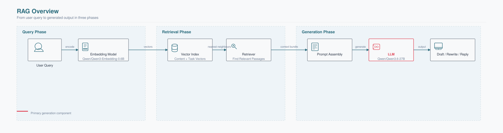
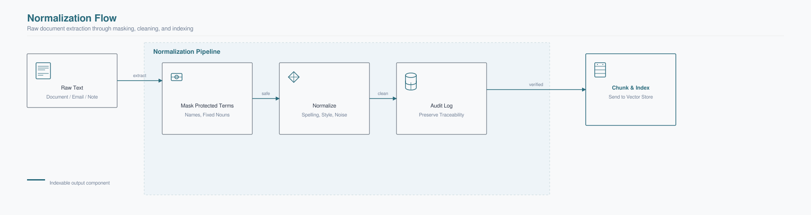

# Designing a writing assistant that (almost) actually sounds like me

*A system that remembers how I write, knows when to step back, and leaves the final call where it belongs: with me.*

*The corpus acts as memory, the RAG layer supplies relevant voice evidence, Claude Code orchestrates the loop, the generation model does the draft labor, and the verifier keeps the leash.*

***Disclaimer:*** *I use AI as a writing partner to refine my prose and structure, but the ideas, analysis, and first drafts originate entirely with me.*

Quick confession. This project did not begin as a clean lab exercise. It began with irritation.

I had been drowning in reflection papers at AIM. Not because the thinking was hard, but because so much of the writing was mechanical work disguised as writing. Summarizing. Rephrasing. Formatting. The same reflective shape, over and over. And each pass came with an API bill that felt about as justified as paying for a Ferrari to pick up milk.

The real problem was not "how do I build RAG?" I could find a dozen tutorials for that. The real problem was: how do I build a writing assistant that can retrieve my own voice, keep its hands off the parts it should not own, and still leave the final call with me?

That is a very different question. And it took a different kind of system to answer.

## The irritation that started it

I wanted help with public writing, reflective posts, formal notes, and technical prose. But not the same help for all of it. My blog posts are not my MBA reflection papers are not my technical standards documents. Each has a different register, a different level of restraint, a different relationship to certainty.

Most writing assistants flatten everything into one voice. A competent, pleasant, thoroughly generic voice. The voice of someone who has never actually had strong opinions in private.

I also wanted the system to be cost-aware. There is no reason to spend premium planner tokens on every mechanical rewrite and cleanup pass if a strong local model can carry that load. The question was not "can a local model replace the planner?" It could not, and I knew it. The question was "can it become a useful worker under a stronger system?"

The local model does not get authorship authority. It gets a bounded writing task, retrieved evidence from my own corpus, and a verifier above it. If it produces fluff, drift, or fake polish, it gets corrected or rejected. Simple.

## A quick introduction to RAG, in plain English

In plain English, Retrieval-Augmented Generation is a way of making a language model answer with help from an external memory instead of relying only on whatever was baked into the model during training. The model retrieves relevant source material first, then writes with that material in view.

That matters here because I was not trying to make a model sound generally smart. I was trying to make it sound grounded in my own writing. Retrieval is what gives the system access to examples of how I already write. Generation is what turns those examples into a usable draft.

Under the hood, this uses embeddings, which turn text into vectors, and vector search, which finds passages that are close in meaning rather than just close in keywords. The practical point is simpler: the assistant looks things up before it speaks.

*RAG in one pass: the assistant retrieves relevant passages first, then uses them as context for generation. This adapts the logic of the reference diagram from [Shift Asia](https://shiftasia.com/community/retrieval-augmented-generation-rag-a-comprehensive-guide-to-smarter-more-accurate-ai/).*

---

## The architecture I actually wanted

What I ended up designing was less like a single chatbot and more like a writing loop with assigned roles. Each component has a job and a limit. Nobody pretends to do everything.

Retrieval supplies evidence, the model does draft labor, and Claude Code decides whether the output is actually usable.

That division of labor is the whole trick.

## The models in the loop

This was never really about one model. It was about assigning the right role to each model and refusing to let any one of them pretend to be the whole system.

| Model | Role in the workflow | Status in this project | Notes |
|---|---|---|---|
| `Claude Code` | orchestrator / planner / verifier | production | the agent that chooses tasks, runs code, checks output, and keeps the loop moving |
| [`Qwen/Qwen3.6-27B`](https://huggingface.co/Qwen/Qwen3.6-27B) | generation model for draft and humanize steps | production | served as `qwen3.6-27b-q6k-mtp-64k` over `http://127.0.0.1:8080/v1` |
| [`Qwen/Qwen3-Embedding-0.6B`](https://huggingface.co/Qwen/Qwen3-Embedding-0.6B) | embedding model | production | task and content vectors |
| [`StyleDistance/styledistance`](https://huggingface.co/StyleDistance/styledistance) | style embedding model | production | voice and register, not topic |
| [`Qwen/Qwen3-Reranker-0.6B`](https://huggingface.co/Qwen/Qwen3-Reranker-0.6B) | reranker | production | config 7 |
| [`Qwen/Qwen3-Embedding-4B`](https://huggingface.co/Qwen/Qwen3-Embedding-4B) | challenger embedding model | benchmark only | not production |
| [`sentence-transformers/all-MiniLM-L6-v2`](https://huggingface.co/sentence-transformers/all-MiniLM-L6-v2) | old-build baseline embedding | benchmark only | archived comparison artifact |
| Voyage 4 | proposed challenger embedding | never run | separate approval was never given |

The practical split was simple. Retrieval and embeddings gave the system memory. Claude Code orchestrated the work. The generation model handled bounded draft labor. The stronger planner-verifier layer stayed responsible for judgment.

## Why the local model mattered

A powerful local model made sense here, but not as the whole assistant. It made sense as a worker. It could do first-pass drafting, cleanup, section reshaping, tone adjustment, and the repetitive parts of writing that should not consume premium model attention every single time.

Where it still needed supervision was the part that matters most: knowing what kind of writing it is doing, what source material should dominate the voice, what should be cut, what should remain restrained, and whether the prose actually sounds like me rather than a polished approximation.

| Layer | Job | Failure if missing |
|---|---|---|
| Retriever | Pull voice evidence by purpose and bucket | draft sounds generic or wrong-genre |
| Local worker model | Draft, compress, expand, restructure | premium model wastes time on mechanical writing |
| Claude Code | Orchestrate, inspect, reject drift | fluent garbage slips through |

## The corpus was not the assistant, but it defined the assistant

People talk about RAG as if it begins at retrieval. It does not. It begins at curation.

The writing assistant only became credible once the corpus stopped behaving like a junk drawer. Emails, letters, blog posts, MBA reflections, professional reports, and technical documents do not all carry the same kind of signal. If they are mixed lazily, the assistant starts sounding like whichever bucket is most repetitive or most overrepresented.

That is how you end up with a writing model that sounds like a tender document when it should sound like a person.

| Bucket | What it contributes | What can go wrong if overused |
|---|---|---|
| `email_personal` | cadence, explanation, natural phrasing | can get too conversational |
| `letters` | restraint and formal control | can become stiff |
| `blog` | first-person narrative voice | can become too essayistic |
| `academic_mba` | reflection with structure | can sound too school-shaped |
| `technical_standards` | terminology and discipline | can dominate tone and kill the human voice |

The corpus is the assistant's memory, and like any memory, it is only as good as what you put in it.

## The quiet hard part was cleanup before retrieval

Some of the technical source material came in with British English conventions. My own default written voice is standard American English. If those documents were embedded raw, they would leak the wrong habits into retrieval. The assistant would start suggesting "colour" when I write "color" and "programme" when I mean "program."

So the pipeline normalized the text before chunking. That matters more than it sounds. The embeddings reflect the cleaned text, not the mixed original. Proper nouns and protected terms were masked before substitution and restored afterward so the cleanup did not corrupt names that should stay fixed.

*Before retrieval can help, the text has to be clean enough to trust. This normalization pass keeps terminology intact while reducing stylistic noise in the index.*

This is the kind of detail that makes the difference between a demo and a system I would actually trust. Nobody applauds a good normalization pass at a conference. But you know when it is missing.

## Why verification mattered more than elegance

The index eventually reached a verified state that was much more honest than I had expected: 847 corpus records, 134 source files, `mxbai-embed-large` embeddings, 500-word chunks, 80-word overlap, and technical sources included.

Those numbers are not interesting because they are large. They are interesting because they are inspectable. They live in files and logs, not in a process that merely claims success.

| KPI | Value | Why it mattered |
|---|---:|---|
| Corpus records | 847 | enough coverage for real retrieval, not a toy sample |
| Source files | 134 | broader voice evidence across genres |
| Chunk size | 500 words | enough room for cadence and context |
| Overlap | 80 words | smoother recall across chunk boundaries |

A writing assistant becomes believable when the evidence survives outside the model that generated the answer.

## Where the writing actually changed

The final system was not just RAG plus a local model. It also needed a humanizer layer. That layer mattered because even a strong draft can still sound too eager, too balanced, or too synthetic. The local model can make that worse if it is allowed to chase fluency without constraint.

So the writing loop had to include a final pass that cut the usual assistant tells: inflated significance, promotional rhythm, fake certainty, neat symmetry, and the kind of sentences that sound impressive right until you read them twice.

That combination was the real breakthrough: retrieval gave the assistant evidence of how I write, Claude Code handled the orchestration, the local model handled bounded draft labor, and the verifier layer kept the output from turning into a stage version of me.

## What I am actually taking from this

The most useful lesson was not "RAG works." That is too vague to help anyone. The better lesson is that a writing assistant gets interesting when you stop treating it as one model with one personality and start treating it as a managed system.

Keep the corpus clean. Retrieve by purpose. Use the local model as a worker, not an oracle. Keep Claude Code above it. Then verify hard.

And even then, the last gate is still me. I still do the review. I still do the final approval. The system can retrieve, draft, compress, and clean up, but I remain the final human in the loop.

That is not a limitation. That is the design.

## Model attributions

Models used in this project are hosted on [HuggingFace](https://huggingface.co):

| Model | HF Link | License |
|---|---|---|
| Qwen3.6-27B | [Qwen3.6-27B](https://huggingface.co/Qwen/Qwen3.6-27B) | Apache 2.0 |
| Qwen3-Embedding-0.6B | [Qwen3-Embedding-0.6B](https://huggingface.co/Qwen/Qwen3-Embedding-0.6B) | Apache 2.0 |
| Qwen3-Reranker-0.6B | [Qwen3-Reranker-0.6B](https://huggingface.co/Qwen/Qwen3-Reranker-0.6B) | Apache 2.0 |
| Qwen3-Embedding-4B | [Qwen3-Embedding-4B](https://huggingface.co/Qwen/Qwen3-Embedding-4B) | Apache 2.0 |
| styledistance | [styledistance](https://huggingface.co/StyleDistance/styledistance) | Apache 2.0 |
| all-MiniLM-L6-v2 | [all-MiniLM-L6-v2](https://huggingface.co/sentence-transformers/all-MiniLM-L6-v2) | Apache 2.0 |

---

## Sources

- [Asian Institute of Management](https://aim.edu/)
- [Retrieval-Augmented Generation for Knowledge-Intensive NLP Tasks](https://proceedings.neurips.cc/paper/2020/hash/6b493230205f780e1bc26945df7481e5-Abstract.html)
- [Google Machine Learning Crash Course: Embeddings](https://developers.google.com/machine-learning/crash-course/embeddings)
- [Microsoft Learn: Vector search overview](https://learn.microsoft.com/en-us/azure/search/vector-search-overview)
- [Shift Asia: Retrieval-Augmented Generation guide](https://shiftasia.com/community/retrieval-augmented-generation-rag-a-comprehensive-guide-to-smarter-more-accurate-ai/)
