# A hundred million tokens later

<!-- HERO LAYOUT NOTE FOR HERMES
The hero section is a two-column grid: [left: kicker + H1 + subtitle] [right: banner image].
Kicker eyebrow text (uppercase via CSS): "Local LLMs, Telegram, and one tired MSI"
H1: "A hundred million tokens later"
Subtitle (.subtitle class): the description field above.
Banner image goes on the right column of the hero grid.
-->

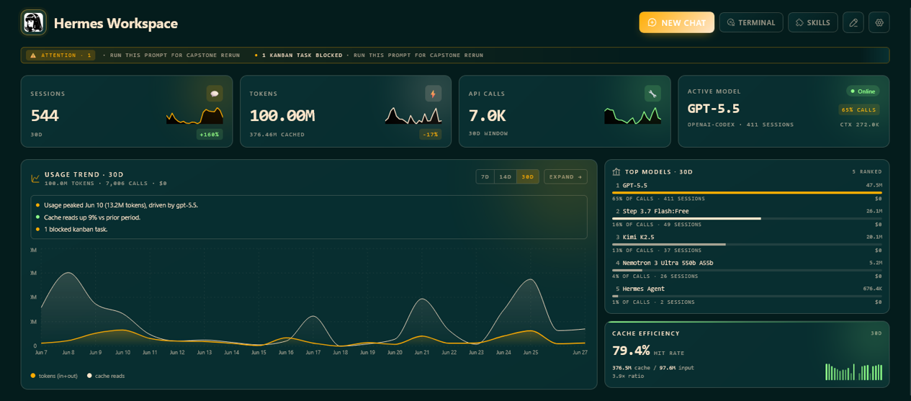

*New banner from the modified asset pack.*

Quick disclosure before anything else: this did not start as a neat lab exercise. It started as irritation. I had been burning serious tokens across coursework in Data Science, Machine Learning, Deep Learning, and Computer Vision, and too much of that cost went to tasks that were not actually hard. Cleanup. Patching. The same notebook scaffolds in slightly different shapes. Chores with an API bill attached.

> The sentence I could not leave alone was simple: if the cloud planner is expensive, why am I making it mop the floor?

<!-- PULL QUOTE NOTE FOR HERMES: render as .quote blockquote with cerise left border -->

---

## The irritation that started it

<!-- TWO-COLUMN GRID (.grid): left = prose paragraphs, right = .callout box -->

I use Borges as my planner, critic, and working partner. That part works. The problem was that I kept handing the same system everything: strategy, debugging, code generation, formatting, checking, and the small mechanical tasks that pile up during coursework.

So I wanted to test a narrower question. Not "can a local model replace Borges?" It cannot. The better question was whether a local model could become a useful worker under Borges, with a planner/tester watching it and refusing to accept fake outputs.

<!-- CALLOUT BOX (.callout with cerise left border) — right column of grid above -->

**The rule I used**

The local model does not get authority. It gets a bounded task, a file allowlist, and a verifier. If it produces nonsense, Borges rejects it. If it produces a useful artifact, we keep it.

<!-- END CALLOUT -->

---

## Model disclosure

Borges was not one of the local models. Borges ran through the Codex/OpenAI provider on GPT-5.5. The local models were candidates for worker roles.

| Role | Model | Source | Use |
|---|---|---|---|
| Planner / verifier | GPT-5.5 via Codex/OpenAI | Proprietary provider | Orchestration, writing, inspection, verification |
| Broad local tutor | [`qwen3.5:9b`](https://huggingface.co/Qwen/Qwen3.5-9B) | Alibaba Qwen | Notebook helper and general explanation |
| Reasoning backup | [`deepseek-r1:8b`](https://huggingface.co/deepseek-ai/DeepSeek-R1-Distill-Llama-8B) | DeepSeek | Math and reasoning fallback |
| Winning local worker | [`qwen2.5-coder:7b`](https://huggingface.co/Qwen/Qwen2.5-Coder-7B-Instruct) | Alibaba Qwen | Small Python coding tasks |

---

## The machine was not pretending to be a workstation

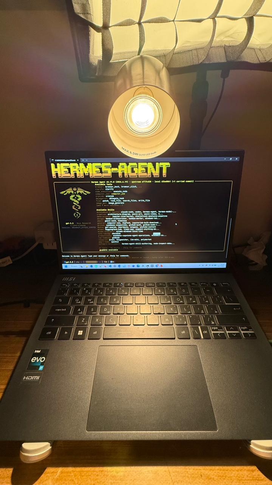

*The personal MSI running the local setup. Purchased about three years ago, used personally, and not really my daily driver.*

This laptop is not low-end. It is a modest mid-tier thin-and-light machine: Intel i7-1280P, 16GB RAM, and Intel Iris Xe graphics. For normal personal use, it is fine. For local AI work, the RAM ceiling shows up fast.

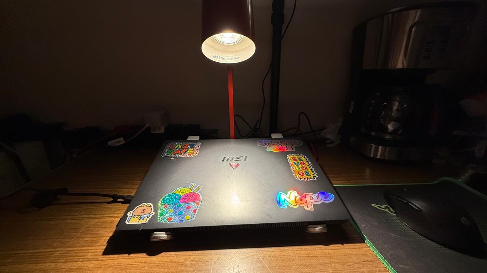

*Also, my daughter has already rebranded it with girly stickers, which is probably the most honest visual description of this setup.*

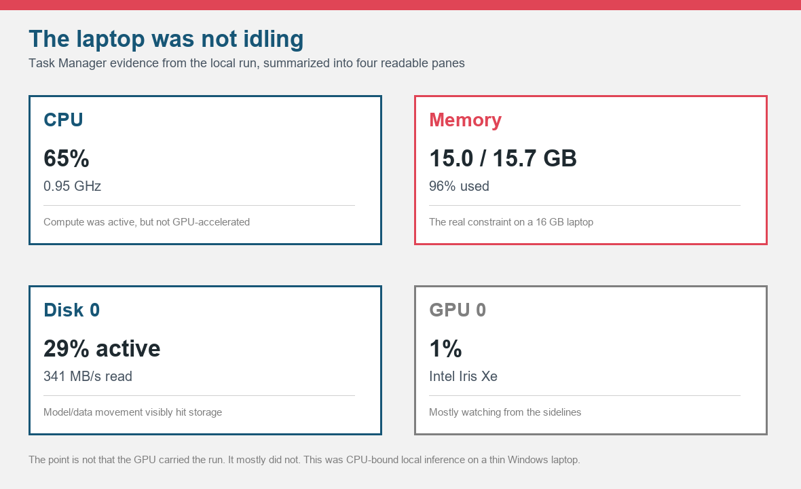

*The run was CPU and memory bound. The integrated GPU mostly watched.*

---

## Inference providers are useful, but not the whole answer

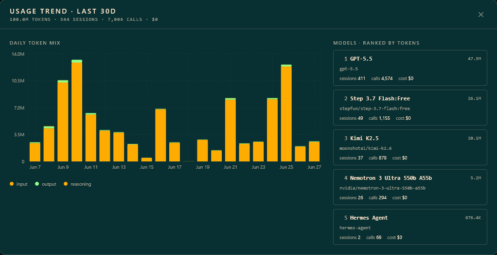

*The inference-provider view from my agents setup.*

An inference provider is whichever endpoint actually runs a model when an agent fires a prompt: OpenAI, Anthropic, an NVIDIA-hosted endpoint, a custom OpenAI-compatible server, or Ollama humming quietly two feet away on a warm laptop. The dropdown looks clean. The tradeoffs are less clean.

NVIDIA provider access was useful for exploration. But exploration and coursework want different things. Coursework needs local files, repeatable runs, and artifacts I can inspect without wondering whether an API quota or a rate-limit killed the job halfway through. Remote inference is powerful. It is also another variable between me and a result I can actually verify. The serious work pulled back toward a setup I controlled completely.

---

## The result: the boring specialist won the worker job

The numbers came back clean, and not in a surprising way. Qwen2.5-Coder finished every task it was given. Nothing else did. That is not a dramatic headline. It is the useful kind of result.

Benchmark results

WQU Local LLM Benchmark — Jun 27, 2026

Qwen2.5-Coder completion

10/10

completed tasks

Only model with zero timeouts

Average task time

94.2s

per task

7.8× faster than Qwen3.5

DeepSeek timeouts

6

of 10 tasks

Hit 1200s ceiling thinking aloud

Qwen3.5 initial quality

4.56/5

initial quality score

Best quality, worst runtime

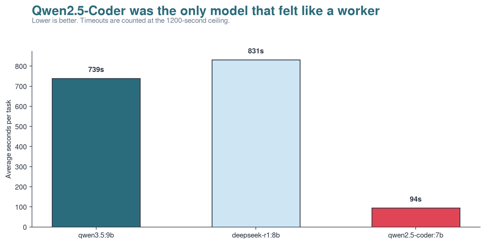

*Qwen2.5-Coder was the only model that felt like a worker.*

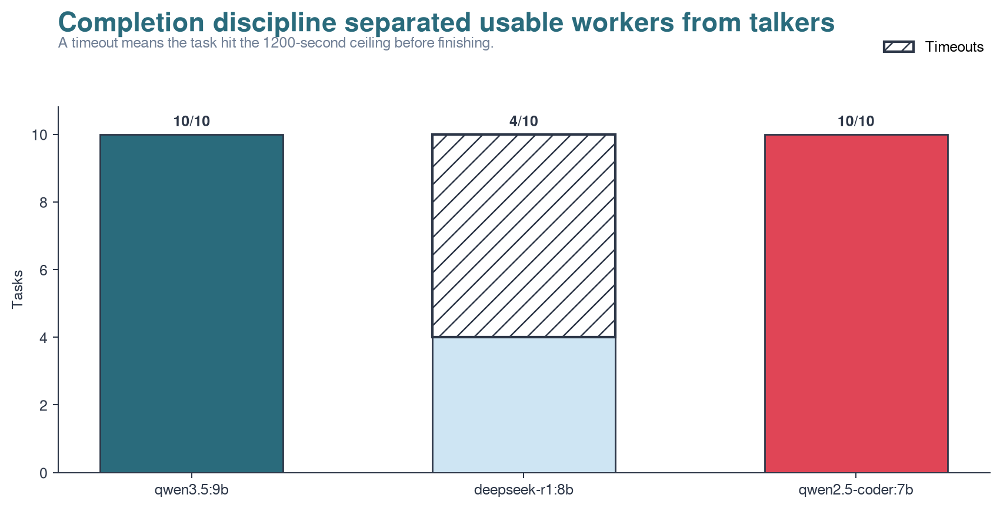

*DeepSeek completed 4 of 10 tasks. The remaining 6 are shown as empty timeout boxes.*

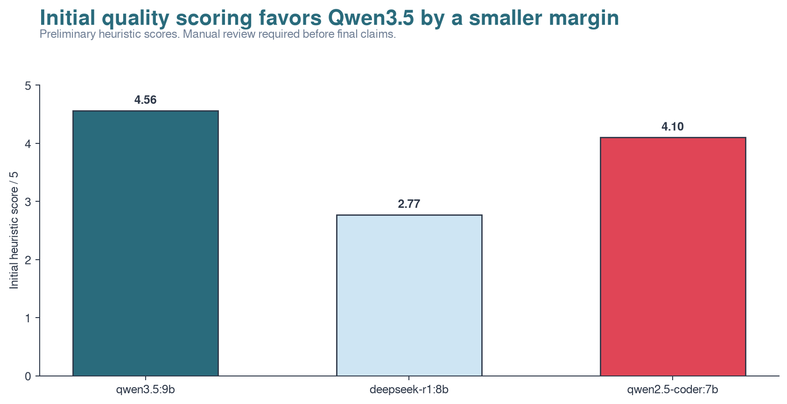

*Qwen3.5 had the best initial quality, but the margin was smaller than the runtime gap.*

---

## The other character in this story

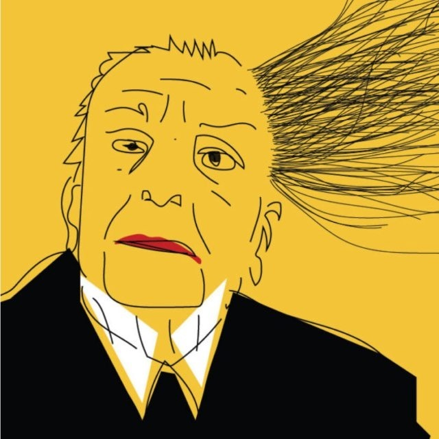

*Image source: [punctum books, *Jorge Luis Borges at Play with Mental Models of the World*](https://punctumbooks.com/titles/jorge-luis-borges-at-play-with-mental-models-of-the-world/).*

Borges is my personal agent, named with the appropriate level of literary overreach. In this post, Borges is not a local model and not the thing being benchmarked. Borges is the planner, critic, file wrangler, and inconvenient adult who keeps asking whether the output actually exists.

That distinction matters. The local models were workers. Borges sat above them, turning vague ideas into bounded tasks, checking the results, rejecting hallucinated artifacts, and occasionally reminding me that a thin laptop with 16GB of RAM is not a datacenter just because I want it to be one.

The name is not accidental. Jorge Luis Borges is also my absolute favorite author in the whole wide world, which I admit has the energy of a child pointing at a bookshelf and declaring a permanent alliance. He wrote about labyrinths, mirrors, infinite libraries, and systems that are elegant until they become impossible to navigate. That feels uncomfortably close to modern AI tooling some days.

---

## The workflow I actually want

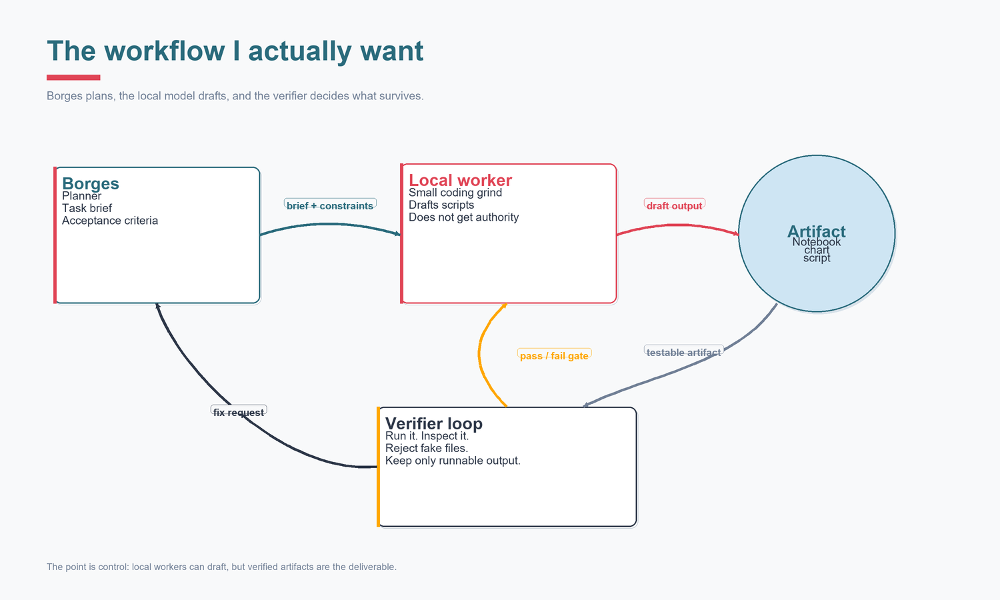

*General planner-worker-verifier flow. Curved connectors make the loop explicit instead of leaving arrow tails fighting each other.*

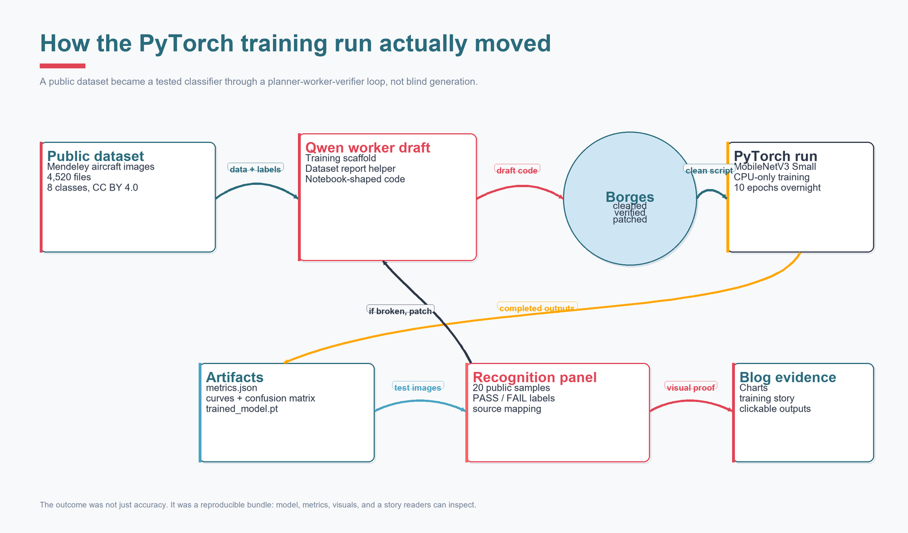

*The specific PyTorch training flow: public dataset, local worker draft, Borges cleanup, overnight CPU training, then recognition-panel evidence.*

The workflow is deliberately unromantic. Borges plans and verifies. Qwen2.5-Coder drafts or patches small pieces. The artifact gets executed. If it fails, it goes back through the loop.

---

## Public Aircraft Recognition Dataset Study

The applied dataset was the [Mendeley Aircraft Image Dataset](https://data.mendeley.com/datasets/mdmczsr5fy/1): 4,520 public aircraft images across eight classes, licensed CC BY 4.0.

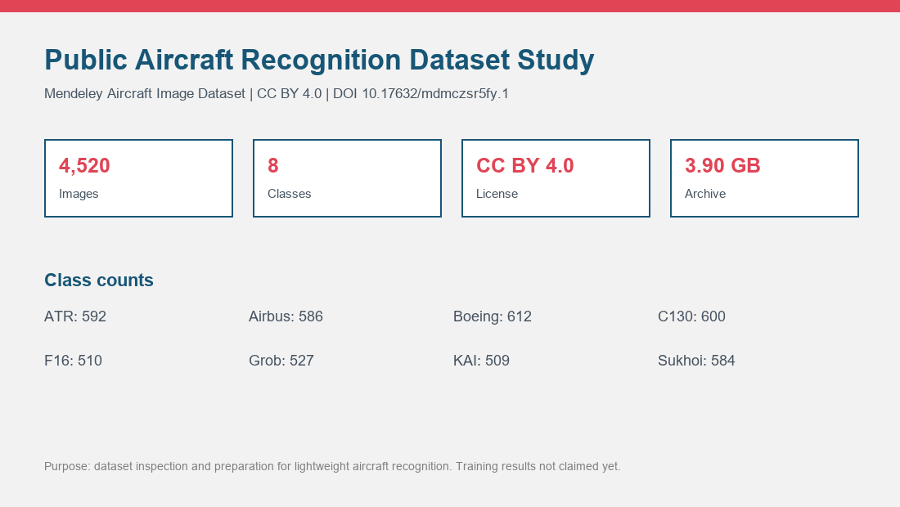

*Mendeley Aircraft Image Dataset: public source, DOI, license, and class summary.*

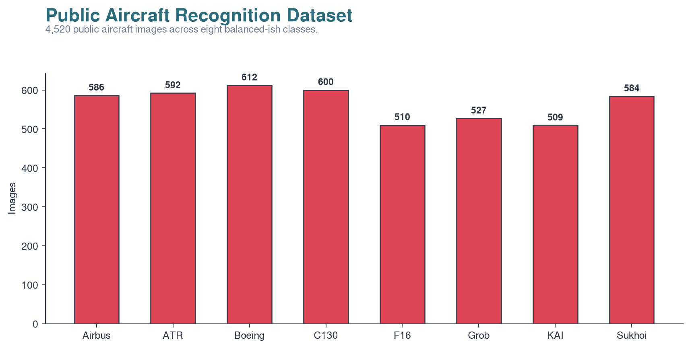

*Class distribution is reasonably balanced, which made it suitable for a lightweight recognition baseline.*

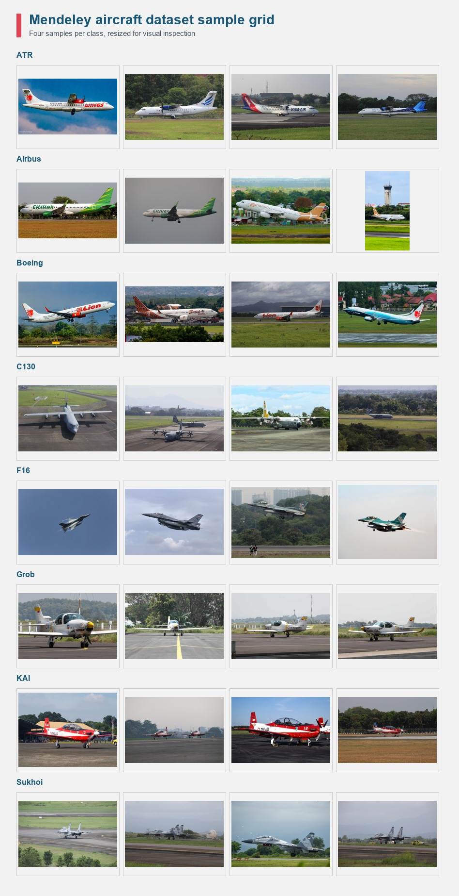

*Sample grid from the public dataset.*

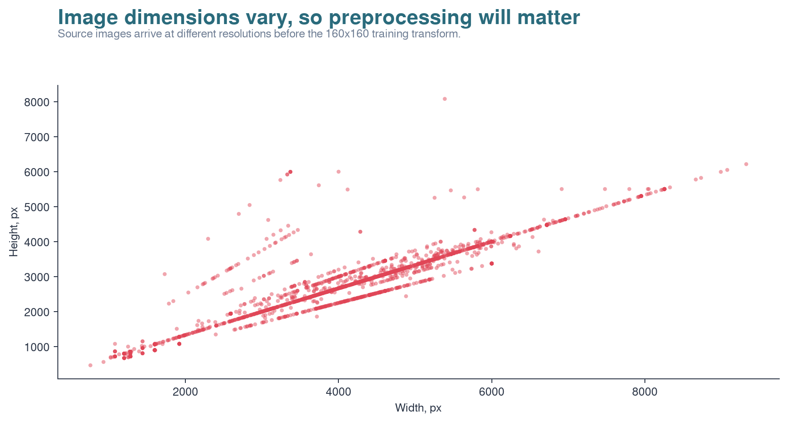

*Image dimensions vary, so preprocessing mattered before training.*

---

## Where Qwen helped, and where it still needs a leash

Qwen2.5-Coder did not become a research assistant. It became a useful mechanic. It helped draft code for dataset reporting, contact sheets, verification scaffolds, and the first pass of the training script. That was enough to matter.

The data analysis itself was straightforward: inspect the public dataset, confirm class balance, summarize image dimensions, generate sample grids, and then run a lightweight transfer-learning baseline. The useful outcome was not just the 84.8% test accuracy. It was proving that the worker could help create a reproducible artifact bundle that Borges could inspect.

The ceiling is clear enough. A stronger backbone, better augmentation, proper validation splits, and actual object detection would all improve future runs. Qwen stays useful in that loop for scaffolding, tests, cleanup, and reporting, right up until something better arrives, or until I become a millionaire overnight and install a proper GPU in the spare bedroom. The RAM problem would also solve itself.

---

## Training a lightweight recognition model

I left PyTorch training the aircraft model while I slept. That sentence sounds fancier than the setup deserves. It was a MobileNetV3 Small transfer-learning run on a personal laptop, with the backbone frozen and the classifier head trained on CPU.

<!-- IMAGE ROW NOTE FOR HERMES
The four images below are a 4-column zoomable image row (.image-row).
Each image links to itself (target="_blank") and has a thin teal border.
-->

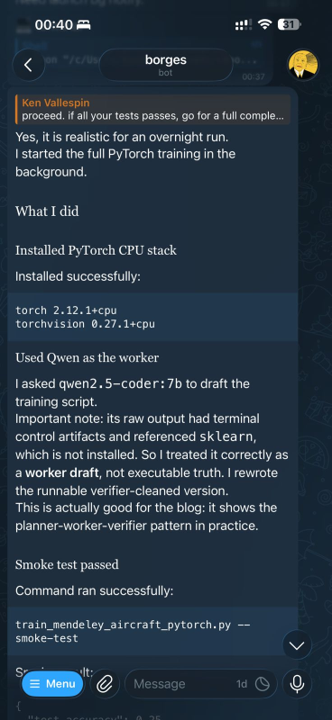

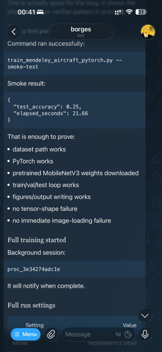

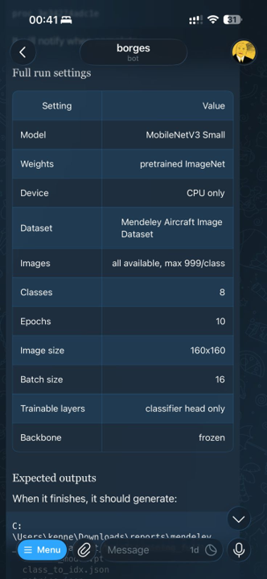

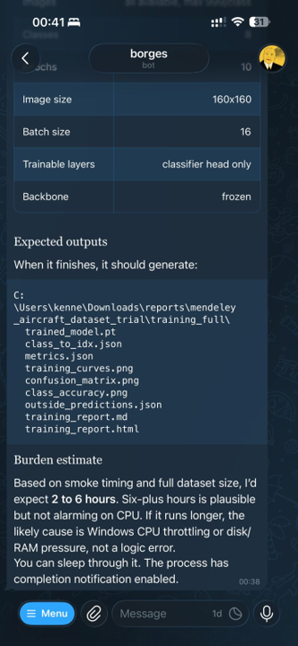

*The overnight sequence: the laptop was left to grind through training while I slept.*

When I woke up, I asked for status. The answer was the useful kind: completed, exit code 0, test accuracy 84.8%, and artifacts written to disk.

<!-- IMAGE ROW NOTE FOR HERMES
The two images below are a 2-column zoomable image row (.image-row.two).
-->

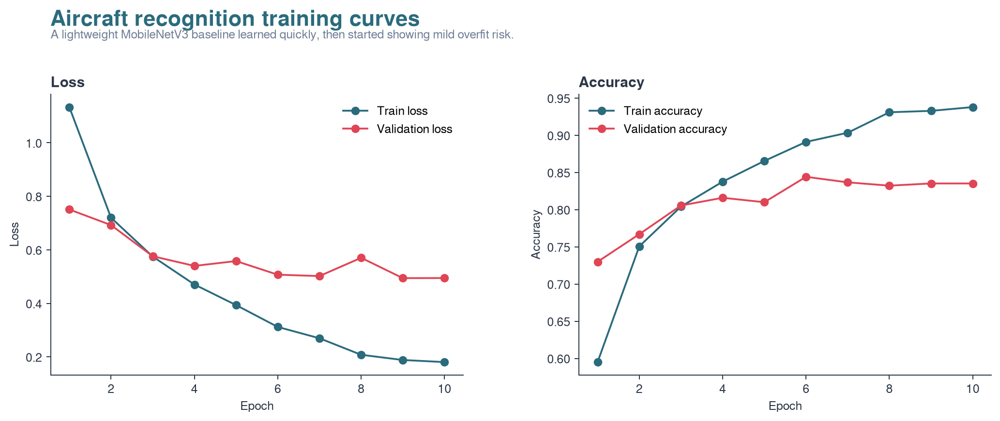

*Training accuracy rose steadily. Validation accuracy settled in the mid-80s, with mild overfitting signs but nothing surprising for a small CPU-only baseline.*

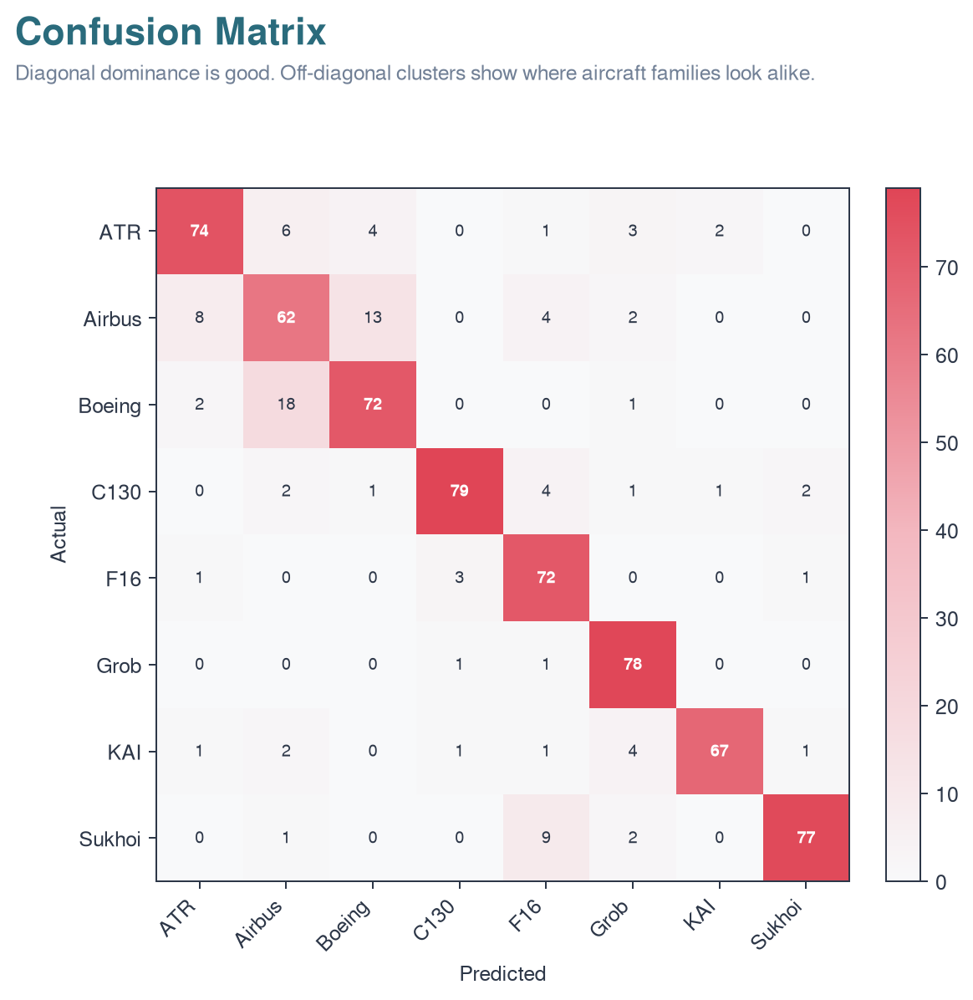

*The confusion matrix uses cerise red. Most signal sits on the diagonal, with Airbus/Boeing and Sukhoi/F16 confusions standing out.*

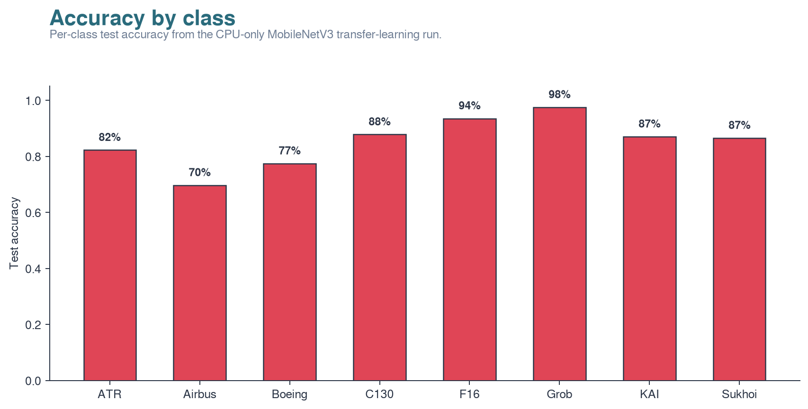

*Accuracy by class, with values shown directly on the bars.*

---

## Twenty public aircraft images, boxed and mapped

To make the recognition test more tangible, I pulled a random sample of 20 public images from the same dataset categories and panelized them. The boxes here are approximate visual object boxes for presentation, not YOLO detections. That distinction matters. The trained model was a classifier, not an object detector.

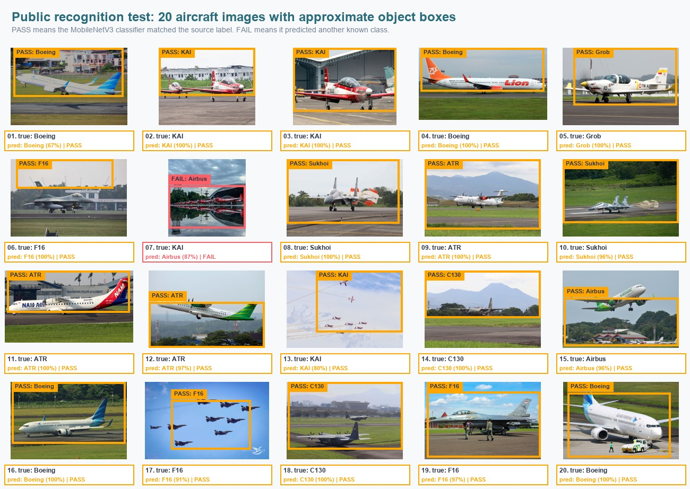

*Twenty public aircraft examples across dataset categories with approximate bounding boxes. PASS = classifier matched the source label; FAIL = predicted another known class.*

### Source mapping

| ID | Class | File | Source |
|---|---|---|---|
| 01 | Boeing | `Boeing - (112).jpg` | Mendeley Aircraft Image Dataset, CC BY 4.0, DOI [10.17632/mdmczsr5fy.1](https://doi.org/10.17632/mdmczsr5fy.1) |
| 02 | KAI | `KAI - (402).jpg` | Mendeley Aircraft Image Dataset, CC BY 4.0, DOI [10.17632/mdmczsr5fy.1](https://doi.org/10.17632/mdmczsr5fy.1) |
| 03 | KAI | `KAI - (369).jpg` | Mendeley Aircraft Image Dataset, CC BY 4.0, DOI [10.17632/mdmczsr5fy.1](https://doi.org/10.17632/mdmczsr5fy.1) |
| 04 | Boeing | `Boeing - (327).jpg` | Mendeley Aircraft Image Dataset, CC BY 4.0, DOI [10.17632/mdmczsr5fy.1](https://doi.org/10.17632/mdmczsr5fy.1) |
| 05 | Grob | `Grob - (387).jpg` | Mendeley Aircraft Image Dataset, CC BY 4.0, DOI [10.17632/mdmczsr5fy.1](https://doi.org/10.17632/mdmczsr5fy.1) |
| 06 | F16 | `F16 - (68).jpg` | Mendeley Aircraft Image Dataset, CC BY 4.0, DOI [10.17632/mdmczsr5fy.1](https://doi.org/10.17632/mdmczsr5fy.1) |
| 07 | KAI | `KAI - (210).jpg` | Mendeley Aircraft Image Dataset, CC BY 4.0, DOI [10.17632/mdmczsr5fy.1](https://doi.org/10.17632/mdmczsr5fy.1) |
| 08 | Sukhoi | `Sukhoi - (294).jpg` | Mendeley Aircraft Image Dataset, CC BY 4.0, DOI [10.17632/mdmczsr5fy.1](https://doi.org/10.17632/mdmczsr5fy.1) |
| 09 | ATR | `ATR - (382).jpg` | Mendeley Aircraft Image Dataset, CC BY 4.0, DOI [10.17632/mdmczsr5fy.1](https://doi.org/10.17632/mdmczsr5fy.1) |
| 10 | Sukhoi | `Sukhoi - (486).jpg` | Mendeley Aircraft Image Dataset, CC BY 4.0, DOI [10.17632/mdmczsr5fy.1](https://doi.org/10.17632/mdmczsr5fy.1) |
| 11 | ATR | `ATR - (466).jpg` | Mendeley Aircraft Image Dataset, CC BY 4.0, DOI [10.17632/mdmczsr5fy.1](https://doi.org/10.17632/mdmczsr5fy.1) |
| 12 | ATR | `ATR - (162).jpg` | Mendeley Aircraft Image Dataset, CC BY 4.0, DOI [10.17632/mdmczsr5fy.1](https://doi.org/10.17632/mdmczsr5fy.1) |
| 13 | KAI | `KAI - (377).jpg` | Mendeley Aircraft Image Dataset, CC BY 4.0, DOI [10.17632/mdmczsr5fy.1](https://doi.org/10.17632/mdmczsr5fy.1) |
| 14 | C130 | `C130 - (43).jpg` | Mendeley Aircraft Image Dataset, CC BY 4.0, DOI [10.17632/mdmczsr5fy.1](https://doi.org/10.17632/mdmczsr5fy.1) |
| 15 | Airbus | `Airbus - (452).jpg` | Mendeley Aircraft Image Dataset, CC BY 4.0, DOI [10.17632/mdmczsr5fy.1](https://doi.org/10.17632/mdmczsr5fy.1) |
| 16 | Boeing | `Boeing - (547).jpg` | Mendeley Aircraft Image Dataset, CC BY 4.0, DOI [10.17632/mdmczsr5fy.1](https://doi.org/10.17632/mdmczsr5fy.1) |
| 17 | F16 | `F16 - (420).jpg` | Mendeley Aircraft Image Dataset, CC BY 4.0, DOI [10.17632/mdmczsr5fy.1](https://doi.org/10.17632/mdmczsr5fy.1) |
| 18 | C130 | `C130 - (181).jpg` | Mendeley Aircraft Image Dataset, CC BY 4.0, DOI [10.17632/mdmczsr5fy.1](https://doi.org/10.17632/mdmczsr5fy.1) |
| 19 | F16 | `F16 - (229).jpg` | Mendeley Aircraft Image Dataset, CC BY 4.0, DOI [10.17632/mdmczsr5fy.1](https://doi.org/10.17632/mdmczsr5fy.1) |
| 20 | Boeing | `Boeing - (542).jpg` | Mendeley Aircraft Image Dataset, CC BY 4.0, DOI [10.17632/mdmczsr5fy.1](https://doi.org/10.17632/mdmczsr5fy.1) |

---

## The command center was embarrassingly normal

This whole thing did not happen in a lab, a clean desk setup, or one of those productivity photos where the coffee mug is somehow part of the architecture. I was talking to Borges through Telegram, mostly lying down, chilling, after a full day of class. Then the idea arrived, because apparently my brain prefers to start infrastructure projects when the sensible thing to do is sleep.

That is the strange part I keep coming back to. The installs, model shortlist, benchmark run, dataset study, recognition panel, overnight PyTorch training, and this draft all moved through the same chat thread where I would normally send a quick note. No ceremony. No dashboard theater. Just messages, files, tool calls, corrections, and the occasional moment where I had to ask whether my modest sticker-covered laptop was being brave or just warm.

It sounds ridiculous when written down. It also worked.

---

## What I am actually taking from this

The local model was not the win. The useful part was learning where it belongs. A small model on a RAM-constrained laptop should not be treated like a second brain or a tiny senior engineer living inside Ollama. That is how you get confident garbage at local speed.

But as a bounded worker, it becomes interesting. Give it a narro