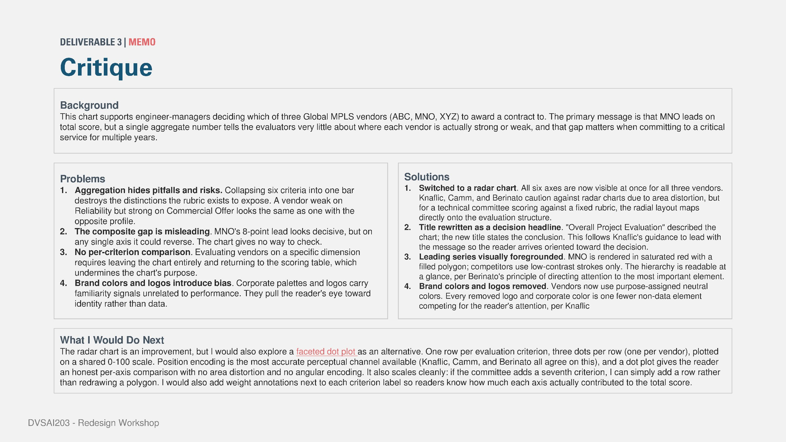
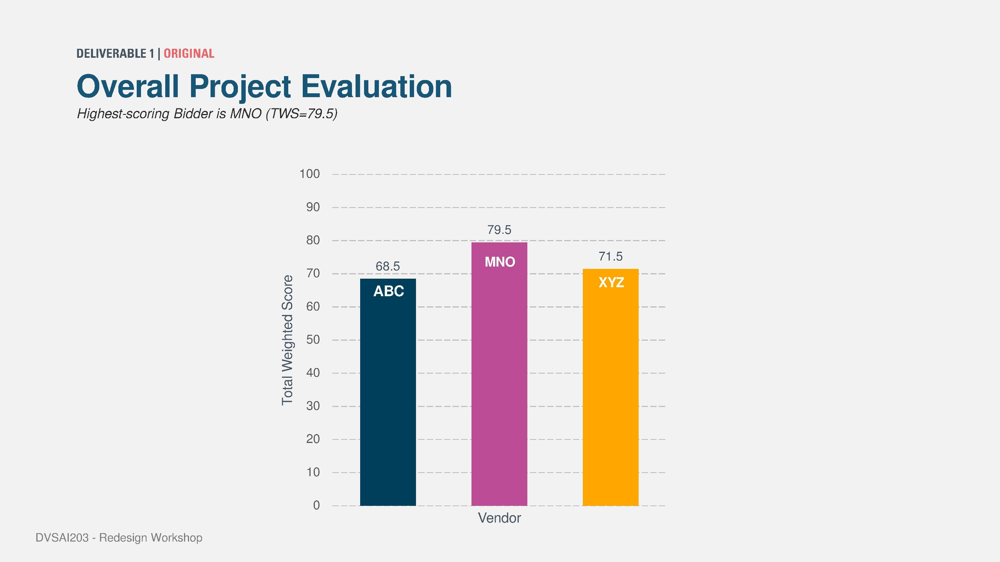
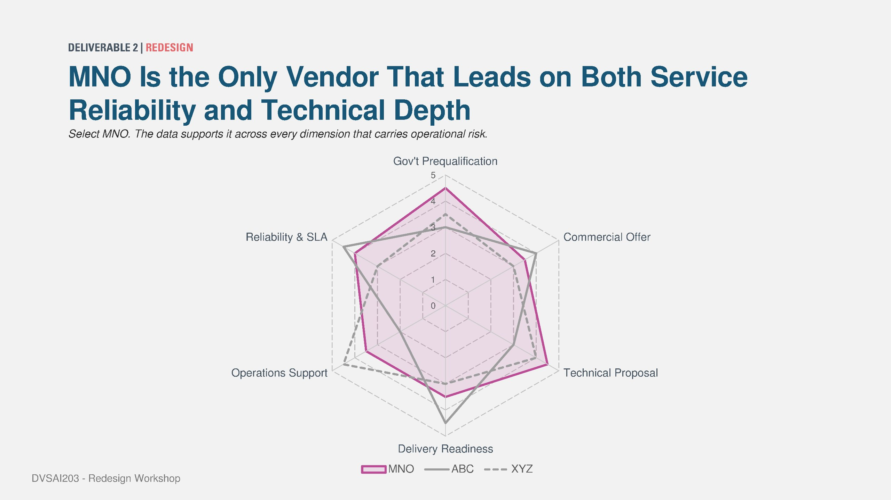
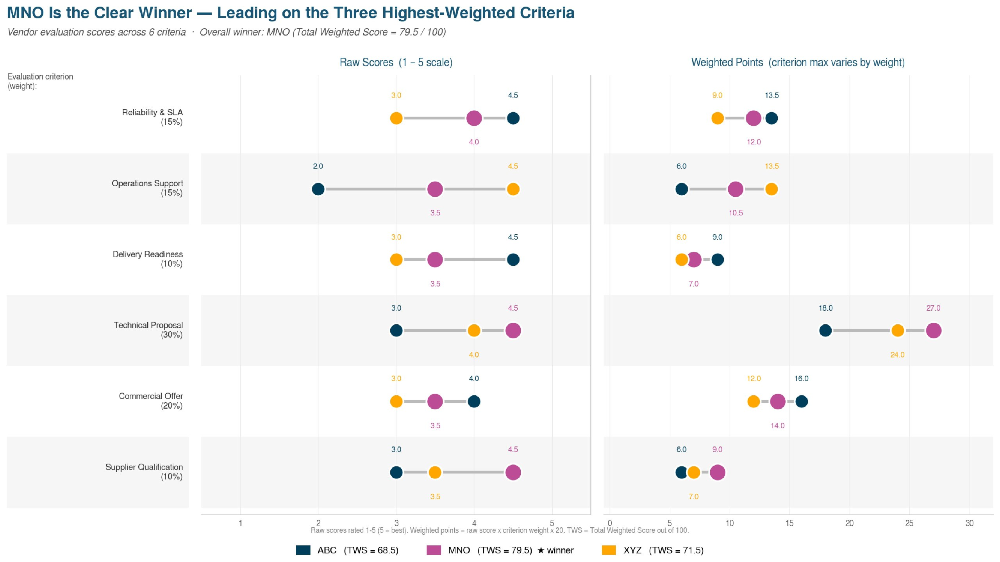

---
title: Redesigning the Redesign Nobody Asked For
tags:
  - data-science
  - data-visualization
  - mba/aim
---

# Redesigning the Redesign Nobody Asked For

*Source: [JetBrains IDE Blog](https://blog.jetbrains.com/pycharm/2026/03/what-s-new-in-pycharm-2026-1/)*

*DVSAI203 and the chart I said I would build next*

Quick disclosure before anything else: nobody assigned this.

The actual brief for Deliverable 3 asked for a written critique plus a short “what I would do next” paragraph. I wrote the paragraph. I submitted it. That should have been the end of the exercise.

But there is a very specific kind of itch that comes from typing the sentence “I would also explore a faceted dot plot as an alternative” and then just not doing it. It sat there in the memo. Unexplored. Mildly mocking me every time I reopened the deck to fix a font.

So this post is me closing that loop. On a weekend, for a grade I had already received.

That screenshot is the actual paragraph in question, for context. The coursework had three deliverables: an original chart, a redesigned chart, and a written critique of both. I had finished all three. Then, in my own “next steps” box, I wrote myself homework I had zero obligation to finish.

Let’s finish it.

## What was wrong, the fast version

Quick recap in case you are reading this without the deck open.

This is Deliverable 1, the original. Three vendors, anonymized here because the names do not matter for this post, scored for a connectivity contract. The chart is a single bar per vendor: total weighted score. One vendor wins at 79.5.

Clean. Simple. Tells you almost nothing.

The issue is not that the chart is wrong. The number is accurate. The issue is that the number is all you get. Six evaluation criteria, each with different weights, compressed into one bar per vendor. If Vendor A is weak on reliability but strong on commercial pricing, and Vendor C is the exact opposite, this chart gives you two bars of roughly similar height and says very little about why.

Deliverable 2 was the redesign. I switched to a radar chart, laid out all six criteria as axes, and rendered the winning vendor in a saturated highlight color so it visually leads against the other two, which sit back in flat gray. I also rewrote the title so it states the conclusion instead of merely describing the chart.

This version is genuinely better. You can see the winner pulling ahead on the two highest-stakes axes: reliability and technical depth. That is the actual argument the deck needed to make.

But this is the part I wrote in the critique and then sat on for a week: radar charts carry a known problem. Area distortion.

The eye reads the shape of the polygon, and that shape can shift depending on the order of the axes, not just the values underneath. Two vendors with different score profiles can end up looking like similar-sized blobs because of the layout. That is a real risk for a chart meant to support an actual procurement decision.

So in the written critique, I said I would also want to try a faceted dot plot: one row per criterion, one dot per vendor, all on a shared scale. No angles. No area. Just position.

Position on a common scale is one of the most reliable ways to read quantitative comparisons. That is the point. The chart should make comparison easier, not more theatrical.

Then I closed the laptop and did not build it.

## Actually doing the thing

I opened PyCharm, wrote a quick Python visualization, and rebuilt the same scoring data as a faceted dot plot. Nothing fancy. Just enough code to test whether the idea I had written in the critique actually worked.

So here it is. The dot plot.

Each row is one of the six evaluation criteria. Each dot is a vendor. The left panel shows raw scores on the original scale. The right panel converts the same data into weighted points, so you can see both “how did they score?” and “how much did that score actually matter to the final total?”

Same winner. Same 79.5. Nothing about the underlying numbers changed. This is purely a different lens on the exact data from Deliverable 1.

What this view gives you that neither earlier chart did is direct per-criterion comparison without leaving the chart. Want to know who is strongest on technical proposal? Look at that row. No flipping back to a scoring table. No squinting at polygon overlap. The dots sit on a number line and tell you what is happening.

Weight is also printed next to each criterion label, which was another critique point from earlier. Readers should not have to remember that technical proposal counts more heavily than delivery readiness. Now it is just there.

Is it as visually dramatic as the radar chart? No.

The radar chart looks like something you would put on a slide titled “the data tells a story.” The dot plot looks like something an engineer would trust before signing a multi-year contract.

Given the real audience for this kind of chart, that tradeoff feels right.

## The actual point, if there is one

The bigger lesson here was not really about radar charts versus dot plots. It was noticing that I had written the “what I would do next” line as a safe hedge: a way of saying “I considered this” without having to prove whether it held up.

There is a version of coursework where that is completely fine. You write the sentence, you move on, the grade does not care either way.

But if I am actually trying to get better at this, and not just trying to get the grade, the sentence is not the deliverable. The chart is.

So I made the chart.

Same underlying data. Three visual treatments. One conclusion that never changed.

Make of that what you will.

