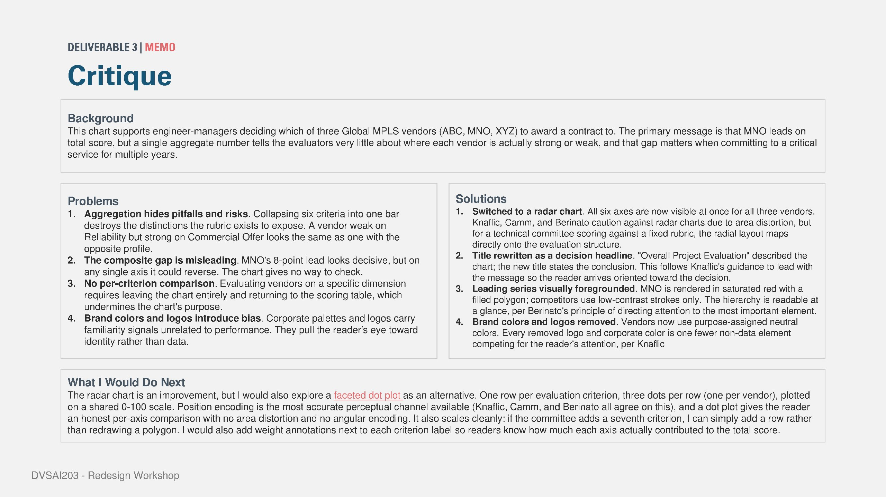
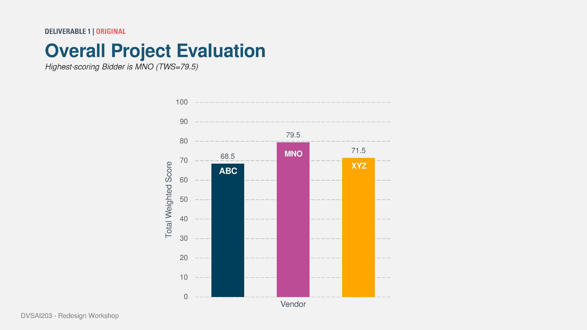
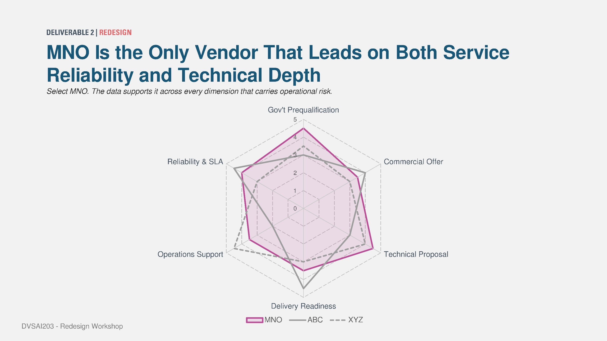
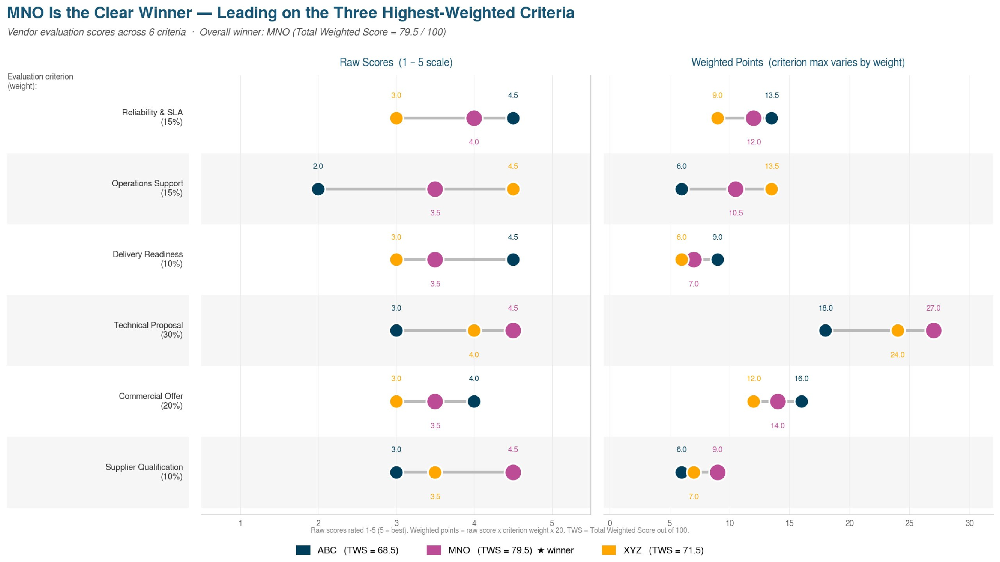

# Redesigning the redesign nobody asked for

*I wrote a sentence in a homework critique that haunted me for a week. So I went home and did the thing.*

> **Disclosure:** I use AI as a writing partner to refine my prose and structure, but the ideas, analysis, and first drafts originate entirely with me.

*Source: [JetBrains IDE Blog](https://blog.jetbrains.com/pycharm/2026/03/what-s-new-in-pycharm-2026-1/)*

Nobody assigned this. The actual brief for Deliverable 3 in my data visualization course asked for a written critique plus a short paragraph on what I'd explore next. I wrote both, submitted the deck, got my grade. Done.

Except for one sentence I'd written in that "next steps" paragraph:

"I would also explore a faceted dot plot as an alternative."

It kept staring back at me every time I reopened the file to fix a typo. Unexplored. Just sitting there as a promise I had no intention of keeping, which is how those sentences usually go.

So one weekend I actually built it. For no audience and no credit.

That screenshot is the actual paragraph in question, for context. The coursework had three deliverables: an original chart, a redesigned chart, and a written critique of both. I had finished all three. Then, in my own “next steps” box, I wrote myself homework I had zero obligation to finish.

---

## What we were working with

Three technology vendors, evaluated on six criteria with different weights, for a connectivity contract. The data was real in structure even if the names are anonymized.

**Deliverable 1** was the original chart: one bar per vendor, total weighted score. Clean and simple. Vendor B won at 79.5.

And that was the problem. You got one number per vendor and nothing else. If Vendor A crushed it on commercial pricing but barely passed on reliability, and Vendor C was the exact opposite, the chart showed you two bars of roughly the same height and said nothing about why. Six weighted criteria collapsed into a single digit each. Accurate, sure. Almost useless for actually making a decision, also sure.

**Deliverable 2** was my first redesign. I switched to a radar chart with all six criteria as axes, rendered the winning vendor in a bright saturated color, pushed the other two back into flat gray, and rewrote the title to state the conclusion instead of just describing the chart.

This was genuinely better. You could see the winner pulling ahead on the two criteria that mattered most: reliability and technical depth.

But radar charts have a problem I knew about and wrote down in my critique and then promptly forgot. Area distortion. The eye reads the size of the polygon, not just the position of each point, so two vendors with genuinely different score profiles can look like similar-sized blobs depending on how the axes are arranged. For a chart meant to support a real procurement decision, that's a risk you don't want to carry.

So in the written critique I said I'd also try a faceted dot plot. One row per criterion, one dot per vendor, all on a shared scale. No angles, no area, just position on a number line. Position on a common scale is probably the most reliable way humans compare quantities. It's why rulers work. Then I closed PyCharm and never built it. For a week.

---

## Finally building the thing

I opened the editor, pulled the same scoring data, and wrote a Python script to render the dot plot I'd described but never made.

Each row is one of the six evaluation criteria. Each dot is a vendor. The left panel shows raw scores; the right panel converts them into weighted points so you can see both how each vendor scored and how much that score actually mattered to the final total.

Same winner. Same 79.5. This is the exact same data from Deliverable 1 viewed through a different lens.

What this view gives you is direct per-criterion comparison without leaving the chart. Want to know who's strongest on the technical proposal? Look at that row. The dots sit on a number line and they tell you what's happening. No flipping back to a scoring table. No squinting at overlapping polygons. (Also, the weight for each criterion is printed right next to its label, which was another point I'd made in my critique. Readers shouldn't have to remember that technical proposal counts more than delivery readiness.)

Is it as visually dramatic as the radar chart? No, not even close. The radar chart looks like something you'd put on a slide titled "The Data Tells a Story." The dot plot looks like something an engineer would trust before signing a multi-year contract. For the actual audience this kind of chart is meant to serve, that tradeoff feels right.

---

## The part that actually matters

The bigger lesson isn't about radar charts versus dot plots.

I had written that "what I would do next" line as a safe hedge. A way of saying "I considered this" without having to prove whether it actually held up. There's a whole version of coursework where that's completely fine. You write the sentence, you move on, the grade doesn't care either way. The sentence is the deliverable.

But if I'm actually trying to get better at this work, not just trying to get a grade, then the sentence is not the deliverable. The chart is.

So I made the chart. Same underlying data, three visual treatments, one conclusion that never changed. The bar chart told you who won. The radar chart showed you where they won. The dot plot let you check the math yourself, which is what you'd want if the contract was real.

All three were true. Only one invited you to verify.

I'm not going to write another "I would also explore" sentence and leave it hanging. Next time I'll just do it, probably on a weekend, probably for no one.

---

## Sources

- JetBrains IDE Blog: <https://blog.jetbrains.com/pycharm/2026/03/what-s-new-in-pycharm-2026-1/>
