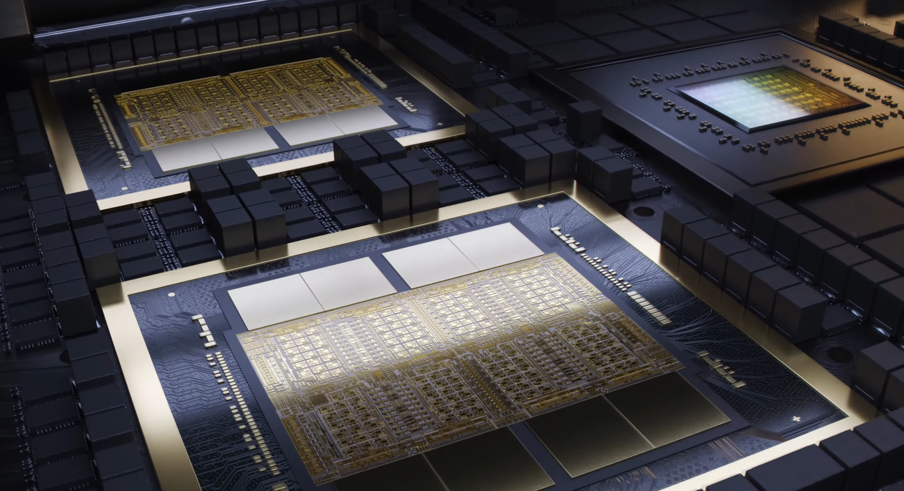
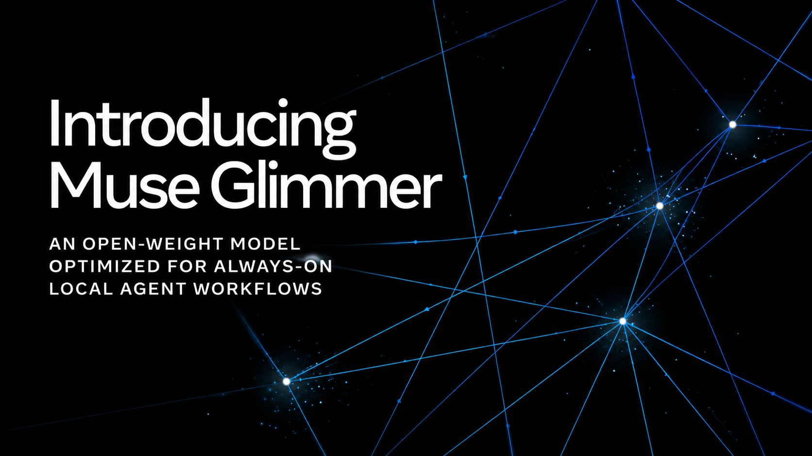
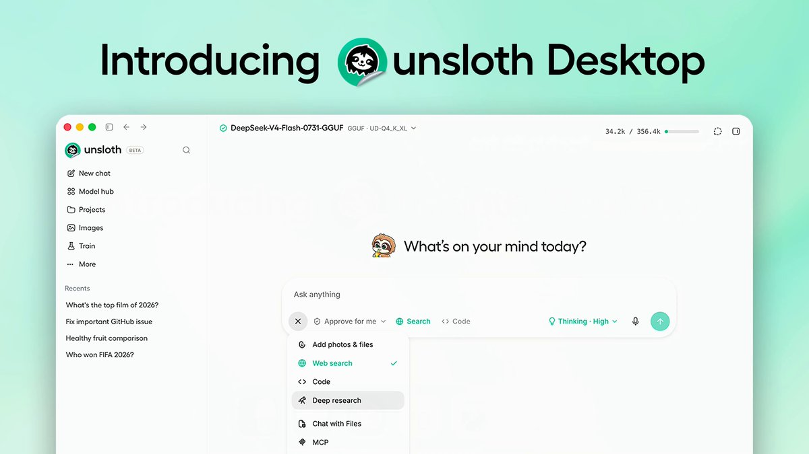
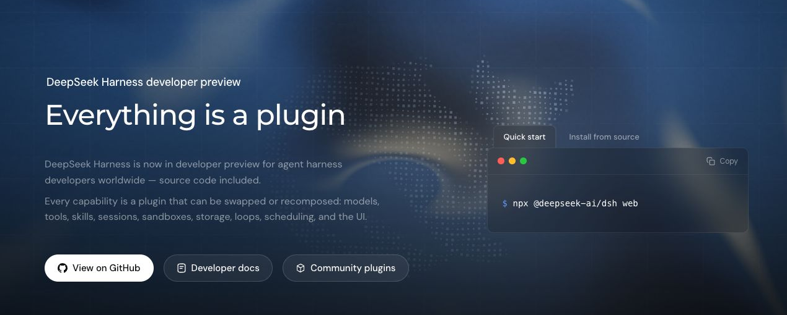
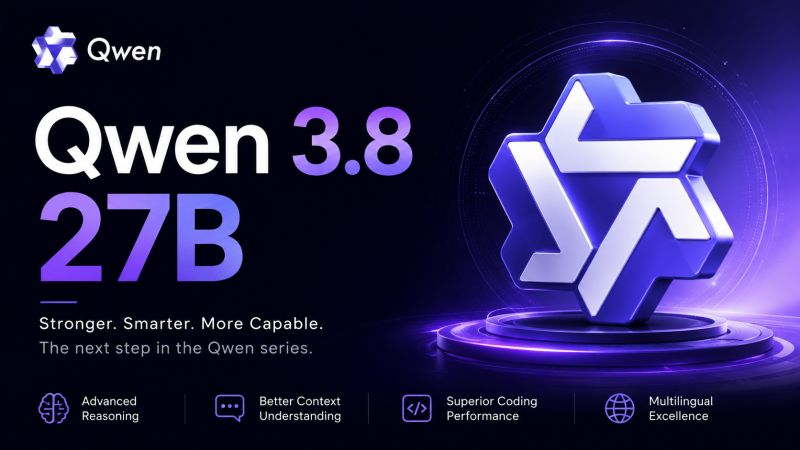
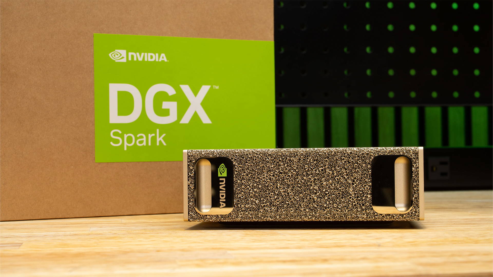
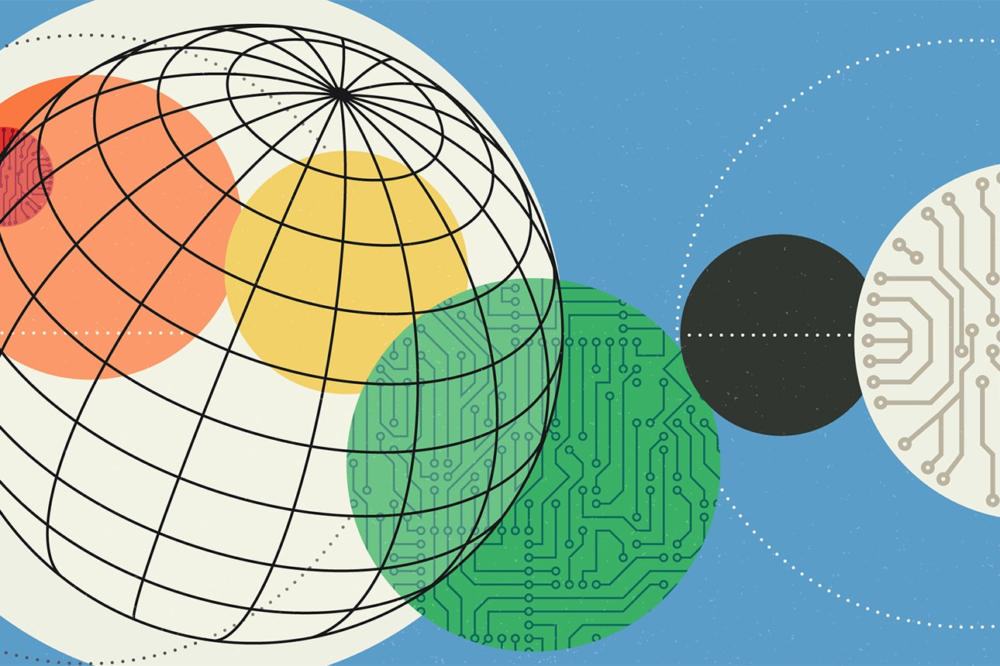

<!-- prettier-ignore-start --><h1>Septimana mirabilis: The week we stopped renting intelligence</h1><figure><figcaption>The week mattered because the stack is moving toward machines people can actually own.</figcaption></figure>
If you would rather own your models than rent them by the token, the week of August 10 to 14 was a gift.

Annus mirabilis usually points to one of two famous moments: Dryden writing about 1666 when London burned, or Newton’s plague years when Cambridge sent him home and quietly invented calculus. One story has fire. The other has isolation. Both carry the same idea. Every so often, too much important work lands in too little time, and you are left blinking like you missed a memo.

The last week had a smaller version of that feeling. Four teams shipped four different things with no sign of coordination, all bending in the same direction. Models worth running. Tools worth building on. More of the stack moving from metered cloud APIs to hardware you can actually own.

That last part is why I care.

I run local models every day on a DGX Spark sitting on my desk. It hums quietly and does its job. My daily driver is Qwen-3.6-27B. It runs on my own metal, answers without a token meter, and does not require me to send private work to a company that can reprice access, deprecate a model, change terms, or read the prompt.

There is a romantic angle to that. There is also a boring, practical one. I am all in on AI. Which means I want my tools to survive the day the cloud does not. Dryden’s London burned in his year of wonders. If mine does, I would still like to work. Personal sovereign AI is not branding. It is insurance. I am the kind of person who keeps a flashlight in the car just in case. This is the same instinct, but with GPUs.

So here is the week, in order.

<h2>Monday, August 10: Meta opens Muse Glimmer</h2><figure><figcaption>Meta’s Muse Glimmer put a capable multimodal model into the local-first conversation.</figcaption></figure>
Meta’s Superintelligence Labs released Muse Glimmer, a 30 billion parameter model under Apache 2.0. It is a distilled version of Muse Spark 1.2, their closed flagship, compressed into something that can run on a single consumer GPU or a Mac. At four bit quantization it drops under 20 gigabytes. No account. No cloud endpoint. No bill that gets worse because you used the tool too much.

Glimmer is pitched at agents, not chat demos. It is tuned for the actual work people ask agents to do: write and debug code, call tools, read images and documents, and keep a long task coherent after the easy first step is over. It handles text and images, covers over a hundred languages, and has integrations with llama.cpp, MLX, and ExecuTorch on the way.

Zuckerberg framed the release as a bet on distributing intelligence widely instead of locking it inside one company’s data center. I believe the argument. I also believe the business model. Meta makes its money on ads and hardware, not on selling model access. Giving away a capable local model hurts the labs that live on monthly AI bills more than it hurts Meta.

There is a boundary to the generosity. Glimmer is open. Muse Spark stays closed. That is not charity, and it does not need to be. A gift with strategy behind it still runs offline on my machine, which is all I care about.

<h2>Tuesday, August 11: Unsloth ships a desktop app that trains</h2><figure><figcaption>Unsloth Desktop moved local AI from running models toward training them on your own machine.</figcaption></figure>
Unsloth Desktop is the first mainstream local AI app I have seen that does the thing local AI apps usually avoid. It does not just run a model. It trains one.

That is why Unsloth has quietly become my favorite lab of the last few months. Nearly every GGUF and MTP sidecar on my machine came from them. They have a habit of shipping a clean, working quant before I have finished reading the model card. It is like they know I do not have the attention span for forty seven pages of technical notes.

Running a quantized model locally stopped being hard a couple of years ago. Training one on your own data did not. That still meant a Python environment, CUDA versions that disagreed with each other, and a notebook copied from someone’s gist with the same confidence people bring to folk medicine.

Unsloth Desktop puts inference, fine tuning, dataset prep, and export into one application on Windows, macOS, and Linux. There is an Arm64 build, which fits my Spark. Their claims are fifty plus supported models, roughly twice the training speed, and about seventy percent less VRAM. It covers text, image, video, audio, and diffusion models. Dynamic GGUF quantization helps fit large models onto one GPU. It also bridges Claude Code and Codex to whatever you run locally, which becomes a lot more interesting the moment your code is internal and cannot go to an outside API.

For my workflow, this is the door that opens next. Right now I run RAG. I retrieve from my documents, feed the model relevant chunks, and hope it reads them properly. It works, but it is a workaround. The model does not know my material. It borrows it for a few thousand tokens at a time, like a library book you are always late returning.

The real next step is training. I want to take my own body of professional work, fine tune on it, and move some of that knowledge into the weights instead of pasting it into the context window over and over. Unsloth Desktop makes that sound like an evening project instead of a research program. I have not run it in anger yet. I am close.

Beta warning still applies. Version 0.1.701. Training still likes NVIDIA best. Privacy and speed claims depend on your machine and config, and I have not seen a clean cross platform test yet. None of that has pushed it off my machine, because at this point, I am committed to the bit.

<h2>Thursday, August 13: DeepSeek open sources the scaffolding</h2><figure><figcaption>DeepSeek Harness made the agent layer legible: models, tools, sessions, sandboxes, and loops as plugins.</figcaption></figure>
DeepSeek’s expected release that week was V4-Pro. The more interesting release was the thing beside it: Harness, or dsh, a developer preview under the MIT license.

A harness is the part around the model that lets it act. Tool registry, sandbox, session log, working loop, memory of what has happened, interface to the outside world. Most coding agents treat that layer as product plumbing. You can extend what they let you extend, and no further.

DeepSeek made the opposite bet. First rule in the README: everything is a plugin. Models, tools, skills, sessions, sandboxes, storage, the loop, the interface. Even Claude Code or Codex can sit inside it as sub agents.

The lineage is the interesting part. Harness runs on Cordis, a plugin framework DeepSeek did not invent for this launch. Cordis comes from Shigma and has been the plugin kernel behind Koishi, a chatbot framework, since 2019. Alongside Harness, DeepSeek and Peking University published a paper formalizing the idea: A Programming Paradigm for Spatiotemporal Composability.

That title is doing a lot of academic heavy lifting, but the useful idea is simple. If you remove a plugin, what it did should unwind cleanly. If components depend on each other, those relationships should stay honest while parts get mounted, replaced, or reverted. That is the difference between everything is a plugin as architecture and everything is a plugin as launch copy.

It also hints at the next shape of agents. If tools can be installed and removed safely at runtime, an agent can eventually write a tool, try it, keep it if it works, and pull it back if it misbehaves without tearing down the whole process. A chatbot plugin loader from 2019 turns out to be a serious foundation for agents that modify their own working environment. That is why I would read the paper even if I never touched the code.

DeepSeek frames it as Agent equals Model plus Harness. That puts Harness below Claude Code rather than beside it. It is not the finished agent. It is the substrate you build one on. Configuration is readable YAML. It picked up thirty thousand GitHub stars in hours. It also says plainly that versions will break setups. Developer preview means developer preview.

For the sovereignty case, this was the quiet standout. The model was only half the story. The machinery around the model is starting to open too.

<h2>Friday, August 14: Qwen 3.8-27B lands</h2><figure><figcaption>Qwen 3.8-27B put a new local candidate beside the model I already use every day.</figcaption></figure>
Alibaba’s Qwen team closed the week by dropping Qwen 3.8-27B on Hugging Face under Apache 2.0 at three in the afternoon UTC. It is a dense twenty eight billion parameter model, multimodal out of the box, with a vision encoder nobody had confirmed until the weights appeared. Native context is 262 thousand tokens, stretchable toward a million with YaRN. Quantized, it runs in roughly sixteen to seventeen gigabytes, putting it squarely in 3090 and 4090 territory. Unsloth had Dynamic GGUFs ready on day one. The Tuesday release and the Friday release met each other halfway.

Qwen 3.8-27B is the open sibling of Qwen 3.8-Max, the 2.4 trillion parameter flagship that stays behind an API. Nobody self hosts a 2.4T model. A 27B model is different. You can download it, quantize it, keep it, and run it long after the launch page changes.

This one is interesting because it is the successor to the model I actually use.

Keep one hand on your wallet, though. Qwen’s own card puts 3.8-27B close to, and on some coding benchmarks above, Claude Opus 4.6. SWE-bench Pro is listed at 61.7 against Opus’s 53.4, with big jumps over the previous 27B on agentic and computer use scores. Those are Qwen’s numbers. Several benchmarks are in house or modified versions of public ones.

Simon Willison ran it on release day, called the self reported figures eye opening, and then said the only sensible thing: wait for independent benchmarks. I am in the same place. The default reasoning mode also ships at xhigh, and at least one tester found it willing to write an essay in its own head before answering what is two plus two. Turn it down before judging it.

<h2>From my own machine</h2><figure><figcaption>The point is not only what the models can do. It is that the work can run on hardware I control.</figcaption></figure>
My setup is simple in the way only overbuilt setups become simple. The box is a DGX Spark, the GB10 Grace Blackwell machine with 128 gigabytes of unified memory, running Ubuntu on Arm. I do not sit in front of it much. I drive it from Telegram. Borges, my assistant, runs inside Hermes Agent, and the work happens on the Spark whether I am at my desk or not.

The week’s releases fit into that workflow without much ceremony. Unsloth Desktop is where models live and, soon, where they get trained. Harness is what can turn a model into something that acts with tools instead of merely replying. Glimmer gives me a different lineage to test beside Qwen. Qwen 3.8-27B is the upgrade waiting on deck.

The honest answer, though, is that Qwen-3.6-27B is still my daily driver. The 3.8 weights are on disk. I keep reaching for 3.6 because it works and I know its failure modes. That is not sentimentality. A predictable model is worth more than a better looking benchmark table.

The upgrade will happen when the new model earns it on my tasks, on my hardware, in my time. Nobody pushes the update. Nobody sunsets the older model to force my hand. That is the point.

<h2>The actual headline</h2><figure><figcaption>Sovereign AI is usually framed as a national or enterprise strategy. For individuals and small teams, the same logic starts with local control.</figcaption></figure>

Image credit: Carolyn Geason-Beissel/MIT SMR | Getty Images <a href="https://sloanreview.mit.edu/article/what-ceos-need-to-know-about-sovereign-ai/">https://sloanreview.mit.edu/article/what-ceos-need-to-know-about-sovereign-ai/</a>

Strip away the launch copy and the week has one clean thread: usable AI is drifting toward hardware you own and licenses you can read.

Meta opened a capable model. Unsloth made local training feel like software instead of ritual. DeepSeek opened the scaffolding that turns a model into an agent. Qwen put frontier adjacent claims on a model that fits on a gaming card.

For me, that is the story. Every one of these can run on my machine, outside a token counter, with my data staying where I put it. The model cannot be deprecated out from under me. The price cannot change next quarter. The terms cannot be rewritten while I sleep.

And if the cloud goes unreachable for an afternoon, or for longer, the work still runs.

That is not paranoia. It is the same instinct that makes people keep some cash and copies of important papers somewhere the bank cannot reach. I am all in on AI. Being all in is exactly why I want a version that does not depend on somebody else’s service staying alive.

I would not oversell the week. Nearly every benchmark was self reported. Everything came with preview or beta caveats. Runs locally still hides a lot of configuration pain that screenshots do not show. The frontier labs will probably keep the raw capability crown for a while.

But the rest of us are getting something they cannot sell and cannot take back: models we own, on machines we control, that keep working when the lights flicker. A week is a snapshot, not a verdict. This one pointed the right way.

<h2>Sources</h2><ul class="sources"><li><strong>MIT Sloan Management Review: What CEOs need to know about sovereign AI</strong> <a href="https://sloanreview.mit.edu/article/what-ceos-need-to-know-about-sovereign-ai/">https://sloanreview.mit.edu/article/what-ceos-need-to-know-about-sovereign-ai/</a></li><li><strong>Meta Muse Glimmer release and model materials</strong> Source to be filled during final preflight.</li><li><strong>Unsloth Desktop release materials</strong> Source to be filled during final preflight.</li><li><strong>DeepSeek Harness repository and paper materials</strong> Source to be filled during final preflight.</li><li><strong>Qwen 3.8-27B Hugging Face model card and release materials</strong> Source to be filled during final preflight.</li><li><strong>Simon Willison release-day notes on Qwen 3.8-27B</strong> Source to be filled during final preflight.</li></ul>
<!-- prettier-ignore-end -->