I have a problem. If you have ever watched me prepare a deck of slides or format a document, you already know this about me.

The problem is not attention to detail. The problem is that I cannot stop myself from inventing a new theme every single time.

One month I am experimenting with a navy-and-grey palette with one accent color. Two weeks later I am trying a high-contrast dark theme with a different accent because the previous one felt "too corporate." Then I decide I want something warm, then something cool, then something that looks like it could have come from an airline brand I happen to like.

By the time I am done, I have produced four different versions of almost the same slide deck.

This is not efficient. I know this. And yet I keep doing it.

## The free lunch

The breaking point arrived when Claude Design first dropped.

I did not have a grand strategic reason to build a design system that week. I had something better: a free usage allocation that lasted about two or three weeks, and a refusal to pay for more compute once it ran out.

I am cheap and I am broke, so instead of spending money, I spent the pilot window. I used the tool to generate layouts, iterate on palettes, and stress-test components. After the free allocation burned out, I had enough structure to stop making one-off themes.

I used the moment as an excuse to build my own design system from scratch instead of making yet another one-off theme. That is how the KV Design System started.

## The red rule

My favorite color is red. Not because it is especially sophisticated, and not because it fits every use case. It is simply the color I reach for first.

The first pass of the system was the creative act I actually enjoyed: choosing the palette, type roles, slide vocabulary, chart rules, and the overall restraint I wanted. I picked Cerise Red as the identity color, Deep Teal Blue for structure, and a lot of disciplined whitespace. Ten load-bearing colors. Two type roles. One spacing rhythm.

That was the fun part.

## The part I delegated

After the creative act came the harder operational work: formalizing the rules, turning the choices into reusable tokens, documenting the components, and making the system usable beyond a single artifact.

This is where I stopped being a designer and started being an engineer with a problem to solve. I built the system so that when I prepare a technical document, I do not have to choose colors. When I build a slide deck, I do not have to discover halfway through that the background makes thin text unreadable. When I publish a blog post, I want consistency instead of a small design decision made fresh every time.

The KV Design System is a compact visual operating system for executive-ready decks, technical proposals, analytical writing, and interface sketches. That is what it is, officially.

Unofficially, it is a set of rules that keep me from my own worst instincts.

## What the system actually does

It gives me ten colors. Stay inside them. Cerise Red marks sections, accents, and the single most important number. Deep Teal carries titles, primary chart lines, and table rules. Soft White, not pure white. Slate, not black. Pale Ice Blue is the only soft fill. No gradients, no drop shadows on slides, no emoji, no rounded card tropes.

It gives me two type families. FreeSans Display for headlines. FreeSans for body. Atkinson Hyperlegible for every figure. Berkeley Mono for code snippets only.

It gives me a 4-based spacing scale, lines instead of boxes, and ten slide masters that cover the recurring jobs of an executive deck: cover on Cerise, section divider on Slate, everything else on Soft White.

The most interesting rule is the chart palette rule. One to three series: core palette. Four or more: switch entirely to an extended ramp so no single hue reads as an alert. That is the kind of constraint I would have ignored if I had not written it down.

## Self-criticism included

I should acknowledge the obvious.

I am not a designer. I am an engineer who once tried to make every document look special. That impulse is not a strength in this context. It is exactly the habit that needed fixing.

If the system feels restrained, that is intentional. If it looks simple, that is the point. If some parts seem almost too basic, remember that the alternative was me tweaking heading colors at 11 PM the night before a presentation.

This system exists because I finally admitted that I needed constraints.

## What comes next

The first version is done. It is already in use for decks, notes, and documents.

What I want to do next is make it easier to apply. Better templates, clearer rules for dark presentations, and guidelines that are simple enough that I will actually follow them without second-guessing every color choice.

It also means accepting that the system will evolve. Red will remain the anchor, but the rest of the palette will grow as I learn what works across different formats and audiences.

If you are reading this and recognize yourself in the story, consider this your permission to stop making new themes for every slide deck. Build one system. Make it boring. Make it yours.

And if your favorite color is also red, you already have a head start.

---

## Full design-system note

### KV Design System

> [!abstract] What this is
> The personal branding and visual system for **Kenneth Vallespin (KV)** — built for executive-ready decks, technical proposals, and analytical communication. One small palette, two type roles, and a strict set of rules. The point is consistency and clarity, not decoration.

> [!tip] How to read this note
> Every section pairs the **rules** with a **rendered sample** so you can see the intent, not just read it. The reference PDF is embedded below and linked for download.

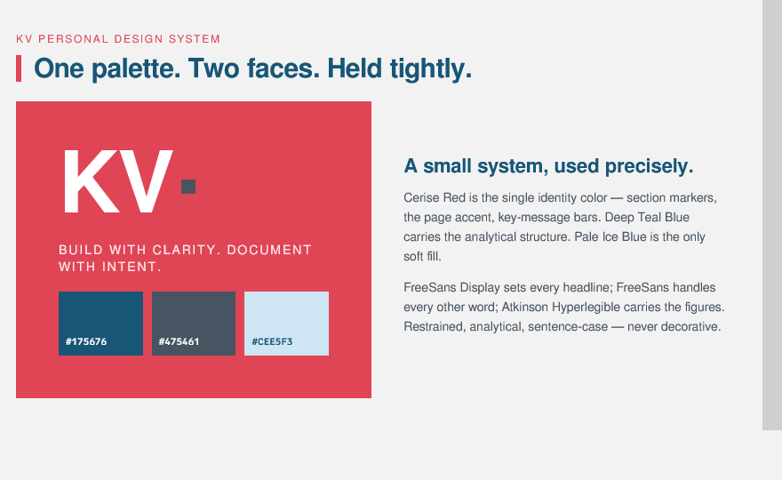

---

## Contents

- [1 · Identity](#1-identity)
- [2 · Color — core palette](#2-color-core-palette)
- [3 · Color — data visualization](#3-color-data-visualization)
- [4 · Type — families](#4-type-families)
- [5 · Type — scale & usage](#5-type-scale-usage)
- [6 · Spacing, lines & markers](#6-spacing-lines-markers)
- [7 · Components](#7-components)
- [8 · Charts](#8-charts)
- [9 · Process & timeline](#9-process-timeline)
- [10 · Slide masters](#10-slide-masters)
- [11 · Voice & content](#11-voice-content)
- [12 · Do & don't](#12-do-dont)
- [13 · Token reference](#13-token-reference)

---

## 1 · Identity

KV is **analytical, restrained, and sentence-case**. The system leans on a single identity color (Cerise Red), a structural blue (Deep Teal), and a lot of disciplined whitespace. Hierarchy is built with **size, color, and a Cerise marker bar** — never with decorative effects.

| Principle | In practice |
|---|---|
| One identity color | Cerise Red marks sections, accents, and the single most important number. If everything is red, nothing is. |
| Structure is blue | Deep Teal Blue carries titles, primary chart lines, and table rules. |
| Lines over boxes | Rules, hairlines, and a 6px marker bar do the work that borders and cards do elsewhere. |
| Sentence case | Titles and headings read like sentences. No Title Case, no ALL CAPS except short eyebrows. |
| No decoration | No gradients, no drop shadows on slides, no emoji, no rounded "card" tropes. |

> [!note] Tagline
> **Build with clarity. Document with intent.**

---

## 2 · Color — core palette

Ten load-bearing colors. Stay inside them — there are no "almost" exceptions. Reds are the identity; blues carry analytical structure; neutrals are never pure black or pure white.

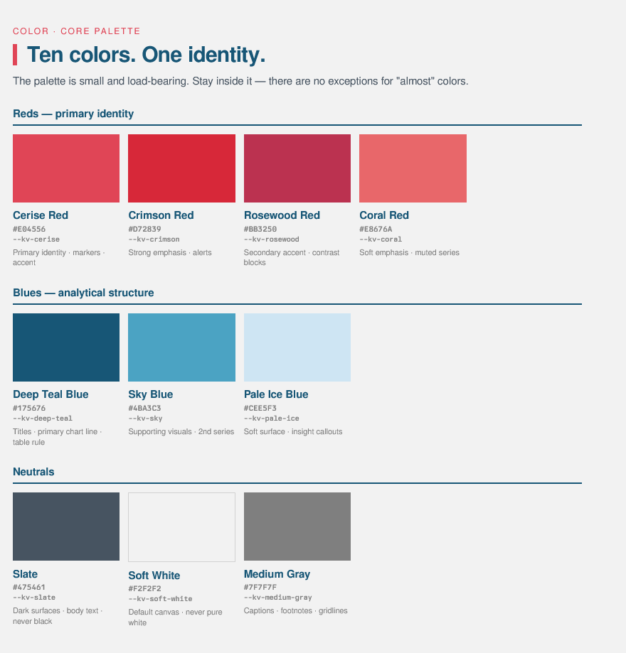

### Reds — primary identity

| Color | Hex | Token | Role |
|---|---|---|---|
| Cerise Red | `#E04556` | `--kv-cerise` | Primary identity · markers · the one number that matters |
| Crimson Red | `#D72839` | `--kv-crimson` | Strong emphasis · alerts · negative deltas |
| Rosewood Red | `#BB3250` | `--kv-rosewood` | Secondary accent · contrast blocks |
| Coral Red | `#E8676A` | `--kv-coral` | Soft emphasis · muted chart series |

### Blues — analytical structure

| Color | Hex | Token | Role |
|---|---|---|---|
| Deep Teal Blue | `#175676` | `--kv-deep-teal` | Titles · primary chart line · table rule |
| Sky Blue | `#4BA3C3` | `--kv-sky` | Supporting visuals · second series |
| Pale Ice Blue | `#CEE5F3` | `--kv-pale-ice` | Soft surface · insight callouts (the only soft fill) |

### Neutrals

| Color | Hex | Token | Role |
|---|---|---|---|
| Slate | `#475461` | `--kv-slate` | Dark surfaces · body text — **never** black |
| Soft White | `#F2F2F2` | `--kv-soft-white` | Default canvas — **never** pure white |
| Medium Gray | `#7F7F7F` | `--kv-medium-gray` | Captions · footnotes · gridlines |

> [!warning] Hard rules
> - Backgrounds are **Soft White** (`#F2F2F2`), not white. Dark surfaces are **Slate**, not black.
> - **Pale Ice Blue is the only soft fill.** Don't tint other colors to make pastels.
> - No gradients, anywhere.

---

## 3 · Color — data visualization

> [!important] The rule that changed
> For **categorical charts**, the number of series decides which palette governs. Up to three series, the core palette leads. **Past three categories the two-color core pairing stops separating cleanly, so an extended data-viz ramp _takes precedence_.**

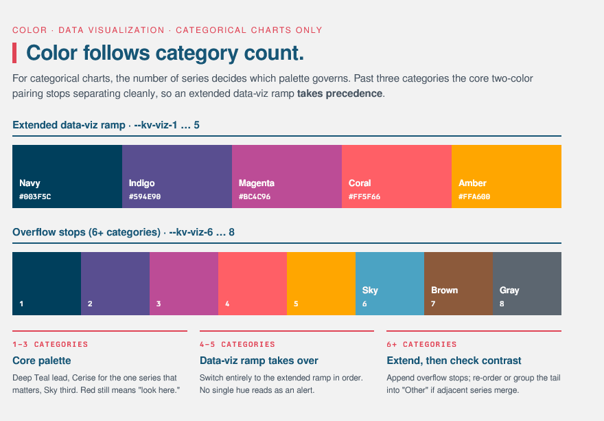

### Precedence by category count

| Categories | Palette | Notes |
|---|---|---|
| **1–3** | Core palette | Deep Teal lead, Cerise for the one series that matters, Sky third. Red still means "look here." |
| **4–5** | **Extended data-viz ramp** | Switch entirely to `--kv-viz-1…5` in order. No single hue reads as an alert. |
| **6+** | Ramp + overflow stops | Append `--kv-viz-6…8`, then check contrast. Re-order or group the tail into "Other" if adjacent series merge. |

### Extended ramp · `--kv-viz-1 … 5`

A perceptually-spaced 5-stop ramp (navy → indigo → magenta → coral → amber).

| Stop | Hex | Token |
|---|---|---|
| Navy | `#003F5C` | `--kv-viz-1` |
| Indigo | `#594E90` | `--kv-viz-2` |
| Magenta | `#BC4C96` | `--kv-viz-3` |
| Coral | `#FF5F66` | `--kv-viz-4` |
| Amber | `#FFA600` | `--kv-viz-5` |

### Overflow stops (6+ categories) · `--kv-viz-6 … 8`

| Stop | Hex | Token |
|---|---|---|
| Sky | `#4BA3C3` | `--kv-viz-6` |
| Warm brown | `#8C5A3B` | `--kv-viz-7` |
| Cool gray | `#5C6670` | `--kv-viz-8` |

> [!tip]
> The ramp is for **categorical** encoding only. For sequential or diverging data, build a single-hue scale from Deep Teal or Cerise instead.

---

## 4 · Type — families

Two faces for words, one for figures, one for code. Hierarchy comes from size and color — not from swapping weights inside a family.

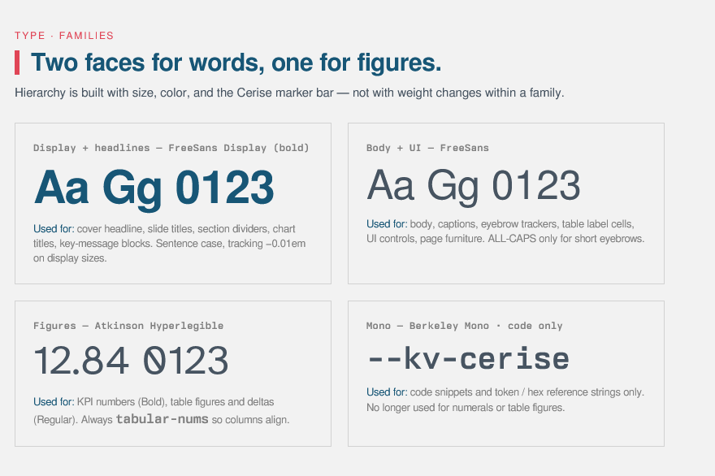

| Role | Family | Token | Used for |
|---|---|---|---|
| Display / headlines | **FreeSans Display** (bold cut) | `--font-condensed` | Cover headline, slide titles, section dividers, chart titles, key-message blocks |
| Body / UI | **FreeSans** | `--font-sans` | Body, captions, eyebrow trackers, table label cells, UI controls |
| Figures | **Atkinson Hyperlegible** | `--font-figure` | KPI numbers (Bold), table figures & deltas (Regular) — always `tabular-nums` |
| Mono | **Berkeley Mono** | `--font-mono` | **Code snippets and token/hex strings only** |

> [!note] What changed
> - **FreeSans / FreeSans Display** is the type system (open-source, Helvetica-class). `FreeSans Display` is simply the **bold** cut, used for every headline.
> - **Atkinson Hyperlegible** carries all **figures** — KPI numbers and table cells — for at-a-glance legibility with `tabular-nums`.
> - **Berkeley Mono** is now confined to **code snippets**. It is no longer used for numerals or table figures.

---

## 5 · Type — scale & usage

Deck-scale baseline is 1920×1080. Titles are sentence case; tracking tightens to `-0.01em` at display sizes; eyebrows are the only uppercase.

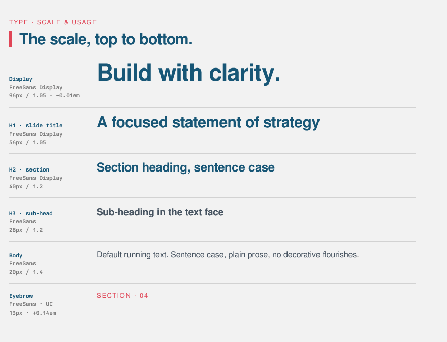

| Step | Family | Size / line-height | Token |
|---|---|---|---|
| Display | FreeSans Display | 96 / 1.05 · `-0.01em` | `--fs-display` |
| H1 · slide title | FreeSans Display | 56 / 1.05 | `--fs-h1` |
| H2 · section | FreeSans Display | 40 / 1.2 | `--fs-h2` |
| H3 · sub-head | FreeSans (bold) | 28 / 1.2 | `--fs-h3` |
| Body large | FreeSans | 24 / 1.4 | `--fs-body-lg` |
| Body | FreeSans | 20 / 1.4 | `--fs-body` |
| Caption | FreeSans | 16 / 1.4 | `--fs-caption` |
| Eyebrow | FreeSans · UC · `+0.14em` | 13 | `--fs-eyebrow` |

> [!warning] Minimums
> On 1920×1080 slides, never go below **24px**. In print, **12pt** is the floor.

---

## 6 · Spacing, lines & markers

A 4-based spacing scale, and a deliberate vocabulary of lines instead of boxes. KV is rectilinear by default.

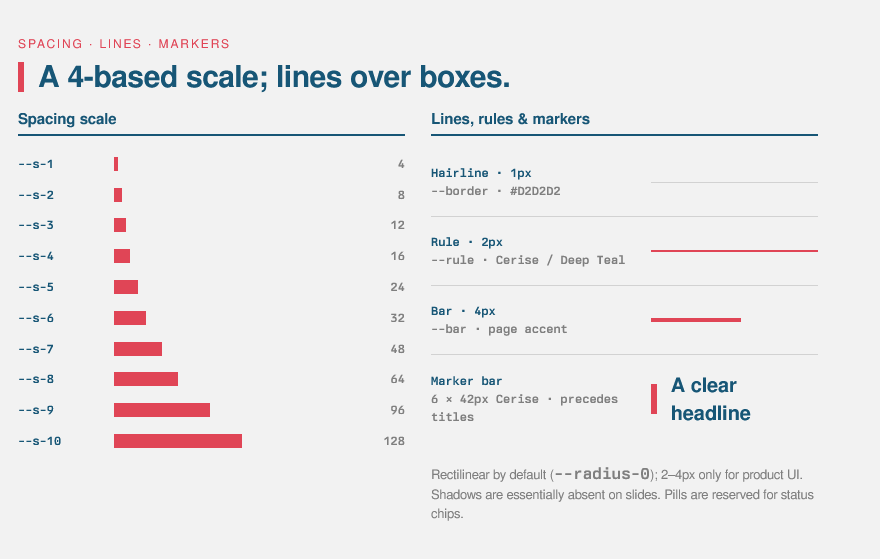

### Spacing scale

| Token | px | Token | px |
|---|---|---|---|
| `--s-1` | 4 | `--s-6` | 32 |
| `--s-2` | 8 | `--s-7` | 48 |
| `--s-3` | 12 | `--s-8` | 64 |
| `--s-4` | 16 | `--s-9` | 96 |
| `--s-5` | 24 | `--s-10` | 128 |

### Lines, rules & markers

| Element | Spec | Token |
|---|---|---|
| Hairline | 1px · `#D2D2D2` | `--hairline` / `--border` |
| Rule | 2px · Cerise or Deep Teal | `--rule` |
| Bar | 4px · page accent | `--bar` |
| Marker bar | 6 × ~42px Cerise block before a title | (compose with `--bar`) |

> [!note] Shape & elevation
> Default radius is **0** (`--radius-0`); use 2–4px only for product UI. Shadows are essentially absent on slides — `--shadow-1/2` exist for product surfaces only. Pills (`--radius-pill`) are reserved for status chips.

---

## 7 · Components

Buttons, badges, KPI tiles, tables, and callouts — the working parts of a KV deck or doc.

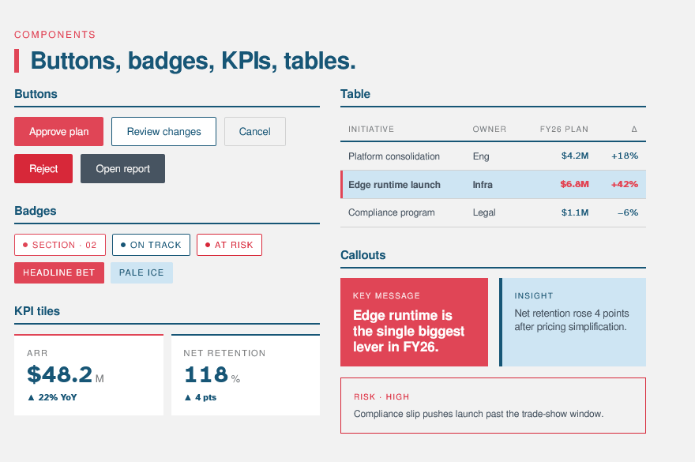

- **Buttons** — Primary (Cerise fill), Secondary (Deep Teal outline), Ghost (hairline), Danger (Crimson), Inverse (Slate). 2px radius max.
- **Badges / status chips** — pill shape, hairline or solid; Cerise / Teal / Crimson dots for section, on-track, at-risk.
- **KPI tiles** — Atkinson Hyperlegible **Bold** number with a small `--font-sans` unit; 2px top rule in Cerise (or Deep Teal for secondary). Deltas in Atkinson, Crimson when negative.
- **Tables** — Deep Teal 2px header rule, hairline row dividers, figure cells right-aligned in Atkinson with `tabular-nums`. Emphasis row gets a Pale Ice fill + Cerise edge bar.
- **Callouts** — Key message (Cerise block, white text), Insight (Pale Ice with Deep Teal edge), Risk/alert (Crimson hairline).

---

## 8 · Charts

Make the point, then move on. Minimal gridlines, labeled directly where possible, source line in Medium Gray. The series count drives the palette (see [3 · Color — data visualization](#3-color-data-visualization)).

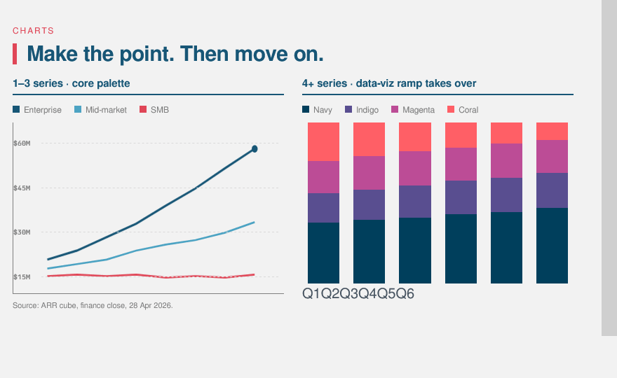

- **1–3 series** use the core palette — Deep Teal lead, Cerise for the series that matters, Sky third.
- **4+ series** switch entirely to the extended data-viz ramp so no single hue reads as an alert.
- Always cite the source in a Medium Gray caption beneath the chart.

---

## 9 · Process & timeline

Flows and timelines use numbered steps, a thin baseline, and Cerise to mark "done / now."

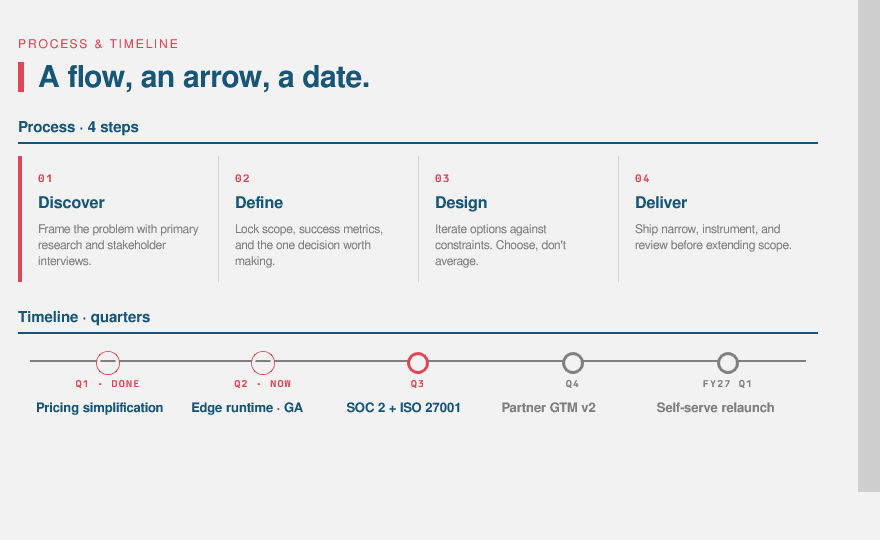

- **Process** — numbered steps (`01`–`0n`), first step gets the Cerise edge; titles in FreeSans Display, descriptions in FreeSans.
- **Timeline** — a 2px baseline with filled Cerise nodes for past/current milestones and hollow nodes for upcoming; quarter labels in mono, milestone labels in FreeSans Display.

---

## 10 · Slide masters

Ten masters cover the recurring jobs of an executive deck. Cover is on Cerise; the section divider is on Slate; everything else sits on Soft White.

**01 · Title (cover on Cerise)**

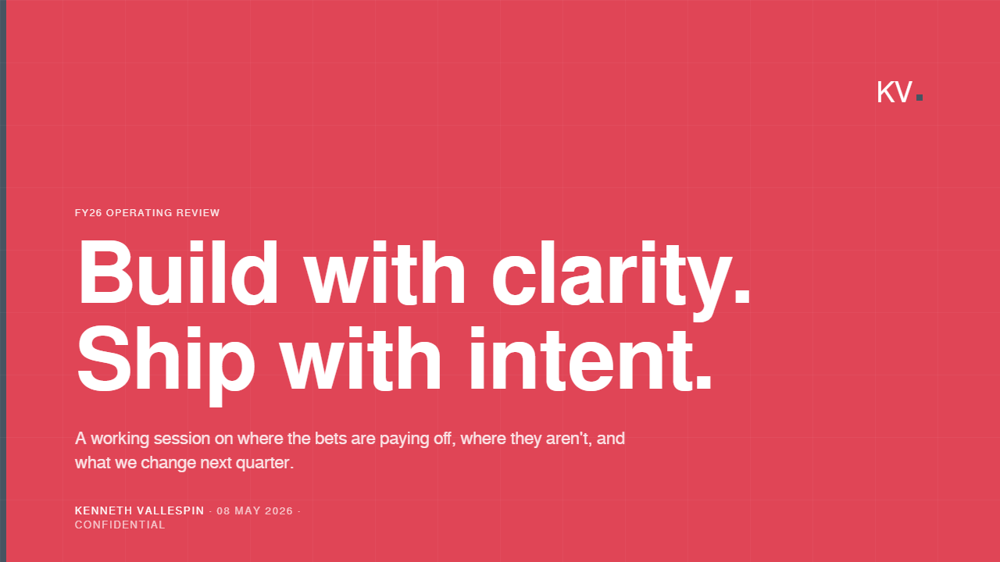

**02 · Section divider (on Slate)**

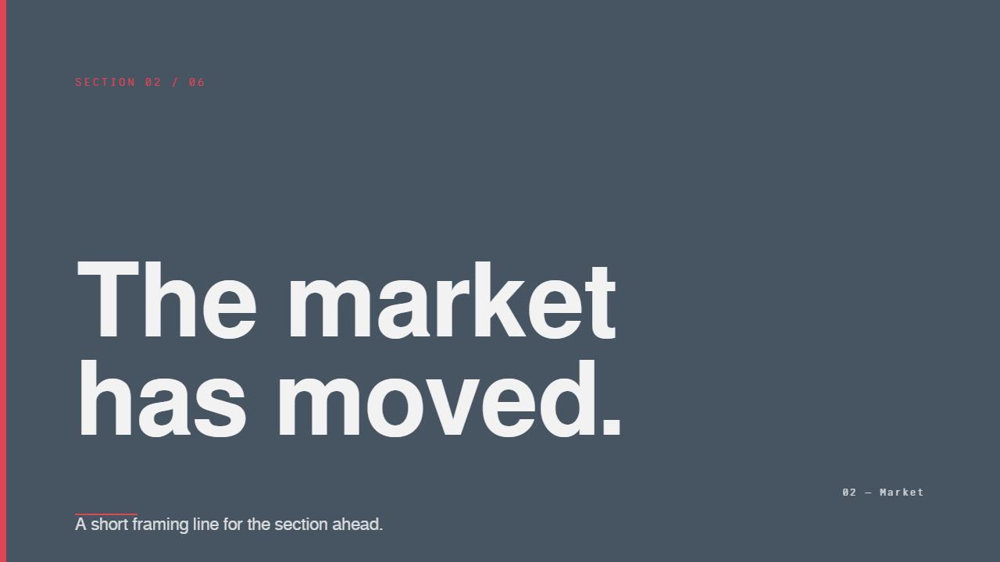

**03 · Executive summary**

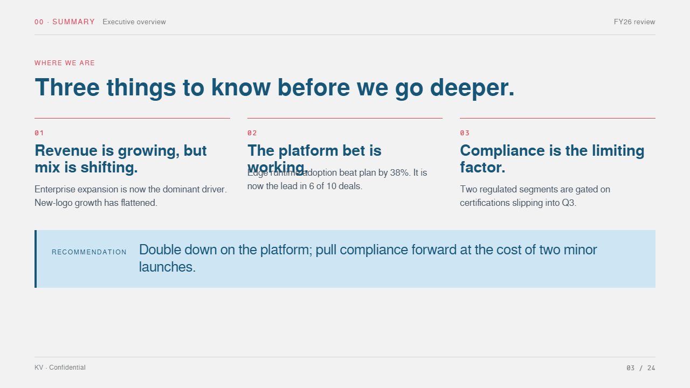

**04 · One message**

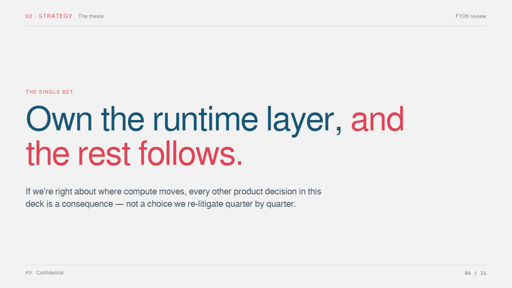

**05 · Two column**

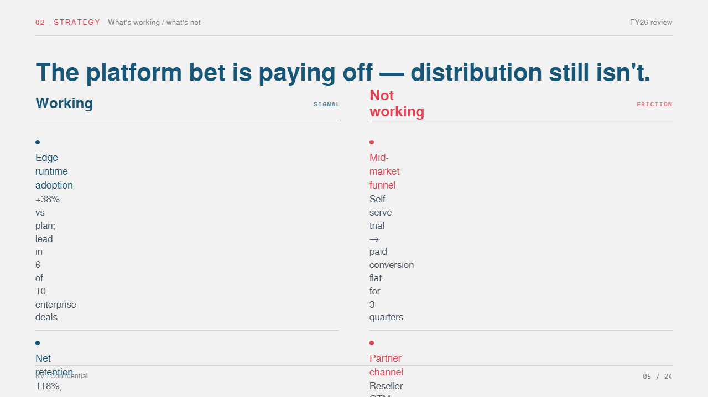

**06 · Chart**

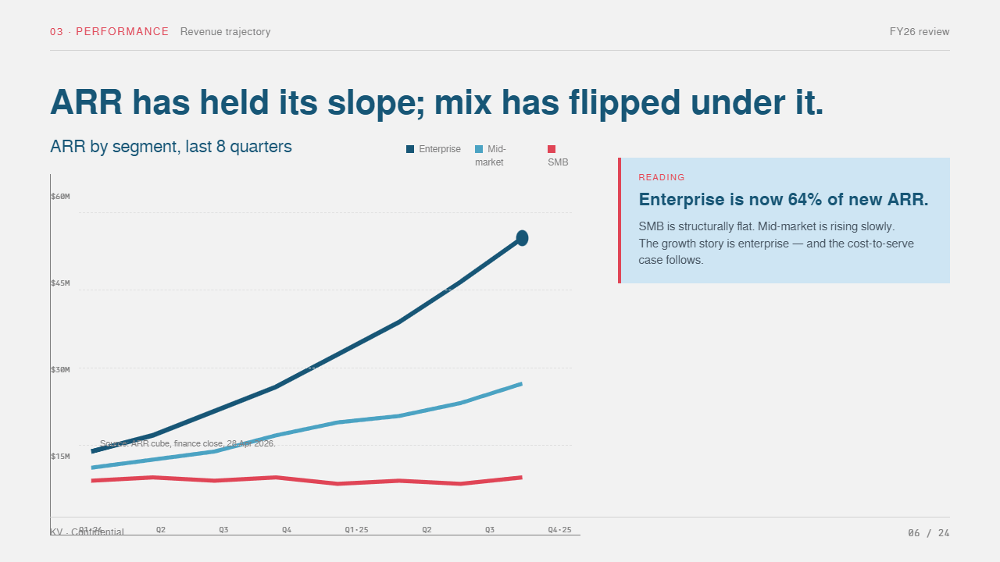

**07 · Table**

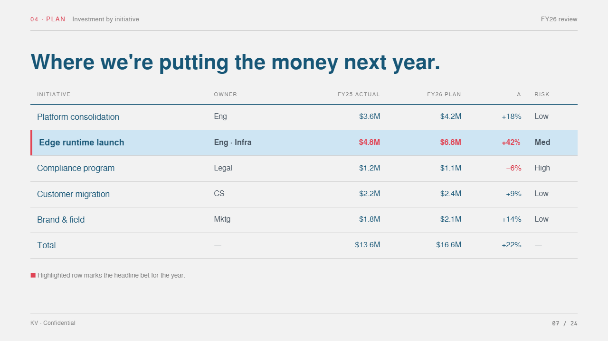

**08 · Timeline**

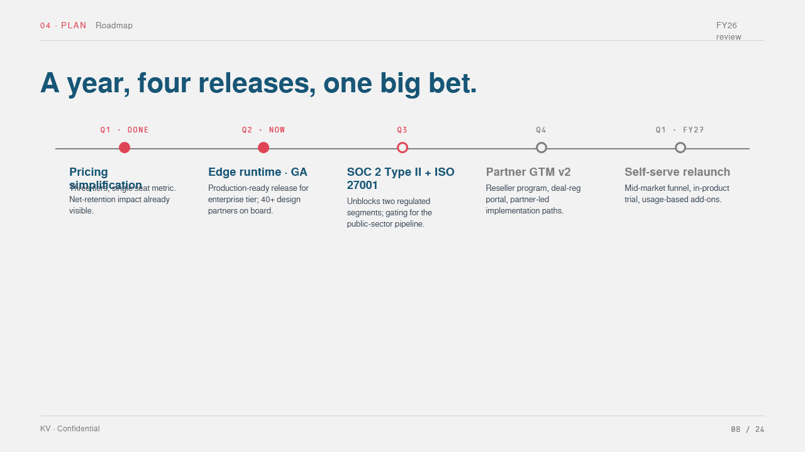

**09 · Recommendation**

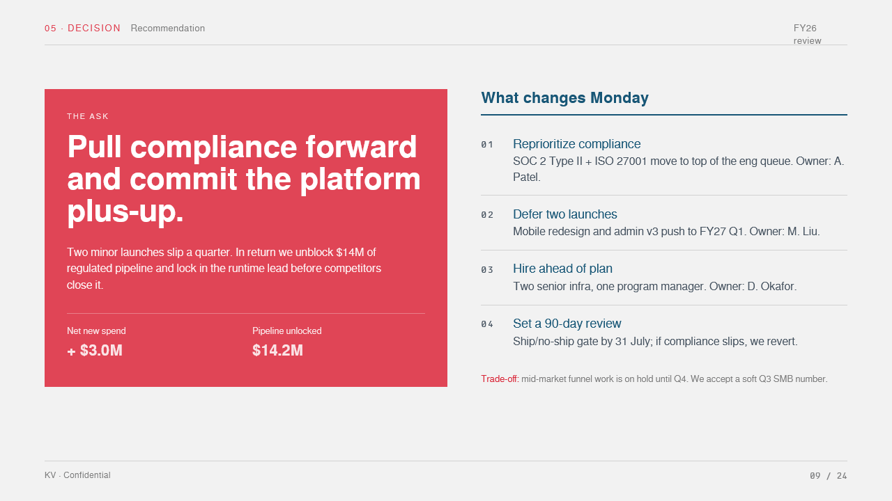

**10 · Closing (on Slate)**

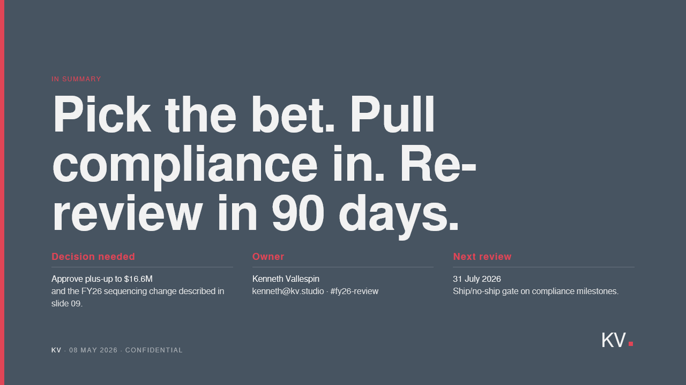

---

## 11 · Voice & content

Clear, sentence-case, executive-direct. Lead with the decision or the number; support with one line of context. No filler, no hype.

| Instead of | Write |
|---|---|
| "Leveraging Synergies to Drive Growth" | "Edge runtime is the biggest FY26 lever." |
| "Q3 Performance Overview Deck" | "Q3: retention up 4 points, churn flat." |
| "ARR is looking really strong!!" | "ARR $48.2M, up 22% YoY." |

> [!tip] Defaults
> - Sentence case for every title and heading.
> - One idea per slide; the title states the takeaway.
> - Numbers in Atkinson Hyperlegible with `tabular-nums` so columns align.
> - No emoji.

---

## 12 · Do & don't

> [!success] Do
> - Use Cerise sparingly — for the single most important thing on the surface.
> - Build hierarchy with size, color, and the marker bar.
> - Switch to the data-viz ramp the moment a chart exceeds 3 series.
> - Keep figures in Atkinson; keep code in Berkeley Mono.
> - Sit content on Soft White; use Slate for dark surfaces.

> [!failure] Don't
> - Don't use pure black or pure white.
> - Don't add gradients, drop shadows on slides, or rounded "card" tropes.
> - Don't tint colors into pastels — Pale Ice is the only soft fill.
> - Don't use Berkeley Mono for numbers or table figures.
> - Don't use Title Case or ALL CAPS (except short eyebrows).

---

## 13 · Token reference

Mirror of `colors_and_type.css`. When in doubt, the CSS file wins.

```css
/* Reds — identity */
--kv-cerise:   #E04556;   --kv-crimson:  #D72839;
--kv-rosewood: #BB3250;   --kv-coral:    #E8676A;

/* Blues — structure */
--kv-deep-teal: #175676;  --kv-sky:      #4BA3C3;
--kv-pale-ice:  #CEE5F3;

/* Neutrals */
--kv-slate:      #475461; --kv-soft-white: #F2F2F2;
--kv-medium-gray:#7F7F7F;  --kv-white: #FFFFFF; --kv-black: #000000;

/* Data-viz ramp (categorical · >3 series takes precedence) */
--kv-viz-1: #003F5C;  --kv-viz-2: #594E90;  --kv-viz-3: #BC4C96;
--kv-viz-4: #FF5F66;  --kv-viz-5: #FFA600;
--kv-viz-6: #4BA3C3;  --kv-viz-7: #8C5A3B;  --kv-viz-8: #5C6670;

/* Type families */
--font-sans:      "FreeSans", "Helvetica Neue", Arial, sans-serif;
--font-condensed: "FreeSans Display", "FreeSans", Arial, sans-serif; /* display = bold cut */
--font-figure:    "Atkinson Hyperlegible", "FreeSans", Arial, sans-serif; /* numbers */
--font-mono:      "Berkeley Mono", "JetBrains Mono", ui-monospace, monospace; /* code only */

/* Type sizes (1920×1080 baseline) */
--fs-display:96px; --fs-h1:56px; --fs-h2:40px; --fs-h3:28px;
--fs-body-lg:24px; --fs-body:20px; --fs-caption:16px; --fs-eyebrow:13px;

/* Spacing (4-based) */
--s-1:4 --s-2:8 --s-3:12 --s-4:16 --s-5:24 --s-6:32 --s-7:48 --s-8:64 --s-9:96 --s-10:128

/* Shape / lines */
--radius-0:0; --radius-1:2px; --radius-2:4px; --radius-pill:999px;
--hairline:1px; --rule:2px; --bar:4px;
```

---

> [!quote]
> Build with clarity. Document with intent.

---

## Specification PDF

<iframe src="assets/kv-design-system/kv-design-system-specification.pdf" width="100%" height="760" title="KV Design System Specification PDF"></iframe>

[Download the KV Design System Specification PDF](assets/kv-design-system/kv-design-system-specification.pdf)
