# Unlocking the APEC Engineer

> A cleaned public note migrated from an older personal website backup. References to the former site branding and domain have been removed.

### A Professional Credential Journey to the APEC Engineer Register

## 1. Introduction

Hello and welcome to my blog! This one's another installment of my **UNLOCKING** series. This time, I'm sharing my experience on how I achieved the APEC Engineer title: The highest engineering credential for mobility and mutual recognition currently in existence in the Philippines and in the Asia-Pacific Economic Cooperation (APEC) member economies. At the time of my registration as an APEC Engineer (08 Dec 2017) I made sweeping personal records as the **76th person to be awarded the credential nationally** and the **12th Electronics and Communications Engineer** to do so. The cherry on top of this proverbial cake was the fact that **I was the youngest professional to enter the registry at the age of 31**. It was no easy feat but I pulled it off thanks to a solid qualification portfolio and many months of preparation and personal sacrifices. This is a detailed account for engineers who may be considering the same professional mobility pathway.

## 2. Asia-Pacific Economic Cooperation (APEC)

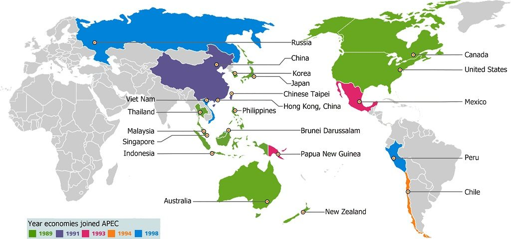

*APEC Member Economies*

A cursory Wikipedia search yields the following entry on APEC:

> Asia-Pacific Economic Cooperation (APEC) is an inter-governmental forum for 21 Pacific Rim member economies that promotes free trade throughout the Asia-Pacific region. Inspired from the success of Association of Southeast Asian Nations (ASEAN)'s series of post-ministerial conferences launched in the mid-1980s, the APEC was established in 1989 in response to the growing interdependence of Asia-Pacific economies and the advent of regional trade blocs in other parts of the world; and to establish new markets for agricultural products and raw materials beyond Europe. Headquartered in Singapore, the APEC is recognized as one of the oldest forums and highest-level multilateral blocs in the Asia-Pacific region, and exerts a significant global influence. [https://en.wikipedia.org/wiki/Asia-Pacific_Economic_Cooperation](https://en.wikipedia.org/wiki/Asia-Pacific_Economic_Cooperation)

## 3. The APEC Agreement (International Engineering Alliance)

The APEC Agreement recognises the substantial equivalence of competence standards for professional engineers within the APEC economies:

> The APEC agreement is in place between a number of APEC countries for the purposes of recognizing "substantial equivalence" of professional competence in engineering. APEC countries can apply to become members of the agreement by demonstrating that they have in place systems which allow the competence of engineers to be assessed to the agreed international standard set by the APEC Engineer agreement. Registration on the IPER register with APEC Engineer ensures that professional engineers have the opportunity to have their professional standing recognized within the APEC region thereby contributing to the globalization of professional engineering services. This is of particular benefit to engineering firms that are providing services to other APEC economies but it also adds value to individuals who may wish, at some stage, to work in these economies. Each member economy of the APEC agreement has given an undertaking that the extra assessment required to be registered on the local professional engineering register will be minimized for those registered under the APEC Engineer agreement. [http://www.ieagreements.org/agreements/apec/](http://www.ieagreements.org/agreements/apec/)

The APEC Engineer, developed under the Asia-Pacific Economic Co-operation (APEC) Human Resources Development Working Group, is an initiative to facilitate mobility of professional engineers among the APEC Economies. The purpose of APEC Engineer project is to set up a framework to facilitate future bilateral or multilateral recognition of professional qualifications in accordance with free wishes of each individual economy. The APEC Economies recognize that any agreement, which would confer exemption, in whole or in part, upon APEC Engineers from further assessment by the statutory bodies that control the right to practice in each economy, could be concluded only with the involvement and consent of those statutory bodies and the relevant governments. The APEC Engineer Coordinating Committee recommends that relevant governments pursue this within the broader APEC framework. The APEC Economies note that only complete or partial exemption from assessment mechanisms operating within the jurisdiction in which an APEC Engineer seeks to become licensed or registered is at issue, not exemption from the requirement to become licensed or registered in the economy concerned. Initially Hong Kong, China, Australia, Canada, Indonesia, Korea, Malaysia, New Zealand, Philippines, Thailand and the United States have been authorized by the APEC Engineer Coordinating Committee to implement APEC Engineer Register in their own economies. The list has since increased with more countries joining the APEC.

## 4. APEC Engineering Register – Philippines

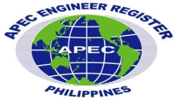

The **APEC Engineering Register – Philippine Section** is administered by the **National Monitoring Committee (NMC)** composed of (1) the **Professional Regulation Commission (PRC)**, (2) the **Commission on Higher Education (CHED)**, and the (3) **Philippine Technological Council (PTC)**. The **NMC** have taken steps ahead in developing the standards of competence for advanced level of professional practice in the technological disciplines. Applicants and registrants alike are all subject to the NMC's highest standards of professional excellence and competence and decides whether or not to admit a candidate to the registry. The complete history and useful further readings of the Philippine APEC Engineering Register and the APEC Competency Standards can be found [here](https://www.prc.gov.ph/uploaded/documents/APEC_Handbook_2003.pdf).

## 5. Requirements for Registration

I referred to the high level requirements for registration from the [APEC Engineer Application Form and Guidelines for Applicants Form (Annex A)](https://ptc.org.ph/apec-application-form/). These requirements are listed below:

- The applicant should have attended and completed an accredited or recognized engineering program by the appropriate authority in the country.
- Been assessed as eligible for independent practice.
- The Assessment maybe undertaken by the Monitoring Committee, by a competent Professional Association and/or by an authority with responsibility for registration or licensing of professional engineers.
- Gained a minimum of seven years (7) of professional experience after registration.
- The works in question should be clearly relevant to the fields of engineering in which the applicant claims experience.
- Should have participated in a range of roles and activities appropriate to these fields of engineering.
- Spent at least two (2) years in responsible charge of significant Engineering Work.
- The Work should have required the exercise of independent engineering judgement, the project concerned should have been substantial in duration, cost and complexity and the applicant should be personally accountable for the success or failure of the project.
- In general, an applicant may be taken to have been in responsible charge of significant engineering work when they have:
  - Planned, designed, coordinated & executed a small project; or
  - Undertaken part of a larger project based on an understanding of the whole project; or
  - Undertaken novel, complex and/or multi-disciplinary work.
- Maintained their continuing professional development at a satisfactory level.
- Bound by the established Code of Professional Conduct or Ethics.
- Held individually accountable for their actions as a professional engineer.

## 6. The Application Process

I created the flowchart below from memory. It may or may not be updated. Best to check directly with the **Philippine Technological Council** (PTC) or your **Engineering Professional Organization** (EPO) / **Accredited Professional Organization** (APO). I take no responsibility for any inaccurate or inexact APEC Engineer application brought about by information shown in the flowchart. This is meant to be a high-level guide and not a detailed walkthrough. Remember, Google is your friend.

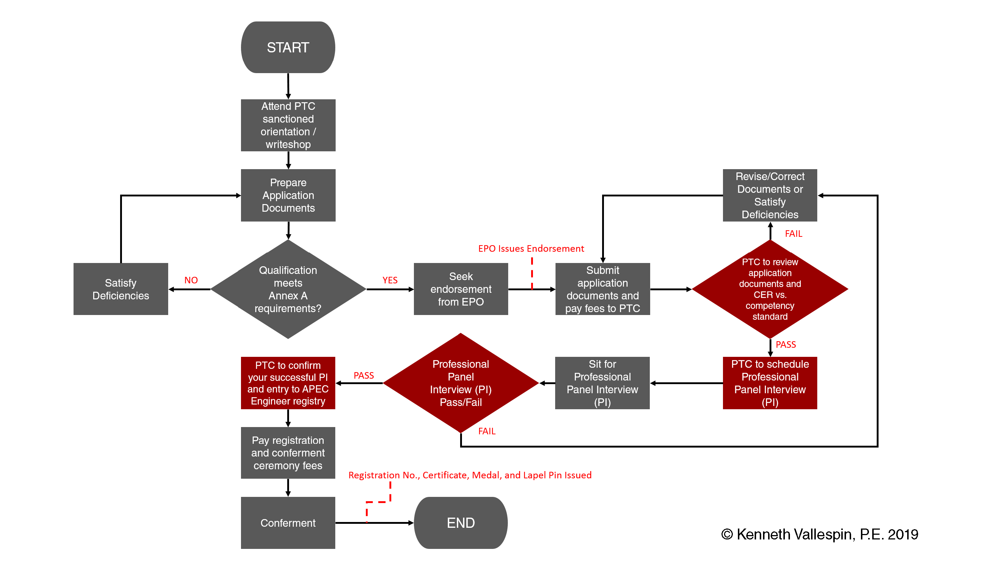

*APEC Engineer Application Process Flow*

This is basically the entire process in a nutshell. This route is, more or less, what you need to take to be registered in the Philippine Section of the APEC Engineering Register. For the most part, documentation and requirements should be straightforward, save for three challenging parts: **EPO Endorsement**, **Engineering Practice Reporting (EPR)**, and **Panel of Experts Interview (PI)**. I'm going to try and shed some light on these three aspects and hopefully help you navigate these areas easily.

### 6.1 Engineering Professional Organization (EPO) Endorsement

Most Engineering Professional Organizations (EPOs) will require you to secure an endorsement letter authorizing you to move forward with your application as an APEC Engineer. Suffice it to say, it is the EPOs way of ensuring that you are (1) an active member of the organization, (2) without back dues or (2) without outstanding complaints and (4) you are able to satisfy the organization's internal standards and requirements to apply for advanced level engineering upgrade. Before submitting any application to NMC/PTC, make sure to run your application with your respective EPOs first. Accredited Professional Organizations (APO)/ Engineering Professional Organizations (EPO) that are members of the Philippine Technological Council (PTC) are listed as follows:

- [Society of Aerospace Engineers of the Philippines (SAEP)](http://www.saep.com.ph/)
- [Philippine Society of Agricultural Engineers (PSAE)](https://www.tpb.gov.ph/alpha-listing/philippine-society-of-agricultural-engineers-psae/)
- [Philippine Institute of Civil Engineers (PICE)](http://pice.org.ph/)
- [Philippine Institute of Chemical Engineers (PIChE)](https://www.pichenet.org/index.html)
- [Institute of Integrated Electrical Engineers (IIEE)](https://www.iiee.org.ph/)
- [Institute of Electronics Engineers of the Philippines (IECEP)](https://iecep.ph/)
- [Geodetic Engineers of the Philippines (GEP)](http://www.geodeticengineer.org.ph/)
- [Philippine Society of Mechanical Engineers (PSME)](https://psme.org.ph/)
- [Society of Metallurgical Engineers of the Philippines (SMEP)](https://www.smep.org.ph/)
- [Philippine Society of Mining Engineers (PSEM)](https://www.psem.ph/)
- [Society of Naval Architects and Marine Engineers (SONAME)](http://soname.org/main/)
- [Philippine Society of Sanitary Engineers (PSSE)](https://www.facebook.com/pages/category/Company/Philippine-Society-of-Sanitary-Engineers-Inc-117596125092275/)
- [Philippine Institute of Industrial Engineers (PIIE)](https://www.piie.org/)

Contacting them wouldn't hurt your chances at all and could even help you fast-track your application after satisfying and meeting your respective EPOs requirements.

### 6.2 Engineering Practice Report (EPR)

When I set out to fill the Engineering Practice Report for the APEC Engineer registration application form, I found a [guide online](https://www.theiet.org/media/3006/cengieng-guidance-v61-apr-2018.pdf) from the Institute of Engineering and Technology (UK) that pointed me on the right direction, I followed this to the letter and it did not disappoint. I was able to craft my statements clearly and effectively. Have a read: The most important task on which any assessment for professional registration is based is to complete a detailed description of each employment role following the advice set out below.

- This part of your application is particularly important and you need to present your evidence carefully and concisely. Remember that **your objective is to 'sell' yourself to the interviewers in your application form**, so that before you walk into the interview they already think you are registrable and all they have to do is confirm your competence.
- Detail your main responsibilities and personal contributions rather than a bland job description. You should aim to provide roughly 3000 characters as it is unlikely that less will adequately demonstrate your relevant experience.
- Remember when presenting evidence:
  - Keep it personal, i.e. talk about your own achievements, not what the team did.
  - Use terms such as "I led, designed, built, tested, negotiated, presented, implemented, achieved……."
  - Avoid use of jargon and unnecessary or unexplained abbreviations.
  - Use language that can be understood by someone who is not a specialist in your field.
  - Use words like "I designed the XYZ system" rather than "the XYZ system was designed" so that you are clearly stating who did what and emphasizing your own individual role.
- Give an extended description of your current role, or the role that is most relevant to the demonstration of your current competence, giving details of your responsibilities together with any relevant metrics. You should aim to be very specific in your examples and if you have held lots of different roles, you should select examples that best illustrate your competence.
- Indicate the size and complexity of the projects or tasks for which you have had direct responsibility, and quantify any budget(s) for which you have had overall responsibility. Use numbers to show the size and scale of your responsibility; for example, numbers of people supervised, or the value in financial terms of the activity for which you were responsible.
- Remember that the information in your application will be used as an agenda for the interview, therefore it is in your own interest to give a full and clear summary of your responsibilities and competence, otherwise time will be wasted while the interviewers try and understand facts which should be in your application.
- When you have submitted your application, it will be checked by PTC staff and then reviewed to determine if there is sufficient evidence of your competence to progress to a Panel of Experts Interview, or if further evidence of your competence is needed.
- The Assessors will be looking to identify there is the following evidence within your career history:
  - Sufficient background to explain the context in which you made technical / engineering decisions.
  - Examples of how you present technical information e.g. plans and diagrams for review by other engineers in your field.
  - Description of a technical investigation, including the gathering of data, identifications of sources and explanation of results; and how you ensured the quality of the data used.
  - Investigation results; to include calculations / use of simulations, prototypes or engineering software that guided your technical / engineer's decisions.
  - Example of reasoned justification for technical / engineering decisions e.g. how the data is pulled together and the results of calculations.
  - Description of how a project outcome was reached and an indication of how technological changes would affect your methods or decisions.

I am more than happy to share my own APEC Engineer Application Form + Engineering Practice Report, but it's going to be in a heavily redacted form due to the nature of my work (Government/Military contracting) and to protect the privacy of my supporters and endorsers. If you wish to obtain a copy of this, feel free to reach out to the author. Introduce yourself and please mention your profession.

### 6.3 Panel of Experts Interview (PI)

Once your application portfolio has been submitted and the NMC/PTC staff has deemed your application complete in form, your application will now move forward and you will be invited to sit in the Panel of Experts Interview (see below). The panel of experts will consist of the members of the National Monitoring Committee and the participation of at least one interviewer who is an expert in your field or profession (usually, a member of your Professional Regulatory Board).

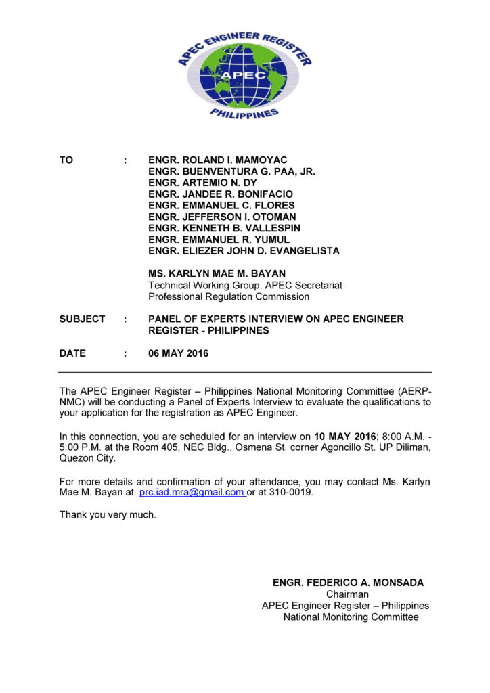

*Panel of Experts Interview Invitation – pg. 1*

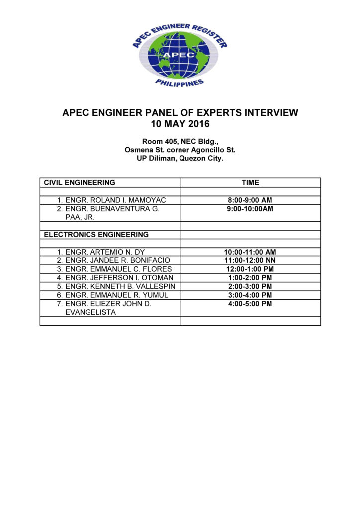

*Panel of Experts Interview Invitation – pg. 2*

The professional panel interview is I think the most fun I've ever experienced in my APEC Engineer journey. I was interviewed by representatives from the National Monitoring Committee (PTC, PRC, and CHED). The interview (conducted fully in English) lasted for a little over an hour and it covered a lot of areas in my professional career. The agenda of the interview will be nothing more that what you submitted in the application with a particular focus on the Engineering Practice Report (EPR).

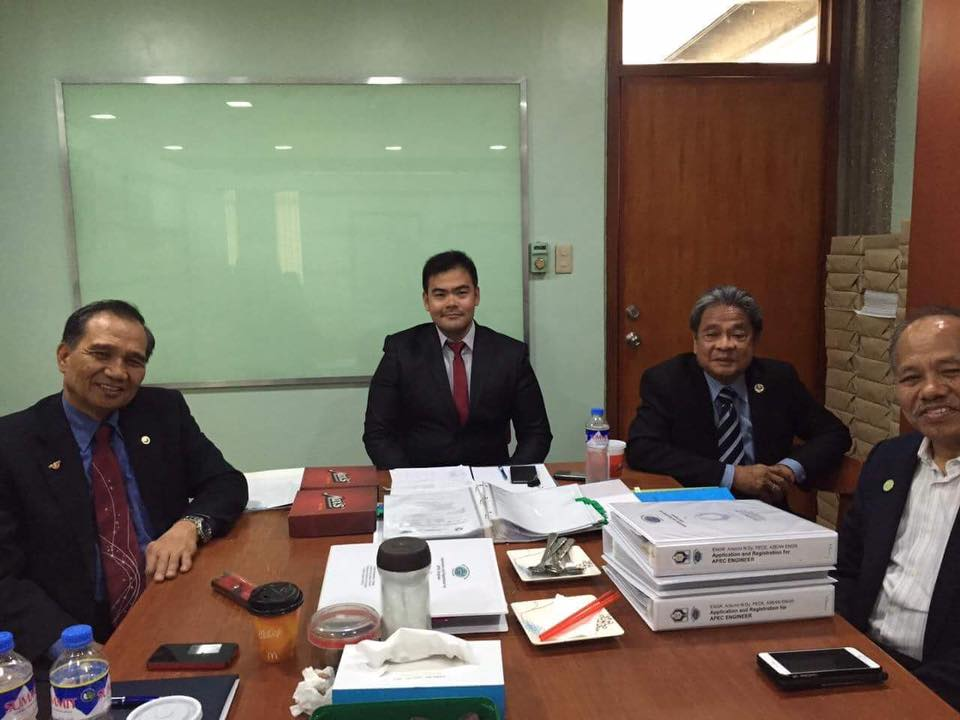

The **Author** (Center) flanked by **Engr. Herminio Orbe** – Member, Professional Regulatory Board of Electronics Engineering, PRC (Left), **Engr. Romulo Agatep** – Country Registrar, PTC (2nd from Right) and **Engr. Federico Monsada** – President, PTC (Right). Photo taken during the author's APEC Engineer Professional Panel Interview at the National Engineering Center, University of the Philippines, Diliman (10 May 2016).

The panel of interviewers were very cool and accommodating and were nothing short of helpful; I was made comfortable for the entirety of the interview. In fact, they will not be there to subject you under tight scrutiny nor put you in a stressful situation, instead, they are there to help you bring the best out of your experience and qualifications and steer you into highlighting how your application meets the APEC Engineer Competence Standard. My advice, keep it simple, do not deluge the panel with vague statements and unnecessary jargon. Keep the interview personal. Highlight your achievements, professional accomplishments, problem solving strategies for tasks/projects handled in the past and I can almost assure you that you will enjoy the ride that is the Panel of Experts Interview.

## 7. APEC Engineer Registration and Conferment

As you might have guessed by now, I passed the Panel of Experts Interview. I am now one step away from earning the APEC Engineer title (waiting game starts at this stage). I received an official notice from the NMC confirming my acceptance to the registry.

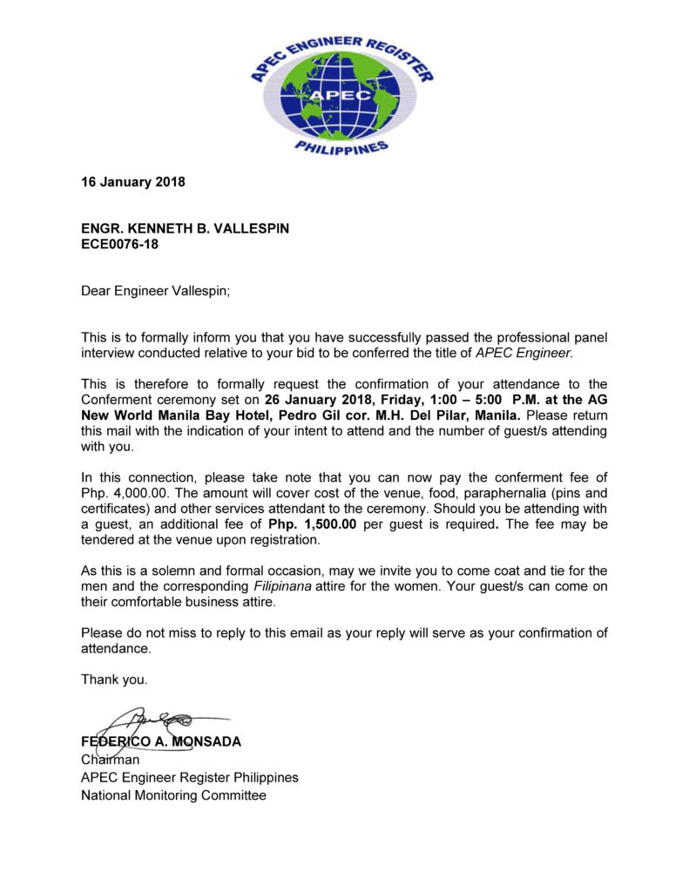

*Official Notice of Acceptance and Conferment Invitation*

I was over the moon upon reading this and immediately arranged my travel to the Philippines to attend the conferment. Fast-forward 10 days, I was in Manila, attending the solemn conferment ceremony along with other APEC Engineer registrants.

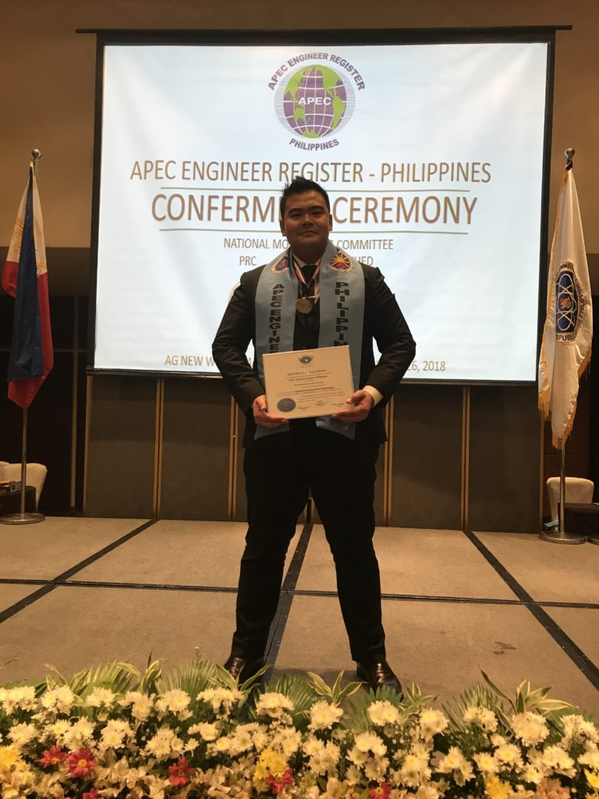

*The Author in an "obviously-beaming-with-pride" pose*

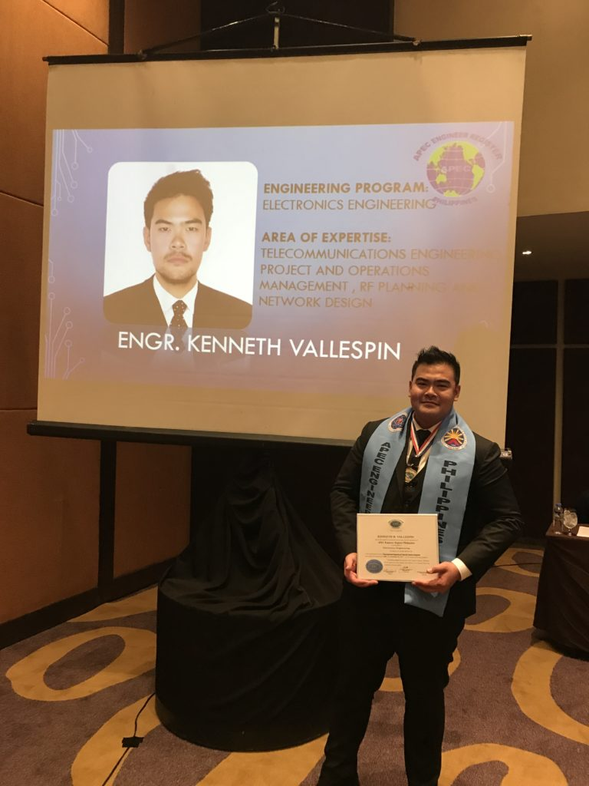

*Two years went by so fast for the Author*

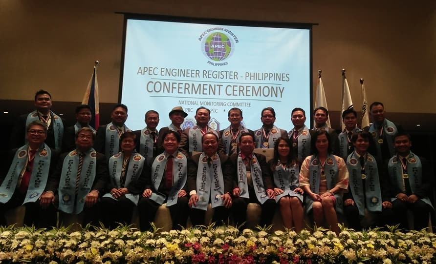

*APEC Engineer Conferees (2018) – Author (top left)*

On the day of the conferment we were given a super awesome **wall certificate**, a blue **stole** (similar to what priests would wear during mass), **a medal** with our name and registry number engraved at the back, and a **lapel pin**. It was all nice and fancy.

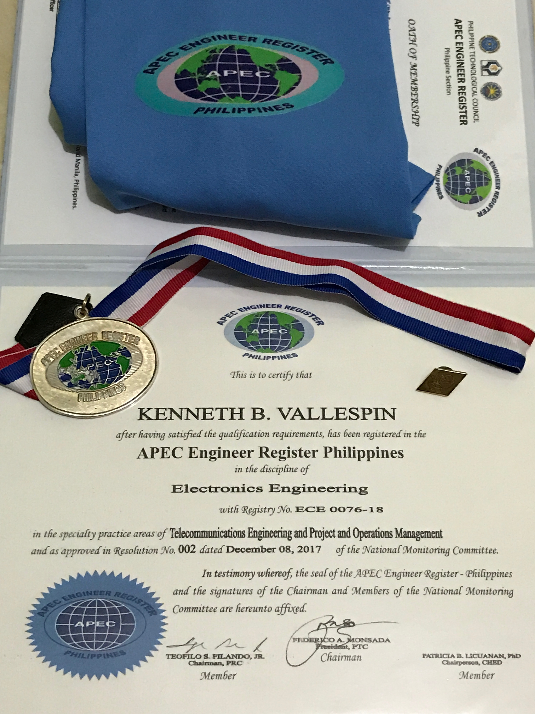

*APEC Engineer Conferment Gear — yay!*

## 8. Post-Conferment and Conclusion

Shortly after I was admitted into the APEC Engineer Registry, I was able to find my name listed on the registers maintained by the [Philippine Technological Council (PTC)](https://ptc.org.ph/apec-engineer-list/) and the [Professional Regulation Commission (PRC)](https://www.prc.gov.ph/sites/default/files/APEC%20REGISTER%20UPDATE%20NEW.pdf). A few months after the conferment I received another notice from the Philippine Technological Council requesting information to be submitted to the International APEC Registered Engineers Databank maintained by the International Engineering Alliance (IEA). I gladly complied and submitted my information to PTC.

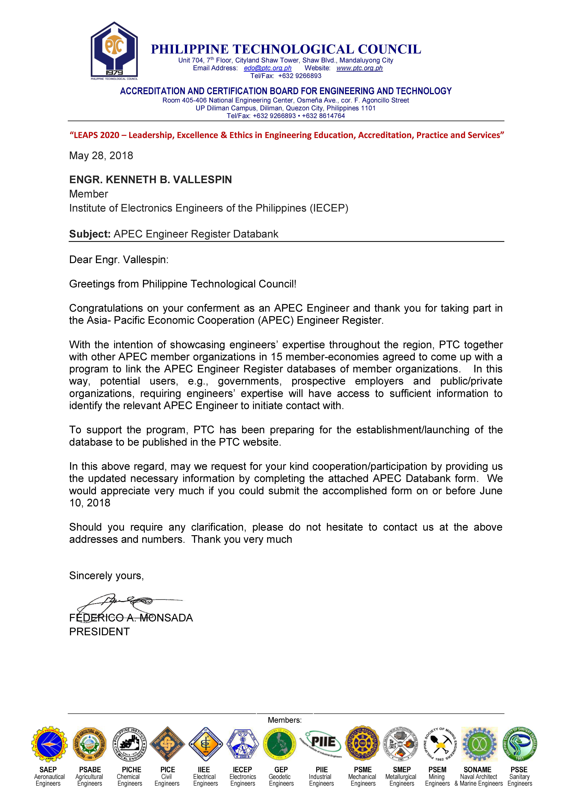

*Request for Database Information from PTC*

Imagine my surprise when a few days ago, as I was loitering online, I saw [the APEC Registered Engineers Databank](http://www.ieagreements.org/agreements/apec/apec-engineer-databank/)!

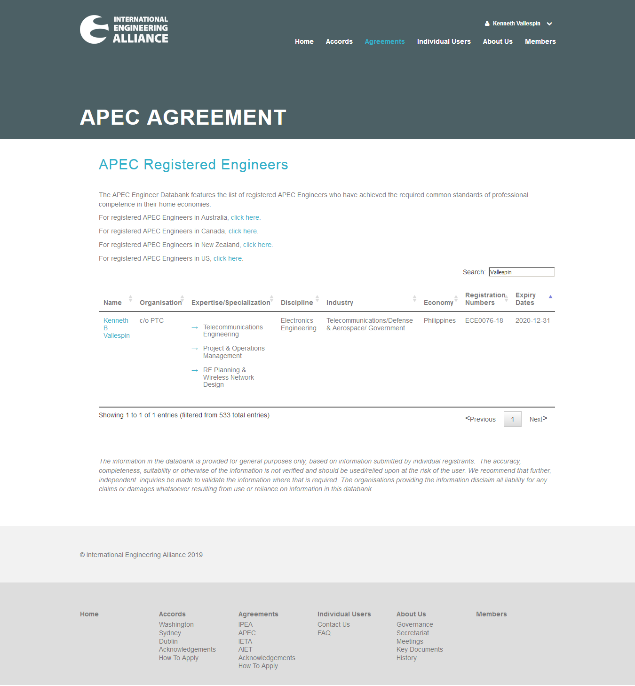

*International Engineering Alliance – APEC Registered Engineers Databank*

It was the final stroke that I was waiting for: To be recognized by my peers and to be listed in the **International Engineering Alliance – APEC Registered Engineers Databank**. **I am now recognized internationally and I have this to show for it**. For me this is way more valuable than the goodies that I got from the conferment. This proof of competence can be viewed anytime by anyone in the planet and it is a humbling thought if you think about it. And with this final step, my long journey to become a full-fledged APEC Engineer has come to an end. I will rest for now and will eagerly wait for new challenges that will come my way. Feel free to reach the author with your questions.
