# Unlocking the P.E.

> A cleaned public note migrated from an older personal website backup. References to the former site branding and domain have been removed.

### **A Filipino Expat Engineer's Quest to Become a US Licensed Professional Engineer.**

Originally posted on June 18, 2019.

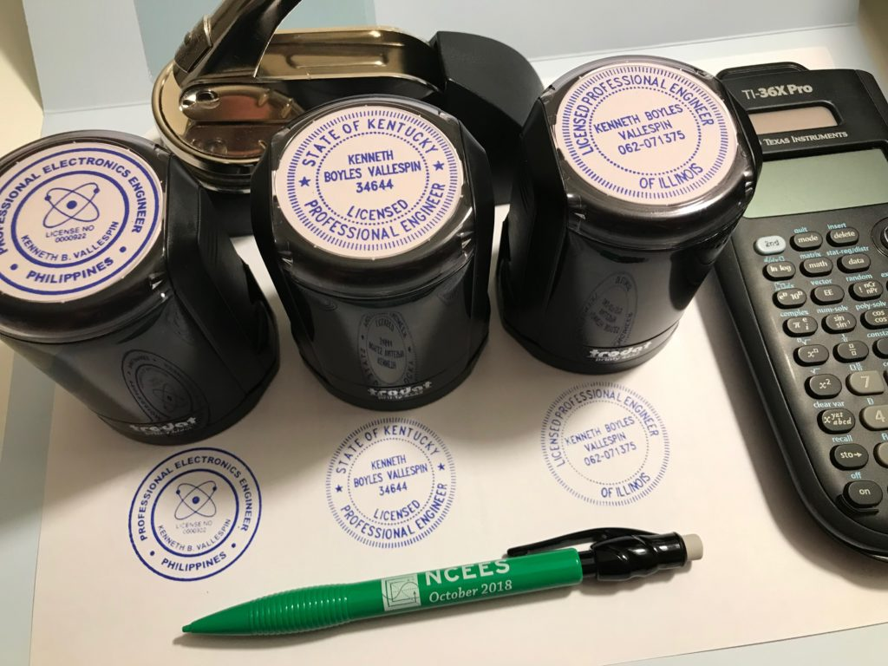

## 1. Introduction

I am Kenneth Vallespin, an engineer based in Saudi Arabia. This is the full account of my path to US professional engineering licensure, written for engineers considering the same goal. This is a long note, so please bear with me. Some details below might no longer be valid at the time of this writing as NCEES and state licensing board policies may change without any notice. ***Disclaimer**: All copyrighted materials referenced on this note belongs to their respective owners and the author claims no copyright violation/infringement.*

## 2. The Fundamentals of Engineering (FE) Exam

### 2.1 Exam Preparation (3 Months)

The very first decision that you need to make when preparing for the [NCEES FE Exam](https://ncees.org/engineering/fe/) is to know what exam you should sit for. The FE Exam is offered in seven disciplines (Chemical, Civil, Electrical and Computer, Environmental, Industrial and Systems, Mechanical, and Other Disciplines). Choose the discipline that suits your education and experience best. In my case, I'm an Electronics and Communications Engineering (BSECE) graduate so the natural choice would be to take the [FE Electrical and Computer Exam](https://ncees.org/wp-content/uploads/FE-Ele-CBT-specs.pdf). Reviewing for the FE is pretty straightforward. It basically boils down to 3 key elements:

- An optimized set of review materials (college textbooks, notes, handbooks, manuals, etc.)
- A reliable calculator (one that is compliant with the [NCEES calculator policy](https://ncees.org/exams/calculator/))
- Mastery of the [FE Reference Handbook](https://account.ncees.org/exam-prep/359). This is the official reference material for the computer-based FE exams. Review the handbook prior to exam day and familiarize yourself with the charts, formulas, tables, and other reference information provided. An electronic version will be available onscreen during the actual exam. Printed copies will not be allowed in the exam room.

Once you get a hang of these, then you're ready to face the FE exam with confidence. For the FE Exam review, my strategy went something like this:

- I registered on the NCEES website (myNCEES) to be able to get a free PDF copy of the reference manual. I printed the document and secured it in a ring binder.
- Come salary day, I actually shelled out money to buy materials from Amazon. The sort of materials with good reviews from successful FE test takers. I bought two different types of calculators (FX-991EX ClassWiz and the TI-36X Pro). I also bought a printed copy of of the FE Reference Handbook (just in case I pass and will need it for the PE Exam). My advice, don't buy it if you're short of funds. Stick with the PDF version. My last purchase for my self-review was the NCEES Electrical and Computer Practice Exam (60 USD). It's got great reviews from successful test-takers and the only material that closely resembles NCEES type questions. You are better off buying this material.

  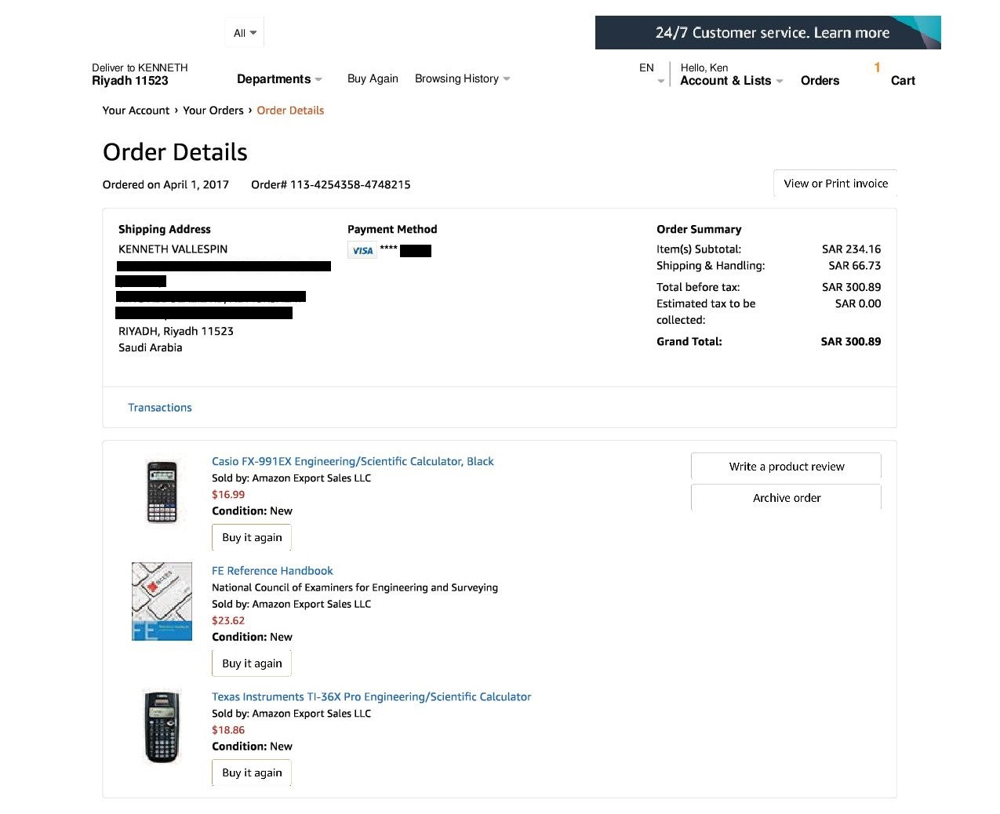

- Since I have full-time job, I didn't have the luxury of relaxed study hours. My weekday review starts at 12:00 midnight up to 3:00 AM (or if a topic is really difficult, up to 4:00 AM). I have an 18 month old daughter at the time and I can't handle the review with her running around wreaking havoc at every turn so I had no choice but to study when she's asleep. On weekends, my supportive wife leaves me to my own devices and lets me study nonstop from 6:00 AM until the last drop of energy leaves my body. I did not take days-off and was really single-mindedly obsessed with taking and passing the FE exam.

**My tip: tailor your review at your comfortable pace. My approach might or might not even work for you. It really depends on the person's study habits and circumstances. You'd be better prepared with a comfortable study plan, just DON'T HALF-ASS IT. Keep on grinding and stay hungry.**

My FE review arsenal consisted of the following:

- Calculators ([FX-991EX](https://edu.casio.com/products/cwiz/fx991ex/index.php) and [TI-36X Pro](https://education.ti.com/en/products/calculators/scientific-calculators/ti-36x-pro)); be mindful of NCEES' strict [calculator policy](https://ncees.org/exams/calculator/).
- [FE Reference Handbook (Printout)](https://account.ncees.org/exam-prep/359)
- [FE Electrical and Computer Practice Exam](https://account.ncees.org/exam-prep/325)
- [FE Electrical and Computer Review Manual by Lindeburg](https://www.amazon.co.uk/FE-Electrical-Computer-Review-Manual/dp/1591264499)
- FE/PE Electrical Topics Videos Online. I specially enjoyed (and highly recommend) **Josh S.**' of [Electronics PE Prep](http://electronicspeprep.com/) his website gave me insight on how to go about preparing for the Electronics FE/PE Exam and he made high-quality videos for FE/PE Electrical topics. Do check his website out.
- Various college textbooks and board exam review materials I had shipped from home
- FE review classes found in YouTube for just about any topic of discipline
- Mechanical pencils and highlighters (or just about any office supply you can get your hands on) to make your review materials more organized and optimized for ease of use.
- Lastly, I kept a 3-ring binder that held all the problems I have solved during my review. I tabbed it according to topic. It was really useful. Again, this is just me thinking forward in case I pass the FE and streamline my review for the PE exam.
- I used one sheet of A4 paper for each question as it helps me think in an organized and methodical way when attacking a particular type of problem.

### 2.2 Exam Registration

On the previous section I mentioned in passing that a candidate needs to create a [MyNCEES](https://account.ncees.org/login) account. This process is free of charge and will be used to track your exam transactions as well as other records you will be needing as you go along your journey to be registered/licensed in the US. Create your account on this website, it's a very straightforward process and will be useful for you in the long run. After completing the MyNCEES registration, I've met my first roadblock. Full disclosure, I intended to be registered first in the state of Hawaii (where my family is) but it would require a lengthy process and me taking the exam there. I was so sure I would bleed cash if I took this route, but hope is not lost after all.

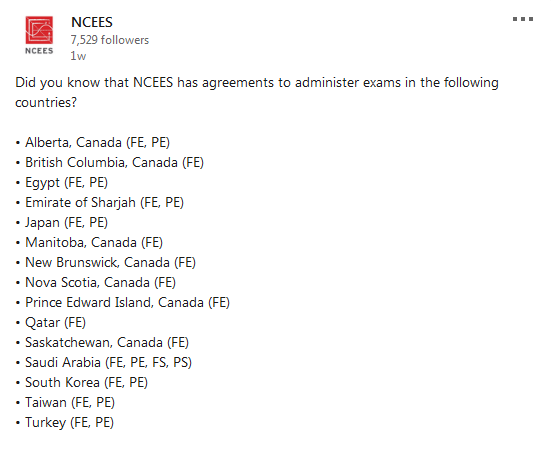

*International NCEES Exam Boards*

Remember when I said earlier that I'm based in Saudi Arabia? I did some reading on the NCEES website and turns out that NCEES has an agreement with international boards to offer the exam in selected countries and as luck would have it, [Saudi Arabia](https://ncees.org/engineering/#saudi-arabia-sce) is one of these select countries. The board responsible for administering NCEES exams in the kingdom is the [Saudi Council of Engineers (SCE)](https://www.saudieng.sa/English/Pages/default.aspx). I am a member of this organization by default as I came in this country on an Engineer's Visa. Membership is mandatory as it is a pre-requisite for obtaining the Saudi residence permit (Iqama). Things are starting to look good for me. I contacted SCE and they directed me to [this page](https://www.saudieng.sa/English/Eservices/Accreditation/Pages/Exams.aspx) where the process is quite easy to follow:

- Pay the SCE FE Exam Fee: 1500 SAR (Saudi Riyals) = 400 USD. SCE Payment can be made through SADAD ATM transaction or Online Banking with your local Saudi bank.
- Visit your MyNCEES account and select your exam/discipline (FE)
- Pay the NCEES FE Exam Fee: 200 USD
- Notify the SCE via email ([nceesexams@saudieng.sa](mailto:nceesexams@saudieng.sa)) that you have paid all the required fees. Include your 7-digit MyNCEES record/reference number
- SCE will review your application along with your academic records already available to them and will issue the approval to take the exam in as little as 24-hours. If you have a valid Iqama and active SCE membership, this part shouldn't be difficult.
- Once you receive the approval from SCE, it will be reflected on your MyNCEES dashboard. You can then schedule your exam on the date of your choosing.
- After scheduling your exam date, the exam provider (PearsonVUE) will send you an appointment confirmation email. It will tell you in great detail everything you need to know about the exam (venue of the exam, what to bring, identity verification, etc.) It should look something like this:

  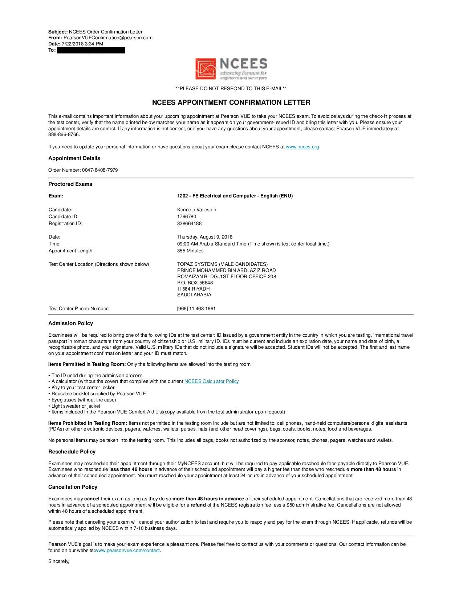

- Once you have your schedule, then you're all set to take the FE exam.

### 2.3 Exam Day

The FE exam includes 110-questions. The exam appointment time is 6 hours long and includes:

- Non-disclosure agreement (2 minutes)
- Tutorial (8 minutes)
- Exam (5 hours and 20 minutes)
- Scheduled break (25 minutes)

I don't recall doing anything remarkable on my exam date. I just appeared on the venue 45 minutes early and checked myself in with the exam proctor. I brought with me a couple of croissant sandwiches and 2 cans of Red Bull energy drink. I remember eating my croissant and drinking a can of Red Bull before my exam even started. I took what's left of my breakfast at the end of the AM session (scheduled break) and continued with what remained of my exam. I finished just in time by sticking to one exam philosophy: Flag difficult questions and move on to the next. Stick to this method for as many passes as you can until you're left with difficult questions that you can focus on solving for longer (or simply guess, if you're out of time). I remember around 10 questions that I had no idea how to solve near the end of the exam, I tried cracking it but ended up guessing the answers anyway. I went home feeling a little relieved and satisfied that the FE exam is finally over.

### 2.4 Post FE Exam

I took the FE exam on August 9, 2018 and waited 6 days before receiving an email notice that I indeed passed the exam. You should also get a green "Passed" button on your MyNCEES dashboard and a verifiable link that you can publicly share (or brag). It should look something like this:

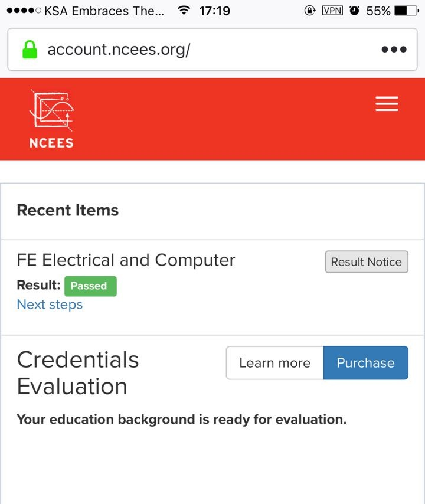

*FE Exam Pass Notice – myNCEES Dashboard*

### 2.5 Fees

MyNCEES Registration – 0.00 USD Calculator and Review Materials – 80.00 USD FE Electrical and Computer Practice Exam – 60.00 USD SCE FE Exam Fee – 400.00 USD NCEES FE Exam Fee – 200.00 USD Total – **740.00 USD**

## 3. The Principles and Practice of Engineering (PE) Exam

### 3.1 Exam Preparation (3 Months)

There was only 3 months between my FE 'Pass' result notice and the Fall examination of the PE exam. I couldn't say that I really stopped studying or anything like that. I kept my routine and further "hacked" my problem solving techniques under time constraint. Any preparation I did for the FE doubled and I remember solving practice problems around the upper 800's range at the end of my review. I did not leave anything to chance, and to borrow my wife's words during those times, it was all "self-inflicted torture". The PE exam differed from the FE exam in a lot of ways. First, there's a lot of options to choose from for each major discipline. For example, my discipline falls under Electrical Engineering. NCEES offers 3 distinct sub-disciplines under EE namely, **EE-Power**, **EE-Computer Engineering**, and **EE-Electronics, Controls, and Communications**. I'm sure you can almost see me choose the third option as it is one closest to my education and experience. Secondly, it is a much longer exam with fewer questions than the FE. So you can already tell that each question is going to be on a different level of difficulty. Thirdly, unlike the FE exam, the PE exam is currently an open-book exam and you can bring all your books and review materials with you inside the testing area. Do not be deceived by this; it's not a guarantee that the exam will be easy. Finding the right formula to use for solving the given problem will take ages to find if you don't know where to look, even if you have all the right books with you. The strategy that I employed for my self-review revolved only on one core philosophy: **Absolute and total mastery of my exam references.**

### 3.2 Exam References and Materials

I had a variety of exam reference materials that I studied and brought with me on the exam, but the ones that I used more frequently than the rest were the following:

- Custom Reference Binder (Handwritten Notes, Formulas, Solved Problems)
- Calculators ([TI-36X Pro](https://education.ti.com/en/products/calculators/scientific-calculators/ti-36x-pro), [FX-991EX Classwiz](https://edu.casio.com/products/cwiz/fx991ex/index.php), [FX-115ES Plus](https://www.amazon.co.uk/Casio-FX115ESPLUS-Natural-Textbook-Calculator/dp/B007W7SGLO))
- [Electrical and Electronics Reference Manual for the Electrical and Computer PE Exam – Camara](https://ppi2pass.com/electrical-and-electronics-reference-manual-for-the-electrical-and-computer-pe-exam-elrmp2p.html)
- [PE Electrical and Computer: Electronics, Controls, and Communications Practice Exam](https://account.ncees.org/exam-prep/351)
- [Wiley Acing the GATE: Electrical Engineering – Lather, Chaterjee, Gupta](https://www.wileyindia.com/gate/wiley-acing-the-gate-electrical-engineering-2ed.html)
- [Wiley Acing the GATE: Electronics and Communications Engineering – Agrawal, Maini, Maini](https://www.wileyindia.com/wiley-acing-the-gate-electronics-and-communication-engineering-2ed.html)
- [Analog Devices Basic Linear Design – Zumbahlen](https://www.analog.com/en/education/education-library/linear-circuit-design-handbook.html)
- [Signals and Systems Made Ridiculously Simple – Karu](https://www.amazon.co.uk/Signals-Systems-Made-Ridiculously-Simple/dp/0964375214)
- [Schaum's 3000 Solved Problems in Electric Circuits – Nasar](https://www.amazon.co.uk/Solved-Problems-Electrical-Circuits-Schaums/dp/0070459363)
- [Schaum's Outlines – Electric Circuits – Nahvi, Edminister](https://www.amazon.co.uk/Schaums-Outline-Electric-Circuits-Outlines/dp/1260011968)
- [NFPA 70 – National Electrical Code (2017)](https://www.nfpa.org/codes-and-standards/all-codes-and-standards/list-of-codes-and-standards/detail?code=70)

I also found the references above really useful in reinforcing my theoretical foundations. Here's a photo of my rig while I was in "Review Mode":

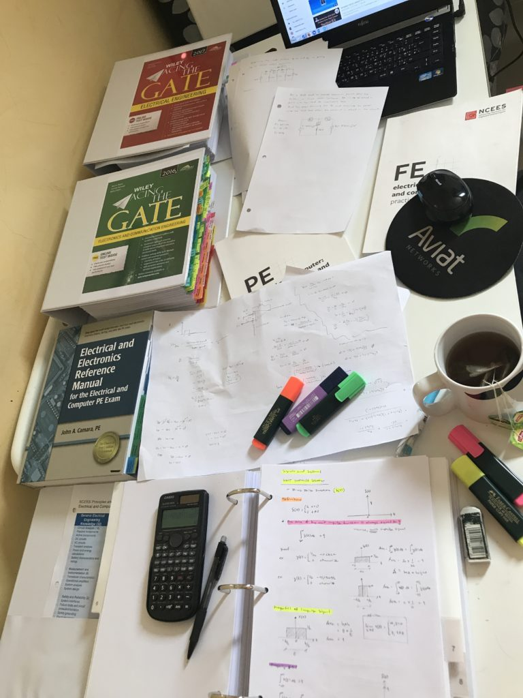

*My Typical Review Rig*

### 3.3 Exam Registration

Registration for the PE Exam is no different from the FE when you're planning to take it in Saudi Arabia. Application and approval is routed through the Saudi Council of Engineers (SCE) as your board. The requirements and procedure for applying for the exam are as follows:

#### 3.3.1 Requirements

- A bachelor's degree in engineering from an accredited institution.
- Valid SCE membership.
- Valid Saudi National ID/residence permit (Iqama/Muqeem).
- FE pass certificate (with NCEES ID).
- Minimum four years of certified professional experience after graduation in the same specialization.

#### 3.3.2 Procedure

- Login and apply through your SCE online profile at [https://eservices.saudieng.sa/en/accreditation/Pages/login.aspx](https://eservices.saudieng.sa/en/accreditation/Pages/login.aspx)
- Pay the SCE FE Exam Fee: 2500 SAR (Saudi Riyals) = 667 USD. SCE Payment can be made through SADAD ATM transaction or Online Banking with your local Saudi bank.
- Visit your MyNCEES account and select your exam/discipline (PE)
- Pay the NCEES FE Exam Fee: 350 USD
- Notify the SCE via email ([nceesexams@saudieng.sa](mailto:nceesexams@saudieng.sa)) that you have paid all the required fees. Include your 7-digit MyNCEES record/reference number
- SCE will approve your examination request and you may view it from the myNCEES dashboard. A downloadable Approval Notice will also be made available for you to bring to the examination venue to be admitted (see mine below):

  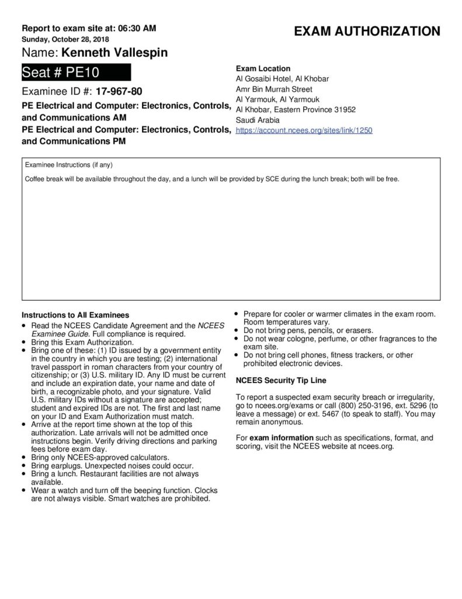

### 3.4 Exam Day

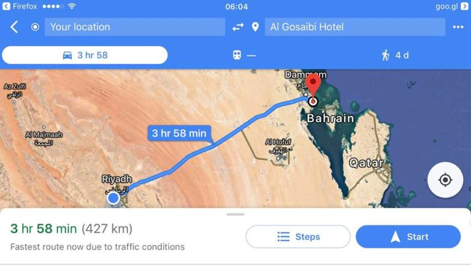

*My Literal and Metaphorical Road to P.E.*

The Fall examination of the NCEES PE Exam that I am sitting for fell on a Sunday. Everyone who has worked in the Middle East will tell you that this is this the start of the work week here. I had to file for a leave on this particular day. Rewind two days before that and you'd find me driving from Riyadh to the examination venue. The venue is located about 427 km (265 mi.) from where I live. And so I drove for 4 straight hours. I took all my reference materials and a change of clothes for two days. I didn't take any chances though, as I chose to stay at the hotel where the exam was to be held. I had the entire Saturday to rest before the exam. I didn't try and cram some more, I just sorted and double-checked my references and my identity papers. I laid down and watched some NatGeo in my hotel room til I fell asleep. Come Sunday, I woke up at 4:00 AM, honestly speaking, I didn't get much sleep (anxiety creeping in). I prepped myself with coffee and some light croissant, and packed with me my secret weapon when taking exams since 2007: Red Bull Energy Drink. For the PE exam, I brought with me 6-packs of Red Bull (dangerous and unhealthy, I know). Chugged one can after eating breakfast, and saved the rest for the exam. I went down at 5:00 AM and sat on the lounge where the other test takers were waiting and just chilled until we were called. Once called, we checked in with the SCE people who will facilitate the exam. I was assigned seat no. 10 and I shared a table with a Mechanical-MDM examinee. And then that's it.. after the facilitator/proctor announced the rules and guidelines the exam seemed to happen in a blur. I didn't notice time, I was singularly focused with the exam and I gunned for low-hanging fruit first (same as my FE strategy), the hard ones I ignored and I kept repeating this process until I finished the test. Problems that I did not have any idea how to solve, I guessed at the last moment. I was able to finish 25 minutes earlier than the scheduled end of the exam. I only had 4 things in my table for the entire duration of the exam: the **NCEES test sheet**, the **NCEES issued mechanical pencil**, my **TI-36X Pro calculator**, and my can of Red Bull. My reference books were stacked in a milk crate and I set it down the floor aisle to my right for easy access. I left the examination hall in a state of Zen (or lack thereof). Maybe it was just the taurine kicking-in. I packed my things, checked-out of my hotel room and prepared to drive (yes, I drove all the way back home right after the exam, 4 hours in the dark of the night). That pretty much ended the examination day for me.

### 2.5 Post PE Exam

Waiting for the result of the PE exam was the most excruciating part of this whole ordeal called US Professional Engineer licensure. The exam results of all PE candidates (both stateside and international) were released **39 days** after the exam date. During those days, I did nothing but go to my myNCEES dashboard and smashed the F5 button hoping I'd catch the exam results (did not work). So you could imagine my surprise receiving an email notice at 2:00 AM morning of December 6 from NCEES telling me to check my myNCEES dashboard for the results of the PE exam. I was a little thrilled and nervous, but deep inside of me *I knew I was gonna pass*. I prepared thoroughly for this and took no chances when I started my adventure. True enough, I saw this:

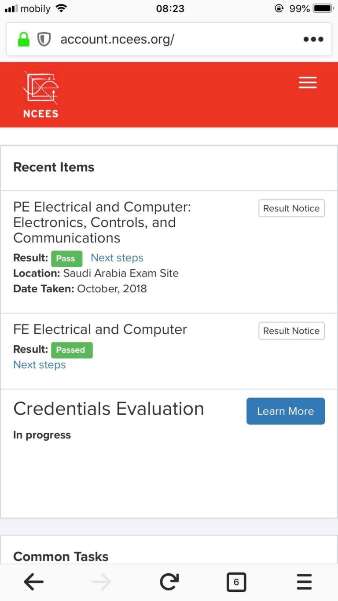

Green "Pass" as expected. You can imagine my relief after seeing this in my phone screen.

### 2.6 Fees

FX-115ES Plus (x2) – 17.00 USD Electrical and Electronics Reference Manual for the Electrical and Computer PE Exam with Access to the eTextbook – 273.00 USD NCEES PE Electrical: Electronics, Controls, and Communications Practice Exam – 73.00 USD Shipping and Handling of #2 and #3 – 85.95 USD SCE PE Exam Fee – 668.00 USD NCEES PE Exam Fee – 350.00 USD Hotel (3D/2N) – 160.00 USD Gas and Snacks – 66.00 USD Total – **1,692.95 USD**

## 4. NCEES Credential Evaluation

### 4.1 Credential Request and Evaluation

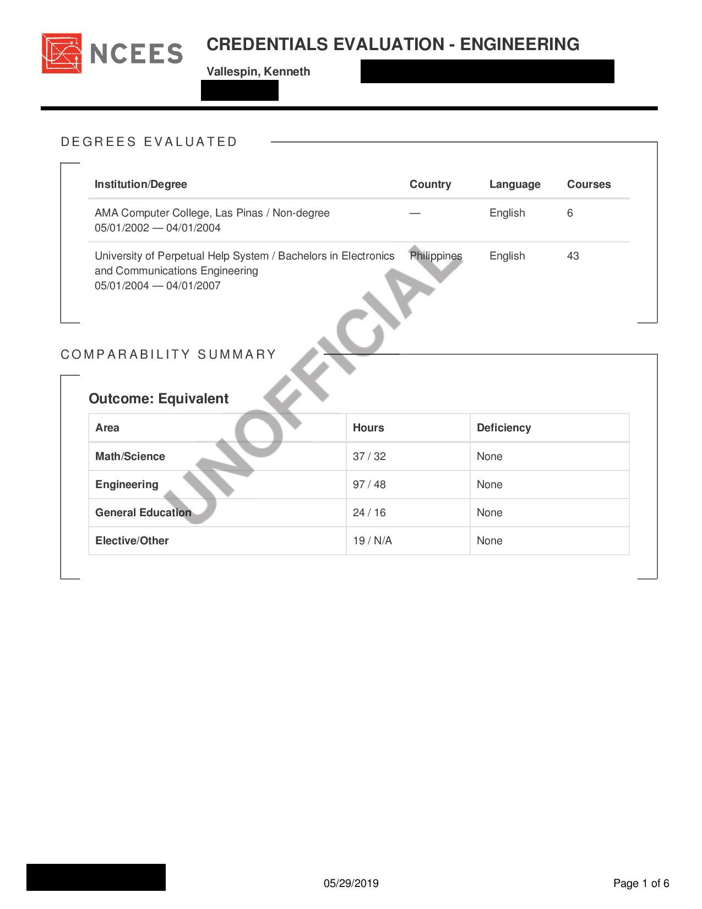

*NCEES Credential Evaluation Outcome*

Most state licensure boards requires P.E. applicants to have an EAC-ABET accredited engineering degree or the equivalent. This equivalence is assessed by NCEES through their credential evaluation service. Basically, the applicant (you) will request the school/college/university where he/she attended to send his/her official Transcript of Records (TOR) and degree certificate (Diploma) directly to NCEES. Once NCEES receives these documents, you'll have to pay the fee to begin the evaluation process. It took me 118 days from start to finish to clear this stage because I transferred to another school and NCEES needed all the transcripts from all the schools I attended to. Lead time sending my documentation between NCEES and my schools prolonged the entire process. Finally, once NCEES finishes their evaluation, they will send you an email notification that your credential evaluation result is ready and can now be viewed from the myNCEES dashboard. Luckily, mine came out as "EQUIVALENT" (to an EAC-ABET accredited degree) and is deemed sufficient by NCEES for me to apply for licensure in any US state board. As a side note, I had to request another credential evaluation from NCEES (free of charge) a few months later for a state board where I applied that deemed one area of my degree to be deficient. Came out OK, but that's a story for later.

### 4.2 Fees

Transcript of Record Request – 92.00 USD International Shipping to NCEES – 65.00 USD NCEES Credential Evaluation – 350.00 USD Total – **507.00 USD**

## 5. State Board Registration/Licensure

The process of applying for licensure in the US is pretty straightforward after you pass the FE and PE exams. Your first consideration is to decide which US state you would practice (or migrate). The list of US and international licensing boards can be found [here](https://ncees.org/state-links/). My first choice was Hawaii, but they have a strict requirement on Social Security Number (SSN) – Read: Citizens and Permanent Residents Only. It didn't stop me though from looking for other options. I decided to apply in Kentucky and Illinois.

### 5.1 Kentucky

#### Kentucky EIT

Applying for the Engineer-in-Training (EIT) certificate requires that you satisfy minimum requirements (pass FE exam; meet educational requirements, etc.) fill out a form and submit said form to the KYBOELS. This process is free of charge and you will be issued a wall certificate to reflect your EIT designation. Licensure Fee: **Free**

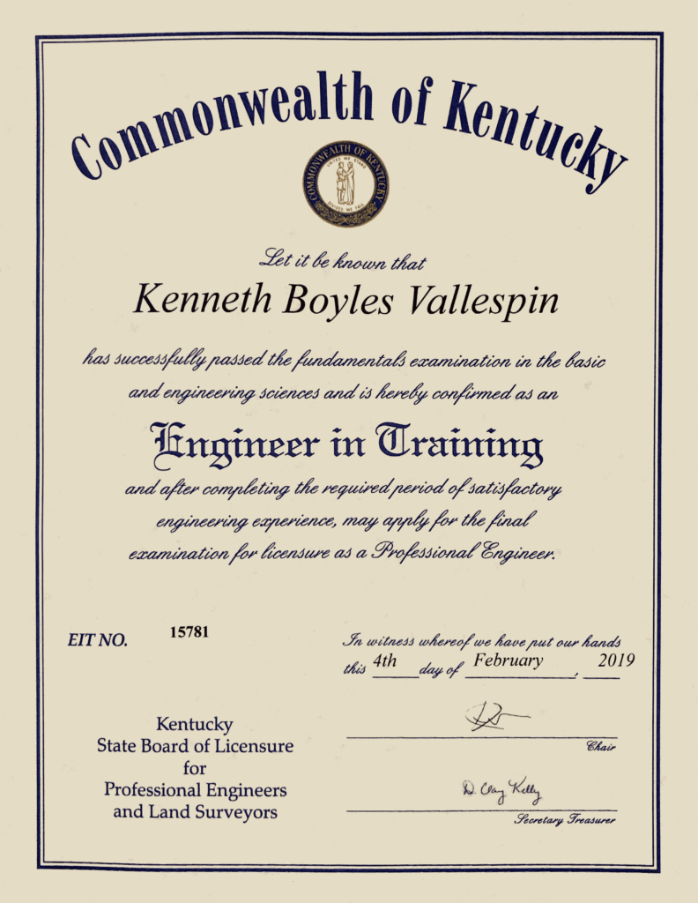

*Kentucky EIT Certificate*

#### 5.2 Kentucky PE

Applying in KY state requires filling out the required forms and paying the registration fees. Visit their [licensing page](https://kyboels.ky.gov/Getting-Licensed/Pages/Getting-Your-Individual-License.aspx) for the specific forms and procedures. One good thing about this board is that they accept credit card payments which is a convenient way to settle your fees and not stall your application. After filling-out the forms and paying the fees, I was then notified by KYBOELS that my application was accepted and I am now officially a P.E. in the State of Kentucky. They sent me a document packet by mail which included my P.E. wall certificate (which by the way is the most bad-ass certificate that I have seen by far.) Once you are officially licensed, you will also be listed on KYBOELS' [searchable roster](https://elsweb.kyboels.ky.gov/kweb/Searchable-Roster) of licensed engineers and land surveyors. Licensure Fee: **300.00 USD**

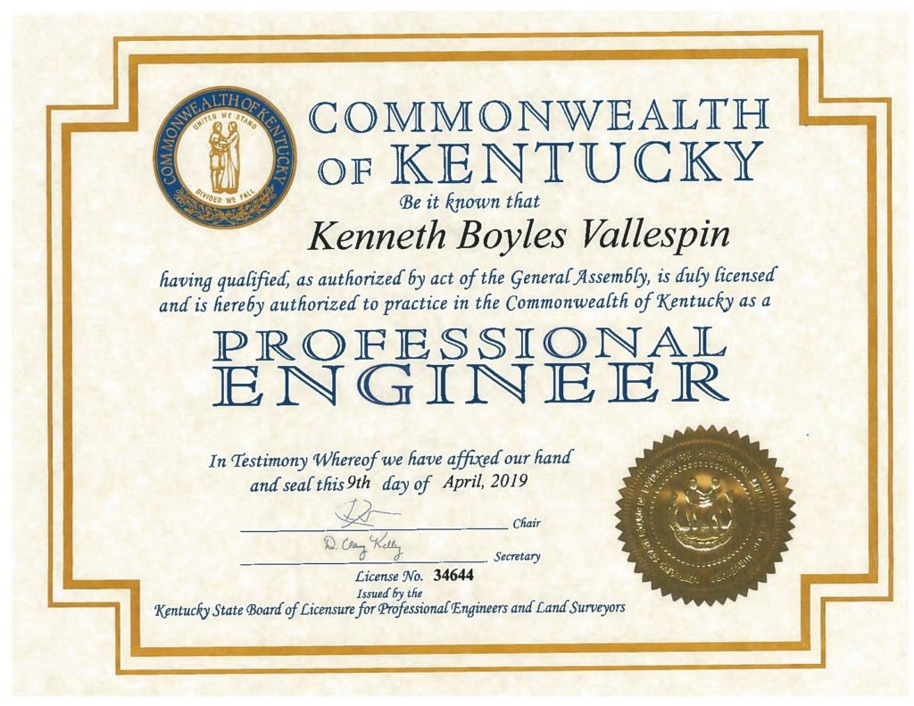

*Kentucky P.E. Certificate*

### 5.2 Illinois

Illinois PE is one of the most challenging and fulfilling endeavors that I ever did in my entire career. The [Illinois Board (IDFPR/DPR)](https://www.idfpr.com/profs/ProfEngineer.asp) requires nearly the same qualifications (Education, Experience, Exam) as with other state licensing boards to be registered as a PE. Apart from filling-out the application form, I had to write a detailed and comprehensive experience report verified by a licensed engineer. This was mind-boggling at first but it was rewarding at the end as I was able to describe my career experience in the strongest possible light, cementing my path to IL P.E. licensure. I sent my application from Riyadh to Hawaii to Illinois, as I needed my family stateside to enclose the payment for me (the IL board only accepts US money orders). When it was all received by IDFPR and upon evaluation, I caught a small hiccup with their educational requirement (deficient credit units/hours) but it was all sorted out thanks to NCEES ironing out the kinks for me. I eventually received my license around 4 months after submitting my application. Like all other state licensing boards, your name should be listed on their [searchable roster](https://ilesonline.idfpr.illinois.gov/DFPR/Lookup/LicenseLookup.aspx). Licensure Fee: **100.00 USD**

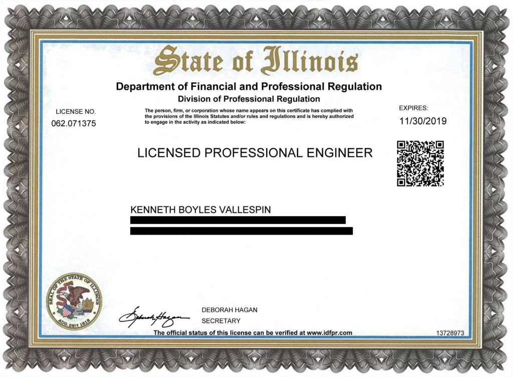

*Illinois P.E. Certificate*

## 6. Summary and Timeline

#### Total Expenses (FE to Licensure)

#### 3,303.95 USD = 12,390.14 SAR = 172,168.83 PHP

#### Time Duration (FE to Licensure)

You can see below a timeline that I made to give you context on the time duration of the entire process that I had to undergo in order to obtain the coveted US P.E. license. It took me almost a year to finish the whole thing.

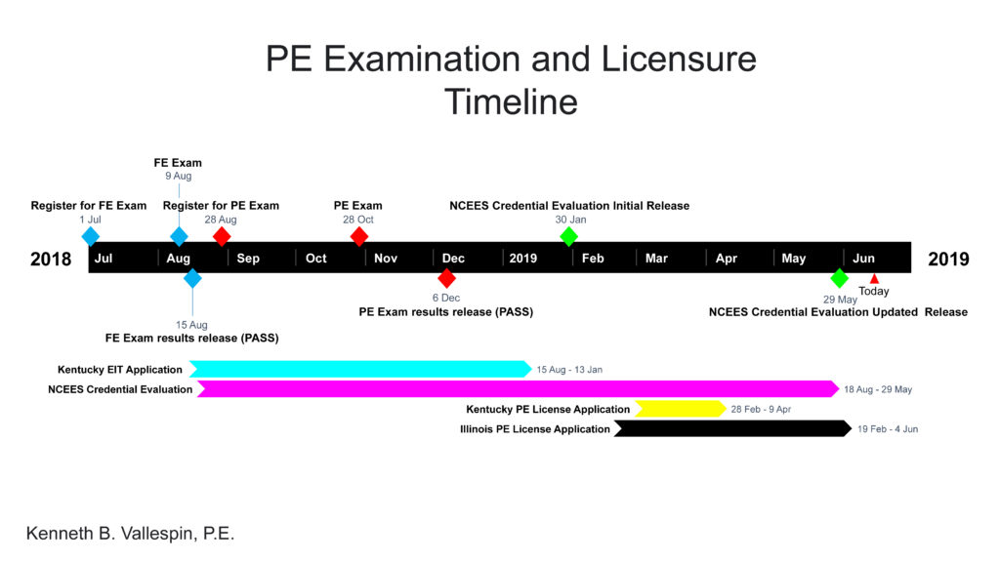

*PE Examination and Licensure Timeline (FE to IL License Release)*

#### End Notes

Earning the P.E. is one of the most challenging things that I have to do in my life. It cost me immeasureable stress, I bled lots and lots of cash, and I spent many sleepless nights preparing my application and soliciting feedback from references. But guess what? it was well worth it. It was money well spent, and it sure will open a lot of opportunities for me in the States and everywhere else. I'm just grateful right now that I have a supportive and patient wife by my side and a helpful and encouraging family back in the Philippines and in the States. I could not have made it this far without them. *"If I can make it there, I'll make it anywhere" – Frank Sinatra* Feel free to reach the author with your questions.
