# An engineer's valuation of the Mynt/GCash IPO

*Image credit: [iTech Solution PH](https://www.itechsolutionph.com/).*

## TL;DR

The offer is PHP 10.00 a share. I could not get there.

Discounted cash flow to equity gives PHP 2.33. To the firm, PHP 2.08. The Gordon relation, which uses no forecast at all, only the company's own return on equity and two rates, gives PHP 1.71 to PHP 2.25. Three methods, different machinery, same neighborhood, and all of it about a quarter of the asking price.

Then I let the assumptions I trust least vary and ran the model ten thousand times. The median came back at PHP 2.47. The single most favorable run of the ten thousand reached PHP 5.02. None of them cleared PHP 10.

One method does clear it, and it is the honest counter-argument. Put the peer median price-to-earnings multiple of 40 times on Mynt's 2025 earnings and you get PHP 10.33, just above the offer. That is what you are buying if you buy here. Not the cash flows. The multiple the market currently pays Sea and Grab.

The reason the cash-flow methods land so low is that this is a lender. Growth in the loan book is not a footnote, it is the reinvestment line, and only 42.5 percent of it is funded with debt. The rest comes out of equity before a shareholder sees anything. Reported net income and distributable cash are not the same number here, and the gap is the loan book.

Run the model backwards and the offer needs terminal growth of 15.7 percent forever, which is far above any credible long-run path for the Philippine economy. Or a beta of 0.08. Or a revenue path where every year's growth factor is multiplied by 1.66 — turning 15 percent growth into 91 percent — which by 2030 means revenue of PHP 1.7 trillion against my PHP 135 billion. Those are not parameter disagreements. They describe a different company.

So the honest version of my conclusion is narrow. I cannot tell you the shares are not worth PHP 10. I can tell you that you do not get there from the prospectus using the tools I was taught, and that anyone who does get there is paying for something this model cannot see.

Valuation summary

Mynt Preliminary Prospectus, 27 June 2026 — 27 June 2026

FCFE per share

PHP 2.33

discounted cash flow to equity

The offer price is 76 percent above the equity cash flow value.

FCFF per share

PHP 2.08

discounted cash flow to the firm

Firm method overstates value since free cash flow includes debt holders.

Justified P/B

PHP 1.71 to 2.25

ROE-based book value cross-check

The offer implies 9.6x book against a justified range under 2.3x.

Monte Carlo median

PHP 2.47

median of 10,000 trials

No trial in 10,000 reaches the offer price.

### The disclaimer, first.

I am not a finance major, I'm a true blue, full blooded engineer. My corporate finance grounding comes from New Language of Business and Financial Management 1 and 2 in the AIM MBA program, plus some asset leasing and buy-side transaction work in an aviation finance course at UCD Smurfit. This exercise is not comparable to what a practitioner would produce. They have the data subscriptions, the institutional backing, and the judgment that only comes from doing this for a living. I have none of that.

What I have is a working grasp of first principles and more local compute than is reasonable for a student. So this is an MBA student applying textbook methods with minimal Excel, orchestrated almost entirely through large language models running on my own hardware. I like AI and data science, so when the GCash IPO came up, I decided to crack this walnut with a tank. Five AI model tanks, actually.

### Why this one.

The Mynt IPO landed on my radar a few weeks ago when the filing went public.

GCash began in 2004 as a Globe Telecom SMS-based money transfer service. It is now the largest mobile wallet in the country, used every month by roughly half the adult population and reaching about four times as many people as its nearest competitor. Revenue and net income have both more than doubled since 2023. The business is already profitable, which is not the usual starting point for a wallet going public.

Mynt, Inc. (Globe Fintech Innovations) is the holding company, running the wallet through GXI and a lending arm through Fuse. The cap table is a strategic coalition rather than a venture roster. Globe Telecom and Ant Group hold roughly a third each, and Ayala's joint vehicle with Mitsubishi holds the next largest block, with MUFG, Warburg Pincus, Bow Wave and management behind them. Globe is itself an Ayala and Singtel joint venture, so the Ayala group's interest runs both directly and through Globe. Most of the shares on offer are secondary, sold by existing holders rather than issued by the company.

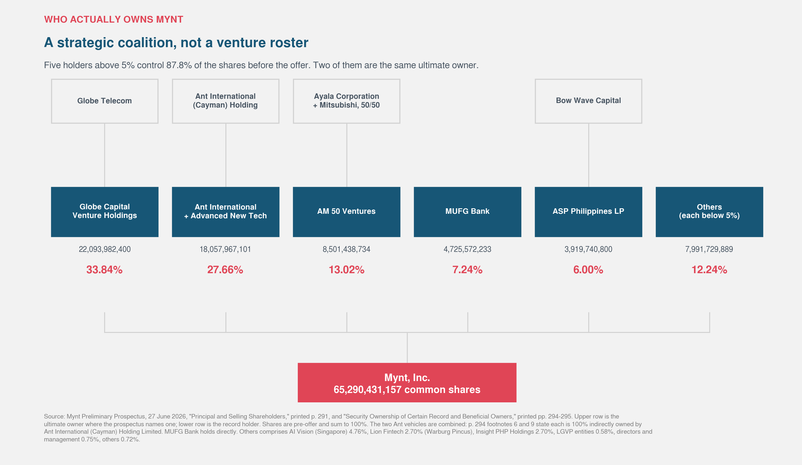

*Two things this makes plain that a list of names does not. Ant's stake is split across two Singapore vehicles that the prospectus footnotes confirm are the same ultimate owner, so the real position is 27.66% rather than the 21.44% that appears at the top of the table. And 87.8% of the company sits with five holders, none of whom is selling out — which is what a 12% float looks like from the inside.*

### On size.

At the top of the indicative range the offer raises about PHP 92 billion, roughly double the PHP 49 billion Monde Nissin raised in 2021. That is a record by proceeds, not by market value. The implied valuation lands near \$11 billion, which would be the largest debut in Philippine history but would still leave Mynt behind ICTSI, SM Investments and BDO once it starts trading. Call it top five, not number one. The indicative price is also a ceiling set for filing purposes. Book-building decides the real number, and earlier reporting had the target closer to \$8 billion.

### On the float.

Mynt is selling 12% of itself, a little under 14% if the overallotment is exercised. That figure is not a preference. It is the legal floor, and it did not exist a year ago. Until February the requirement was a flat 20% for everyone going public. The SEC replaced it with a sliding scale: the smaller the company, the more it has to sell, down to 15% for the largest issuers, with discretion to go as low as 12% for the very biggest. Mynt sits exactly on that floor. The exchange was still writing its matching rules in May, and the offer timeline moved with them.

The trade-off is the interesting part. Inclusion in the main Philippine index currently requires a 20% float, and the global index providers want something similar. At 12%, one of the largest companies on the exchange sits outside the benchmark that most passive money tracks. Less dilution and thinner day-one supply, bought at the price of that demand.

### The Indonesian mirror.

Jakarta has spent the past year finding out what happens when too little of a company actually trades. Indonesia's benchmark index has the thinnest average free float in Asia-Pacific, with a large share of its members closely held and lightly traded. When most of a stock sits with founders and affiliates, the price is set by a small pool of shares. It moves on little volume, and the index built on top of it stops describing the market it is supposed to describe.

Foreign money noticed. MSCI moved in January to measure Indonesian free float more strictly, and brokers estimated that index funds would have to pull roughly \$2 billion out as weightings fell. By the end of March the Jakarta exchange had rewritten its listing rules, tightening what counts as free float and raising the minimum, after warnings that Indonesia risked losing its emerging-market classification over thin float, unclear ownership and signs of coordinated trading.

So the two regulators moved in opposite directions in the same quarter. Manila lowered its floor to land a listing it had wanted for years. Jakarta raised its floor after a thin float was blamed for a distorted index and a sharp selloff.

Manila's bet is that a small float in a profitable consumer business with millions of users behaves differently from a small float in a closely held holding company. That may well be right. It is also the part of the story no valuation model will tell you.

That is what pulled me into the rabbit hole.

### How this was built.

Everything below runs off the prospectus dated 27 June 2026 and a live formula-linked Excel model. Nothing is transcribed by hand. The charts read their numbers from the same file the model writes, so if an assumption changes, the chart changes with it. The workbook and the code are linked at the end for anyone who wants to disagree with a specific cell rather than with the conclusion.

This is not financial advice. It is one model built in the open. Its failure modes are labeled.

## What Mynt actually sells

My initial assumption was wrong. I was valuing a payments company. That is the mental model most of us carry. We scan a QR code. We send money. We pay bills. The audited numbers say something different.

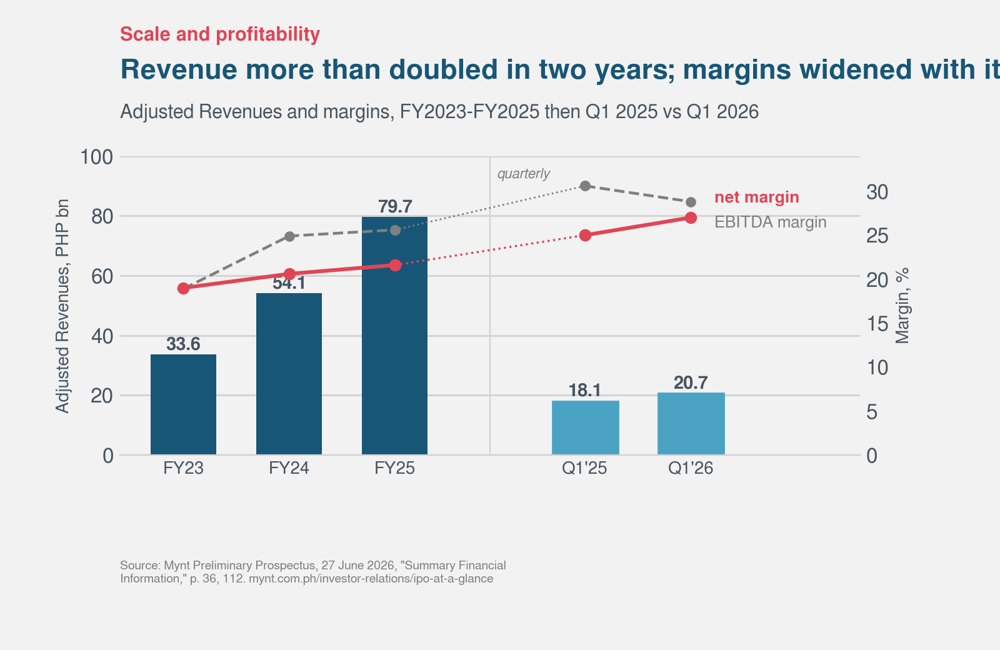

*Adjusted revenue grew 61.1% in 2024 and 47.2% in 2025. In the first quarter of 2026 it grew 14.8%. Source: Mynt Preliminary Prospectus, 27 June 2026, "Summary Financial Information," pp. 34, 36-37.*

Adjusted Revenues were PHP 33.6 billion in 2023, PHP 54.1 billion in 2024, and PHP 79.7 billion in 2025. These figures exclude the cost of over-the-air prepaid load. Total revenues are higher at PHP 39.9 billion, PHP 62.8 billion, and PHP 79.8 billion. The two series converge in 2025 because the company moved to a platform fee model for prepaid load effective January 1, 2025. I use the Adjusted Revenues series throughout because the company itself treats it as the comparability metric.

Growth is decelerating. It was 61.1 percent in 2024, 47.2 percent in 2025, and 14.8 percent in the first quarter of 2026. That is not a gentle slowdown. My first model assumed 20 percent growth for 2026. The first quarter had already come in well below it.

The margin panel contains the second surprise. Net margin rose from 25.0 percent in the first quarter of 2025 to 27.0 percent in the first quarter of 2026. The press picked that up. Over the same period EBITDA margin fell from 30.6 percent to 28.8 percent. Interest income on deposits rose 54 percent and the effective tax rate dropped from 28.2 percent to 23.6 percent. The improvement in net margin did not come from the business getting better at its business. It came from interest on the cash pile and a lower tax bill.

### The business is becoming a lender

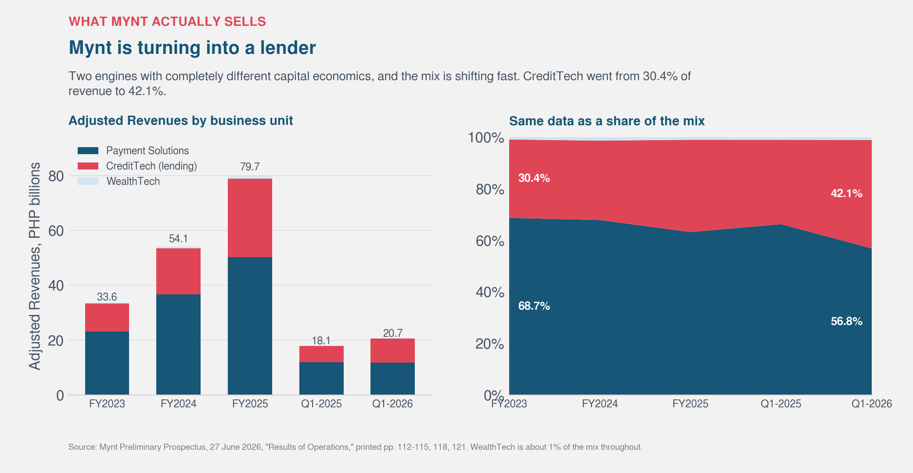

*Payment Solutions fell from 68.7% of Adjusted Revenues in 2023 to 56.8% in the first quarter of 2026. CreditTech is now 43.2%. Source: Mynt Preliminary Prospectus, "MD&A of Consolidated Financial Condition and Results of Operations," pp. 113, 117, 122, 126-127.*

Payment Solutions was 68.7 percent of adjusted revenues in 2023. By the first quarter of 2026 it was 56.8 percent. CreditTech, the lending book behind GLoan and GGives, is now 43.2 percent and climbing.

The loan book itself grew from PHP 11.9 billion at the end of 2023 to PHP 48.8 billion at the end of March 2026. Four times larger in a little over two years.

The mental model has to change. Mynt is becoming a consumer lender that happens to own the best payment rails in the country. Payments is the acquisition channel and the underwriting dataset. Lending is the engine.

The scale is genuine and I am not disputing it. 40.4 million monthly active users. Roughly 55 percent of Philippine adults. 7.5 million active borrowers.

## Two things I missed before the prospectus

The first draft missed two data points. Both change the valuation narrative.

### The BSP gambling directive

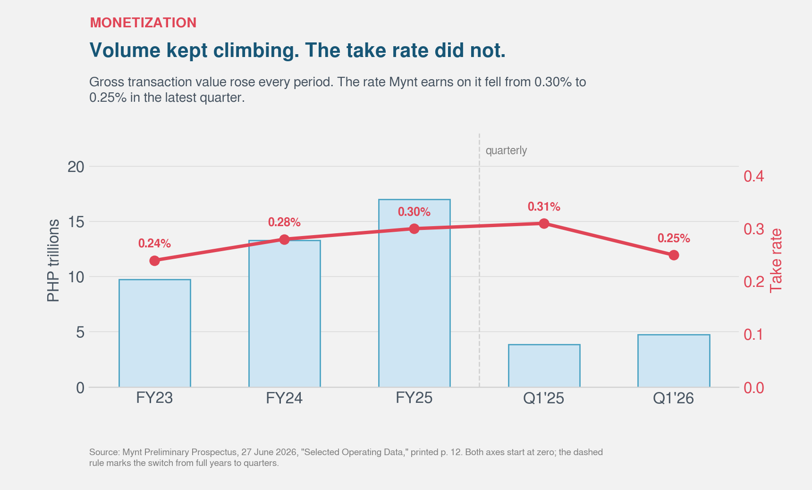

*Gross transaction value grew 23.2% year on year in the first quarter of 2026. Payment Solutions revenue fell 1.5% over the same period. Source: Mynt Preliminary Prospectus, "Summary Financial Information," p. 36, and "Glossary," p. xii.*

In August 2025 the Bangko Sentral issued Memorandum M2025-029, requiring all supervised institutions to remove in-app access to gambling. The prospectus considers the effect material enough to give it its own defined term, "Affected Revenues," meaning the Payment Solutions revenues hit by the directive.

You can see it in the take rate. Payment monetization ran at 0.24 percent, then 0.28, then 0.30 percent of gross transaction value. In the first quarter of 2026 it was 0.25 percent, against 0.31 percent a year earlier. Volume kept compounding: gross transaction value reached PHP 17.03 trillion in 2025 and PHP 4.75 trillion in the first quarter of 2026, up 23.2 percent year on year.

But Payment Solutions revenue actually fell 1.5 percent year on year, from PHP 11,966.3 million to PHP 11,784.8 million. More transactions, less money. The payments half of the business is currently shrinking in revenue terms.

Before the prospectus, I listed "regulation stays supportive" as an unpriced future risk. It is not a future risk. It already happened, and it is in the numbers I am valuing.

### The lending spread is compressing

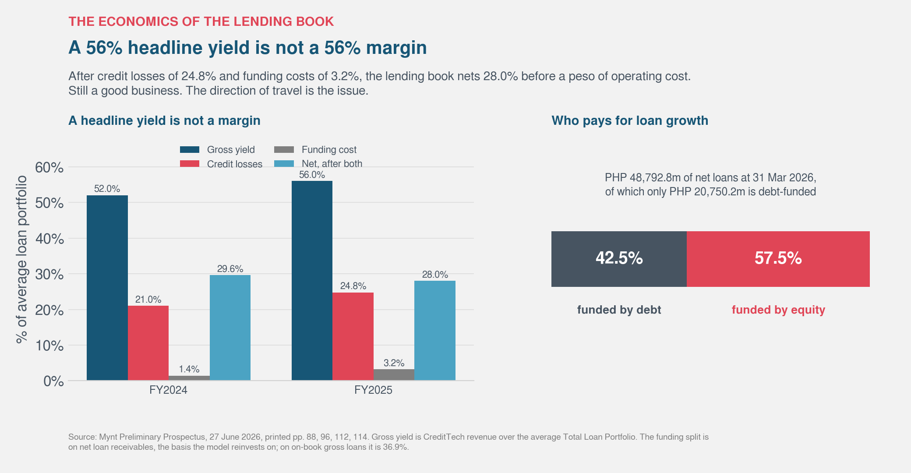

*Net interest margin after losses fell from 31.5% in 2023 to 23.4% in the first quarter of 2026. Source: Mynt Preliminary Prospectus, "Summary Financial Information, Key Performance Indicators," p. 36.*

Before the prospectus, I presented a net interest margin of 23.4 percent as a structural moat against traditional bank margins of 3 to 5 percent. The moat is real. But the series is 31.5 percent, then 26.1, then 23.7, then 23.4. It has fallen by eight percentage points in just over two years, and I showed only the last point.

> **Key insight.** The valuation question is not "what is a payments network worth?" It is "what is a fast-growing consumer lender worth, when its payments engine has stopped monetizing and its lending spread is compressing every year?" Those are very different questions.

## The one number that looked like good news

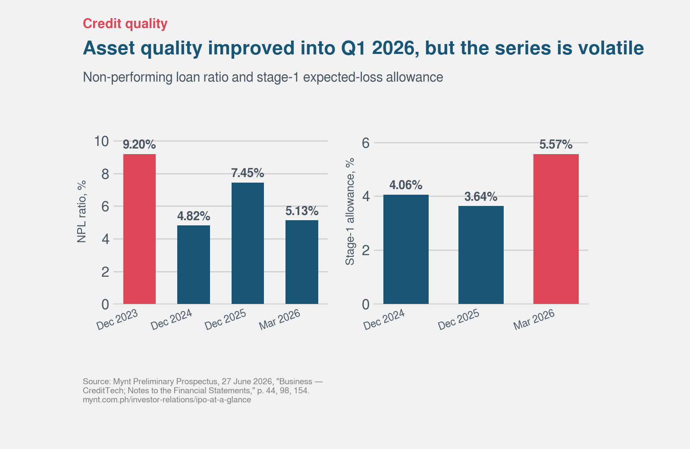

*The headline ratio fell while management raised the cushion on loans that are still paying. Source: Mynt Preliminary Prospectus, consolidated financial statements, expected credit loss movement schedule, p. F-48.*

Credit quality is now observable rather than guessed at. The non-performing loan ratio was 7.5 percent at the end of 2025 and 5.1 percent at the end of March 2026, where non-performing means more than 90 days past due. The prospectus describes this as "a sharp decline."

It is the single most favorable operating datapoint in the document, so I went looking for the note behind it.

The full series tells a different story. The ratio was 9.2 percent at the end of 2023, dropped to 4.8 percent at the end of 2024, rose to 7.5 percent at the end of 2025, then fell to 5.1 percent at the end of March 2026. That is a ratio bouncing inside a wide band, not a clean deterioration. Today's 5.1 percent is well below where the disclosure starts.

But what actually moved the ratio matters more. Here is the roll-forward of loans in default over the first quarter of 2026:

| Q1 2026, loans in default | PHP millions |
|---|---|
| Opening balance | 3,578.7 |
| Collections | (276.1) |
| **Write-offs** | **(3,397.9)** |
| Transfers out | (20.2) |
| **New defaults formed** | **+2,996.4** |
| Closing balance | 2,880.9 |

Mynt wrote off PHP 3,397.9 million of defaulted loans during the quarter, while PHP 2,996.4 million of fresh loans rolled into default. The numerator fell by PHP 697.8 million only because the write-offs slightly exceeded the new arrivals. Over the same three months the gross book grew 17.0 percent, which enlarged the denominator.

The ratio improved because bad loans were removed from the top and good loans were added to the bottom. Borrower behavior did not have to improve for that to happen.

### The better question

A single quarter cannot be compared with a full year on default formation, since a loan written inside a three-month window cannot be ninety days overdue by the end of it. When a loan book nearly triples in a year, normalizing against the opening balance is meaningless.

Average balances are the standard basis, and the prospectus uses them itself: its own net interest margin is defined on average on-book gross loans. On that basis, comparing full year against full year:

| Against the average gross book | 2024 | 2025 |
|---|---|---|
| New defaults formed | 22.6% | **35.3%** |
| Written off | 16.5% | **25.1%** |

Both rose sharply. Measured against the opening balance instead, both appear to fall slightly, which is the answer I published before I checked what the denominator was doing.

One honest qualification. Even average balances flatter 2024, because a book growing 173 percent was small for most of the year. Direction: worsening. Magnitude: uncertain.

### Provisioning tells the same story

Provisions as a share of revenue rose from 13.7 percent in 2023 to 19.3 percent in the first quarter of 2026, but that ratio partly measures business mix since CreditTech went from 32 to 43 percent of the company. The metric that isolates credit is the cost of risk: provisions against the average gross loan book.

| Provisions as % of average gross loans | |
|---|---|
| 2024 | 25.3% |
| 2025 | 29.0% |
| Q1 2026, annualized | 30.8% |

Nearly a third of the book is expected to go bad annually. That is not a distressed number for this kind of lending, because the yields are high enough to carry it. It is still worth sitting with.

> **Key insight.** The clearest signal is in the provisioning against loans that have not defaulted. Allowance held against performing loans was 4.06 percent at the end of 2024 and 3.64 percent at the end of 2025. At the end of March 2026 it was **5.57 percent**. Management sharply increased the cushion on loans that are still paying. That is what a lender does when it expects deterioration it has not yet seen.

The provisioning looks honest rather than aggressive. Coverage of defaulted loans has been stable and high throughout, at 92.9, 93.7, and 94.5 percent. Nobody is hiding losses, and writing off unrecoverable loans promptly is correct accounting.

But putting the pieces together, the picture is not reassuring. The headline ratio improved for mechanical reasons. Default and write-off intensity rose on the proper denominator. Provisions are approaching a fifth of revenue. And management raised its own cushion on performing loans by nearly two percentage points in three months.

One related detail worth carrying forward: the MD&A attributes part of revenue growth to recoveries on loans written off in earlier periods. So heavy write-offs today feed reported revenue tomorrow, which flatters growth in exactly the periods following a bad vintage.

## The discount rate, and the mistake I nearly made twice

In the earlier draft, I assumed Mynt had no debt, could not verify it, and said plainly that it was the weakest link in the model. If there were meaningful borrowings at a rate below my discount rate, I wrote, the true cost of capital would be lower and every valuation would be too low.

The prospectus settles it. **Total debt is PHP 20,750.2 million** as of 31 March 2026: PHP 19,350.2 million current and PHP 1,400.0 million non-current. These are unsecured loans from local and international banks bearing **5.0 to 6.5 percent**, typically repayable within twelve months, plus a three-year term loan of PHP 1,750.0 million from the Asian Development Bank to fund MSME lending. [Prospectus, pp. 88, 117, 142, 171]

So I was wrong, in the direction I predicted. I expected that to rescue the valuation. It did almost nothing, and the reason is a pitfall from my own coursework.

**Cost of equity, from CAPM.** The risk-free rate plus beta times the equity risk premium: 7.26 percent plus 1.6 times 6.7 percent, which is **17.98 percent**.

| Input | What it is | What I used | Source |
|---|---|---|---|
| Risk-free rate | The return on lending to the government instead | 7.26% | PH FXTN 10-year government bond yield, 14 July 2026 [Trading Economics] |
| Beta | How much the equity moves when the market moves | 1.6 | Midpoint of Sea, PayPal and Adyen. Mynt has never traded. [Assumption] |
| Equity risk premium | What equity investors demand over that risk-free return | 6.7% | Damodaran country premium for the Philippines, the figure I used in FM2 [Assumption] |

**Weighted average cost of capital.** The debt weight times the after-tax cost of debt, plus the equity weight times the cost of equity.

After-tax cost of debt is 5.75 percent times 0.75, or 4.31 percent, using the midpoint of the disclosed range and the 25 percent CREATE Act rate. [Computed]

Now the weights, which is where it gets interesting.

| Basis | Debt weight | Equity weight | WACC |
|---|---|---|---|
| **Market value** (equity at the PHP 10 offer) | 3.0% | 97.0% | **17.57%** |
| Book value (from the capitalization table) | 22.0% | 78.0% | 14.97% |

The capitalization table shows PHP 20,750.2 million of debt against PHP 73,519.5 million of book equity, which is a 22 percent debt weight. That is the number it is tempting to use, because it is the one printed in the document.

It is also the wrong one. Market-value weights are required, and at the offer price the equity is worth PHP 668.96 billion, which makes the debt **3.0 percent** of total capital. So discovering PHP 20.75 billion of borrowings moved my discount rate from 17.98 percent to 17.57 percent. Forty-one basis points.

I find this genuinely funny, because the earlier draft contained a pitfalls table with this exact line in it:

| Common error | What it does | Correct approach |
|---|---|---|
| Using book value weights in WACC | Misstates the true cost of capital | Use market-value weights |
| Using a borrowed beta without adjustment | Imports a peer's business and financial risk wholesale | Unlever the peer beta, relever at the target's structure |
| Treating one discount rate as precise | Creates false confidence in a single output | Run a sensitivity grid and report the range |

I wrote that rule down, and then the moment real debt appeared I wanted to apply it the wrong way, because the wrong way happened to help the company. For the record, even at the book-weight WACC of 14.97 percent the valuation comes to PHP 2.56 a share, which changes nothing about the conclusion.

> **Caution.** A large debt balance does not automatically lower a cost of capital. What matters is debt as a share of *market* capital. For a company listing at nine times book, almost any amount of borrowing rounds to nothing in the weights.

The beta of 1.6 remains borrowed, and the prospectus cannot fix that. Mynt has never traded, so there is no history to regress against. I let it vary widely in the simulation later, from 0.9 to 2.0, and it does not change the answer either. One caveat worth a sentence: Sea, PayPal, and Adyen betas are measured against US and EU markets, and Mynt lists on the PSE. The cross-market comparison is imperfect, but it is the best available for an untraded name.

## Real cash flow, finally

The largest apology in the earlier draft is this: I did not have free cash flow. Mynt had not disclosed EBITDA, capital expenditure, or the change in working capital, so I proxied free cash flow as revenue times net margin, said clearly that this was net income wearing a different label, and warned that it flattered the company.

The prospectus has all three. It also has a trap in it.

### The reported cash flow statement is unusable

Net cash from operating activities reads: plus PHP 23.5 billion in 2023, minus PHP 38.1 billion in 2024, plus PHP 14.2 billion in 2025, and minus PHP 12.9 billion in the first quarter of 2026. Negative in two of four periods, for a business that was profitable in all four.

That is not distress. It is float. Mynt is an e-money issuer, so customer balances run through operating activities. Cash held in trust went from PHP 1.0 billion to PHP 78.9 billion over the period, and liabilities to partners and users sit near PHP 100 billion. Those two swing violently and have nothing to do with whether the business generates cash.

So rather than strip float out of the reported statement, I built cash flow from the top. **Free cash flow to the firm** is operating profit after tax, plus depreciation and amortization, less capital expenditure, less the increase in the loan book, less the change in working capital.

Excluding cash held in trust and liabilities to partners and users from working capital entirely, since they are a matched pair belonging to the e-money business rather than to operations.

### The reinvestment line is the loan book, not capex

Capital expenditure was PHP 298.1 million, PHP 520.7 million and PHP 456.7 million across the three years. That is under one percent of revenue. Depreciation now exceeds it. By the standards of a normal DCF this company barely reinvests at all.

That reading would be badly wrong.

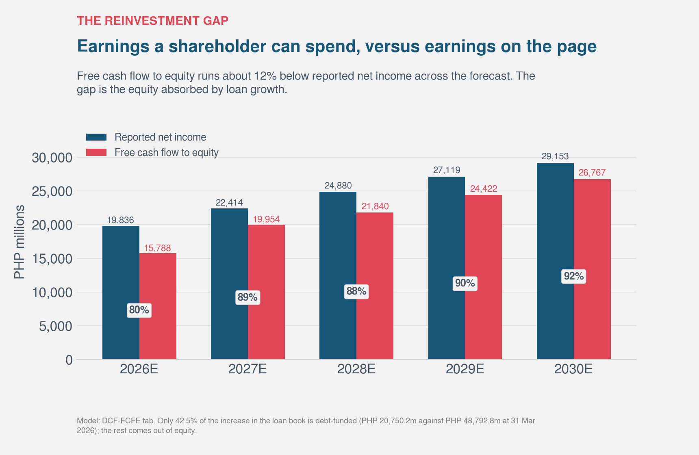

*Loan book growth consumes PHP 6,190 million of forecast 2026 cash, against PHP 279 million net for depreciation less capital expenditure. Source: Mynt Preliminary Prospectus, "Summary Financial Information," p. 35, and "MD&A, Material Commitments for Capital Expenditures and Indebtedness," p. 142.*

The loan book grew PHP 22.2 billion in 2024 and PHP 7.1 billion in 2025. For a lender, that **is** the reinvestment. Every peso lent leaves the business before it returns as income, and a book growing this fast consumes cash exactly the way a factory build-out would.

Run the arithmetic on 2025 and the picture is stark:

| 2025, PHP millions | |
|---|---|
| EBIT x (1 - 25%) | 14,797.3 |
| plus D&A | 699.3 |
| less capex | (456.7) |
| less loan book growth | (7,122.6) |
| **Sustainable FCFF** | **7,917.3** |
| Memo: net income | 17,248.5 |
| **Cash conversion** | **46%** |

Forty-six percent, and that treats the working capital release of PHP 7,189.0 million as non-repeatable, which it is, because working capital excluding float is already down to PHP 669.5 million and cannot fall much further. Include it and 2025 conversion looks like 88 percent. Exclude it and 2024 conversion is **negative**.

In the earlier draft I guessed at a cash conversion factor between 0.60 and 1.00, centered on 0.85. The real number is around 0.46 and it is driven almost entirely by how fast the loan book grows.

### The result, and why I do not trust it

On this basis, with the market-weight WACC of 17.57 percent and terminal growth of 4.5 percent, enterprise value comes to PHP 120.8 billion. [Computed]

Getting from there to a share price needs one more step that I initially got wrong. Enterprise value has to be adjusted for debt **and for cash**. I subtracted the PHP 20.75 billion of debt and forgot the cash, which is a real omission here because EBIT excludes interest income on deposits, so neither the cash nor its earnings appear anywhere in the projected flows. Leave it out and it simply vanishes from the valuation.

Working out how much cash is genuinely available turned out to need less care than I gave it. My first pass derived it: cash of PHP 67.8 billion, less the PHP 25.6 billion shortfall between the PHP 99.6 billion owed to partners and users and the PHP 74.0 billion held in trust, leaving PHP 42.2 billion. Then an audit pointed out that the company states the number outright. Printed page 35: of the total cash and equivalents, **PHP 39.2 billion** represents corporate cash at 31 March 2026, defined as balances not considered customer-related. My derivation was PHP 3.0 billion too generous. I use the disclosed figure. [Prospectus, p. 35]

Enterprise value PHP 120.8 billion, less PHP 20.75 billion of debt, plus PHP 39.2 billion of cash, over 66,895,913,057 shares, gives **PHP 2.08 per share**. [Computed]

That is 79 percent below the offer. It is also the point where I stopped and asked whether the instrument was right, rather than reaching for the conclusion.

> **Caution.** Damodaran is explicit that free cash flow to the firm, discounted at WACC, is the wrong frame for financial service firms. For a lender, debt is raw material rather than financing, and reinvestment is loan book growth rather than capital expenditure. Mynt is now 43.2 percent CreditTech with a PHP 48.8 billion book funded partly by borrowings. By his own rule, the model I just built does not apply to it.

The mismatch is mechanical and it is visible in my own numbers. FCFF charges the full cost of growing the loan book against cash flow, while market-value weights leave debt at 3.0 percent of capital, so the cheap funding that pays for that growth never reaches the discount rate. The model is penalized twice for the same peso.

So PHP 2.08 is what a wrong instrument reports. I have kept it in the football field because deleting an inconvenient number is not a method, but it should carry a warning label.

### Doing it the way he would

Value the equity directly instead. **Free cash flow to equity** is net income, plus depreciation and amortization, less capital expenditure, less the increase in the loan book, plus the new debt raised to fund part of that increase.

Discounted at the cost of equity, 17.98 percent. Debt currently funds 42.5 percent of the loan book (PHP 20,750.2 million against PHP 48,792.8 million), so growth in the book is assumed to be funded in the same proportion. [Computed]

That gives **PHP 2.33 per share**. [Computed]

Then a third opinion that uses no cash flow forecast at all. The Gordon growth relation puts justified price-to-book at return on equity less growth, over cost of equity less growth: 32.1 less 4.5, over 17.98 less 4.5, which is **2.05 times**.

Against book equity of PHP 73.5 billion, that is **PHP 2.25 per share**. [Computed]

That figure needs one caveat, because it depends on which equity base the return is struck against. The 32.1 percent is the prospectus's own return on **average** equity, and I have applied the resulting multiple to **ending** book value, which mixes two bases. Recompute the return on ending equity and it is 25.5 percent, the justified multiple falls to 1.56 times, and the answer is **PHP 1.71**. Equity grew 69 percent during 2025, so a return struck on the smaller average base will not repeat on the larger one. I therefore treat this method as a range of **PHP 1.71 to PHP 2.25** rather than a point, and the lower end is arguably the more honest anchor.

FCFE at PHP 2.33 sits just above that range. FCFE forecasts five years of cash flow and a terminal value; justified price-to-book uses one year of return on equity and two rates.

I want to be honest about how independent that really is. They are not entirely separate opinions: both use the same cost of equity, the same terminal growth, and the same earnings base. What makes the agreement meaningful is that they reach the answer through different machinery, and that their implied payout ratios line up. The justified multiple assumes the company retains 14 percent of earnings, since growth of 4.5 percent on a 32.1 percent return implies that. My FCFE model, built from the loan book upward, converts about 80 percent of 2026 net income into distributable cash. That is a different measure from the retention implied by the multiple, so I am no longer calling it a convergence — an audit was right that I had been comparing two things that are not the same. It is a coincidence of magnitude, not a second opinion.

An independent FCFE model built on different assumptions landed at PHP 3.37 against my PHP 2.33. The PHP 1.04 gap decomposes almost entirely into two offsetting items: that model uses a cost of equity 267 basis points lower than mine, and mine adds a PHP 39.2 billion corporate-cash balance that the other does not. Two models with different frameworks, discount rates, and cash treatments agreeing within 30 percent is a genuine convergence result. It is worth saying so.

Note also that neither of these adds cash back, and that is deliberate. Net income already contains the interest earned on deposits, so the cash is working inside the flow. Adding the balance on top would count it twice. The cash adjustment belongs to the enterprise-value methods only.

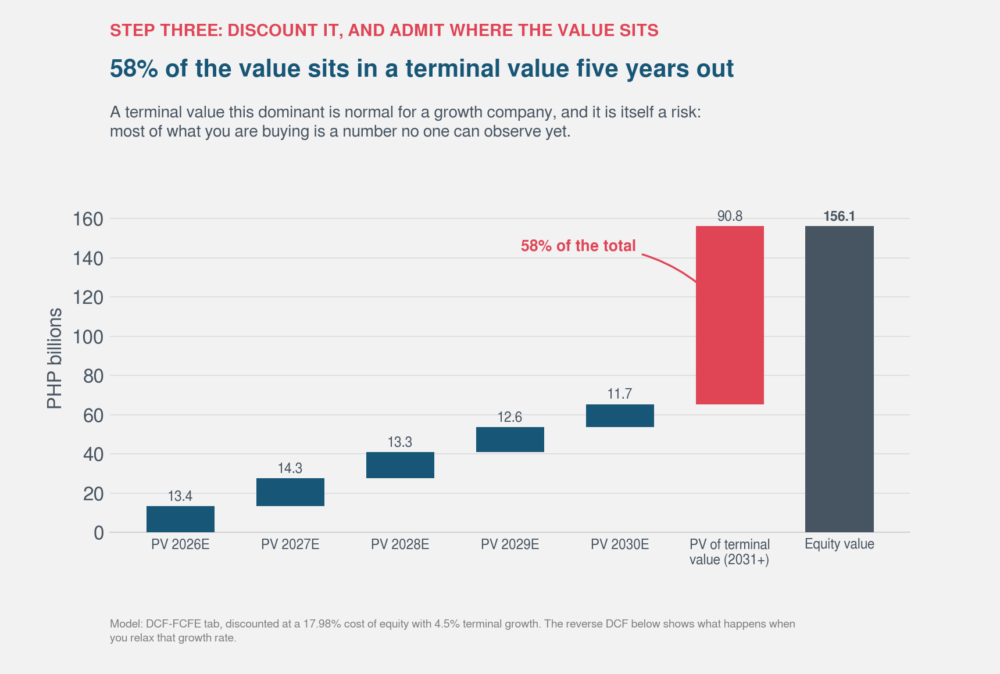

*Each teal bar is one discounted year. The cerise bar is everything after 2030, compressed into a single Gordon-growth number, and it carries most of the total. That is normal for a growth company and it is also a warning: most of what an investor is buying here is a figure nobody can observe yet. It is why I put as much weight on the justified multiple, which uses no forecast at all.*

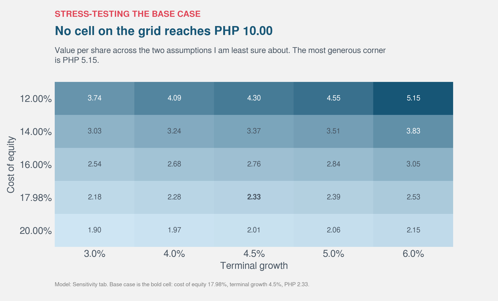

*Implied value per share across a cost of equity from 12% to 20% and terminal growth from 3% to 6%. The offer price does not appear anywhere on the grid.*

And across the full plausible range of the two assumptions I am least sure about, nothing approaches PHP 10. The most generous corner of that grid, a 12 percent cost of equity with 6 percent perpetual growth, does not get close.

The offer price prices this equity at **9.6 times adjusted tangible book** (PHP 1.04 per share, after the LTIP issuance and the June 2026 dividend). The justified multiple, on the company's own return on equity, is between 1.56 and 2.05 times depending on which equity base you strike it against.

## The cash question

The PHP 39.2 billion cash add-back represents 28 percent of the FCFF value per share. It is the single largest upward force in the model, and the claim that it is distributable to equity is not established.

Three things in the prospectus cut against it:

- **Printed page 44, verbatim:** wallet funds "are held in more liquid assets and cannot be used to facilitate lending." This is a regulated e-money balance sheet, not a corporate treasury.
- The only observable distribution is the **PHP 5,001.2 million** dividend declared 17 June 2026, which is 12.8 percent of the disclosed corporate cash balance. [Prospectus, p. 84]
- In March 2026 FUSE borrowed **PHP 1,750.0 million** from the ADB on a three-year term to fund MSME lending. [Prospectus, p. 142] That is not the behavior of a company sitting on 42 billion of surplus cash.

I model three scenarios:

| Free-cash treatment | PHP per share (FCFF) | PHP per share (EV/EBITDA comps, median) |
|---|---|---|
| 100% free (original) | PHP 2.08 | PHP 6.11 |
| 50% free | PHP 1.79 | PHP 5.79 |
| 0% free (strict) | PHP 1.50 | PHP 5.48 |

FCFE is unaffected by this assumption since net income already contains interest earned on deposits. At 0 percent free, FCFF falls to PHP 1.50. The offer remains 6.7 times that figure.

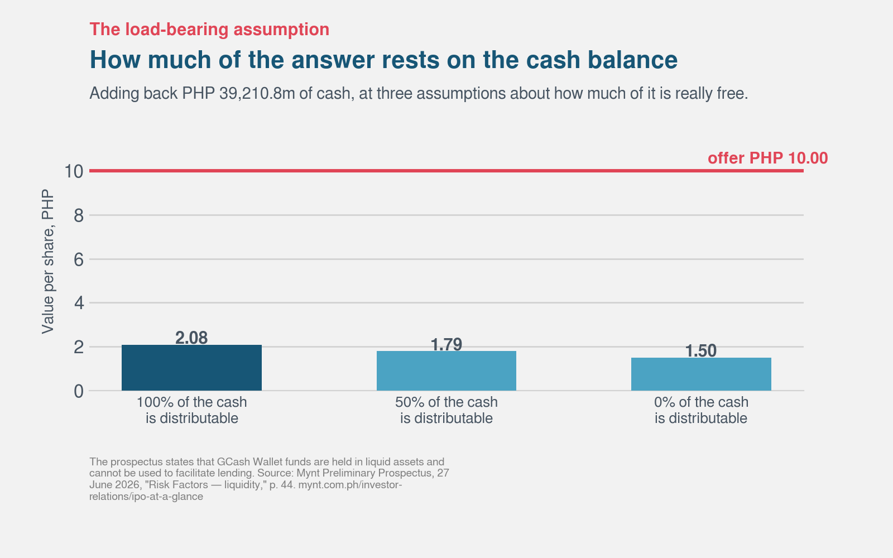

*The same FCFF model at three readings of the cash balance. This is the single largest lever in the analysis, and I would rather show you the range than pick a point inside it and not mention the other two.*

I keep the 100 percent case as the headline because it is the assumption a buyer would make reading the balance sheet cold, and because deleting an inconvenient number is not a method. But the strict reading is the one the prospectus text actually supports, and it takes the firm-side answer down to PHP 1.50. Note too that BSP Circular No. 1166 requires at least half the outstanding e-money balance to sit in trust, so even the corporate-cash figure is not free of regulatory claim. Nothing in this section moves the equity-side answer at all, which is part of why I trust the equity side more.

## What the market pays for companies like this

The cash flow work asks what the business is worth on its own terms. Comparables ask a more modest question: what are investors currently paying for businesses that look like this one? It replaces my assumptions with the market's, which is not the same as replacing them with the truth, but it is a genuine second opinion.

The peer set is the regional platform and payments group: Sea Limited, Grab, GoTo and PayPal. None of them is a clean match, and I want to say that plainly rather than bury it.

I also have to open with a confession. In the earlier draft I used a "peer average" of 19 times EBITDA and 36.6 times earnings. Those numbers came from press coverage. They traced to nothing I could point at, and when I finally went and pulled the multiples myself they did not survive.

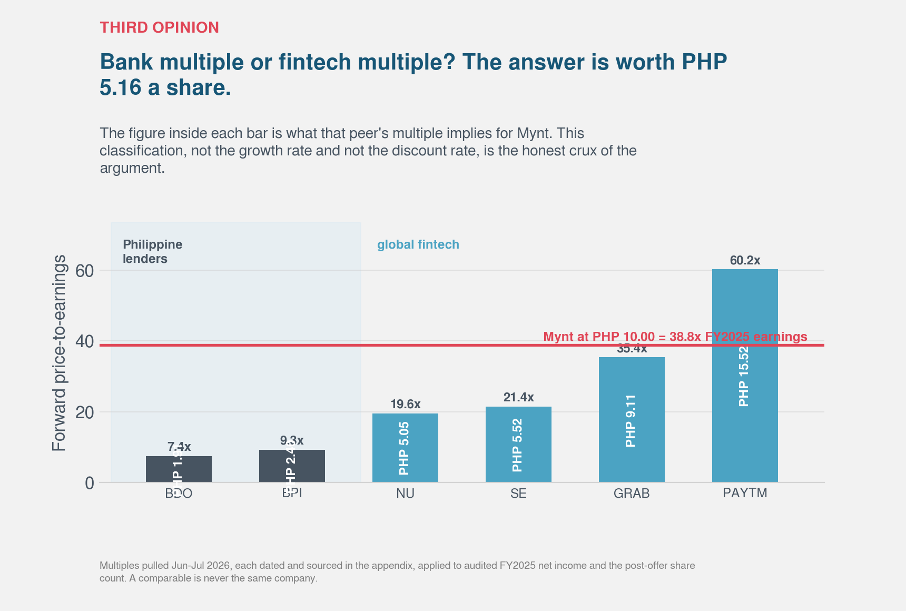

*Mynt's 2025 EBITDA margin of 25.6% is above every peer in the set. Mynt figure from the prospectus, "Summary Financial Information, Calculation for EBITDA," p. 37. Peer figures are from company filings and market data, not from the prospectus.*

The margin comparison is the strongest fact in Mynt's favor anywhere in this analysis, and the prospectus confirms it rather than weakening it. Audited 2025 EBITDA was **PHP 20,429.0 million** on adjusted revenues of PHP 79,670.5 million, a margin of 25.6 percent. [Prospectus, p. 37] Against sourced peer figures that is PayPal at 20.85 percent, GoTo at 12.0 percent and Grab at 11.25 percent. [Peer, not from prospectus]

Those peer margins are lower than the ones I published in the earlier draft, where I had Grab and GoTo in the mid-teens. The corrected numbers make Mynt's advantage larger, not smaller. I have dropped Sea from the chart because I could not source a comparable EBITDA margin for it, and I would rather show three sourced bars than four with one invented.

One caveat on the comparison itself. Mynt's EBITDA comes from the prospectus definition, which explicitly subtracts interest income on deposits. The peer figures come from three different data providers, each with its own adjustments, and none of them is likely to strip out that item. So Mynt's 25.6 percent is measured on a stricter basis than the bars beside it. The direction of that bias favors Mynt, meaning the real gap is if anything wider than the chart shows, but it is a comparison of things that were not defined the same way and I would not read the individual gaps too precisely.

I will note with some relief that my earlier draft had to assume this figure, guessed 25.4 percent, and derived implied EBITDA of PHP 20.24 billion. The audited number is PHP 20.43 billion. That estimate was within one percent, so the comparables work from before stands.

So Mynt is not asking to be valued as a regional super-app that might one day reach profitability. It is already more profitable than the companies it would be compared against. That is a legitimate argument for a premium multiple and any fair analysis has to concede it.

### The peer average was hiding the whole argument

Here is what the peers actually trade at, pulled in July 2026, with what each one implies for Mynt:

| Peer | P/E | implies | EV/EBITDA | implies |
|---|---|---|---|---|
| PayPal | 7.8x | **PHP 2.01** | 6.1x | **PHP 2.19** |
| GoTo | not meaningful | | 15.1x | PHP 4.93 |
| Sea Limited | 40.1x | PHP 10.33 | 22.8x | PHP 7.29 |
| Grab | 43.0x | **PHP 11.09** | 23.5x | **PHP 7.48** |

An average of those describes no company that exists. PayPal trades at a seventh of Sea's earnings multiple. Averaging a mature, de-rated payments processor with two growth platforms produces a number that is not a valuation, it is a compromise between two incompatible views of what Mynt is.

And that is the point, so it is worth stating plainly. **The comparables do not answer the question. They restate it.**

If Mynt is a growth platform in the mold of Sea or Grab, the comps say something between PHP 7.29 and PHP 11.09, and the offer price is inside that range. If Mynt is a maturing payments business with a lending book, which is what PayPal is, the comps say **PHP 2.01 to PHP 2.19**, sitting almost exactly on top of my cash-flow methods.

I did not engineer that. PayPal's multiple and my discounted cash flow arrive at the same place from opposite directions.

Two caveats on the data. Providers disagree materially on two of the four: Sea's EV/EBITDA is reported anywhere from 19.34x to 26.27x, and GoTo's from 15.1x to 41.96x. I have used midpoints for Sea and the lower figure for GoTo, and I would not defend any of these to two decimal places. And all of it is a July 2026 snapshot of a market that reprices daily, which is a different kind of evidence from an audited annual figure.

The gap between the enterprise-value and the earnings multiples is also real, and it is worth slowing down on.

Enterprise-value multiples value the operating business. Price-to-earnings values the bottom line. For most companies the two track each other. For Mynt they diverge because the earnings quality question sits precisely between them. A lender books interest income today against loans that may default tomorrow, and provisioning decisions determine how much of that reaches net income. The P/E route accepts the reported PHP 17.2 billion at face value. The EV/EBITDA route is stricter about what counts as operating profit.

> **Key insight.** The peer set splits along exactly the question this whole post is about. Growth-platform multiples put Mynt near the offer price. Mature-payments multiples put it near PHP 2. Choosing between them is not a modeling decision, it is a judgment about what kind of company this is becoming, and the prospectus says it is becoming a lender whose payments arm has stopped monetizing.

What the offer price actually implies, against the audited figures:

| Measure | At the PHP 10 offer | Peer reference |
|---|---|---|
| Price / earnings, trailing | 38.8x | 7.8x to 43.0x |
| Price / earnings, 2026E | 33.7x | |
| Price / earnings, 2027E | 29.8x | |
| EV / EBITDA | **31.7x** | 6.1x to 23.5x |
| Price / adjusted tangible book | **9.6x** | justified 1.56x to 2.05x |

The offer sits above every peer on both measures except Grab's earnings multiple. On enterprise value to EBITDA, 31.7 times is above all four peers, including both growth platforms.

A note on the forward multiples, because I had these wrong too. My earlier draft quoted about 32 times on 2026 estimates and 27 times on 2027, which came from coverage assuming roughly 20 percent growth. On my own growth path, anchored to the 14.8 percent the first quarter actually printed, they are 33.7 and 29.8 times. Slower growth means the multiple compresses more slowly, so the forward path is less reassuring than the numbers I first repeated.

### Are these earnings arm's length?

Globe and Ant between them own roughly two thirds of Mynt, and both sell to it and buy from it. So before accepting reported earnings at any multiple, it is worth asking how much of the revenue is set by negotiation among owners rather than by a market.

The answer is less alarming than I expected, and the trend runs the right way.

| Related-party revenue | 2023 | 2024 | 2025 | Q1'26 |
|---|---|---|---|---|
| Total, PHP millions | 4,573.8 | 4,499.6 | 5,648.2 | 1,508.8 |
| **Share of Adjusted Revenues** | **13.6%** | **8.3%** | **7.1%** | **7.3%** |

Related-party revenue has fallen from 13.6 percent of the business to about 7 percent. [Prospectus, pp. 297-298] The largest single line is the load service fee Mynt earns from Globe for airtime top-ups, and it is flat in absolute terms at roughly PHP 3.5 billion a year, which means it shrinks as a share of a growing company: 10.6 percent of revenue in 2023, 4.5 percent in 2025. The company is becoming less dependent on its owners, not more.

The prospectus asserts arm's-length terms, says material transactions are supported by a transfer pricing report using recognized benchmarking methods, and maintains a Related Party Transactions Committee. There is also a risk factor devoted to the possibility that related parties fail to act on fair terms, or that tax authorities challenge the transfer pricing. I have no basis to dispute any of it and I am not going to imply otherwise.

One item is worth flagging, not as an accusation but because it is unusual. Two lines appeared in 2025 that did not exist in 2024, both with Ant-affiliated counterparties. Merchant discount rate income from Alipay Connect went from zero to PHP 1,636.8 million, which is 6.4 percent of the year's entire revenue growth. In the same year, maintenance and platform service fees paid to an affiliate went from zero to PHP 1,268.8 million of expense. The two roughly offset, so the effect on profit is about PHP 368 million.

Separately, an affiliate API fee line that produced PHP 677.1 million in 2023 and PHP 835.8 million in 2024 went to zero in 2025.

> **Key insight.** These arrangements appear, grow, and vanish year to year. That is not evidence of anything improper, and the disclosure is thorough. But it does mean a slice of the revenue line is governed by agreements among shareholders rather than by customers, and it is one more reason to prefer the enterprise-value methods over taking reported earnings at face value.

None of this changes my valuation. Seven percent of revenue on an improving trend is a quality-of-earnings footnote, not a thesis.

A few pitfalls I tried to avoid, and one I could not:

| Pitfall | Why it matters here | What I did |
|---|---|---|
| Comparing to listed peers without a liquidity adjustment | Listed multiples embed liquidity that a 12 percent float does not provide | Noted, not quantified. I had no defensible discount. |
| Averaging a widely dispersed peer set | An average of 6x and 43x describes nothing | Fixed in this version. I report each peer and the range. |
| Using multiples that trace to no source | Numbers get repeated until they sound official | Fixed. Every multiple now has a provider and a date, and none of them is from the prospectus. |
| Using trailing earnings for a fast-growing company | Trailing P/E looks expensive by construction when earnings compound | Reported the forward path on my own growth assumptions: 33.7x on 2026, 29.8x on 2027 |
| Picking peers that favor the conclusion | Peer selection is where bias enters unnoticed | Fixed the regional set before seeing results and did not adjust it |
| No listed Philippine comparable exists | Nothing on the PSE resembles this business | Unresolved. A real limitation. |

That last row deserves more than a table cell. There is no listed Philippine company that looks like Mynt. The PSE's large caps are banks, conglomerates, property and utilities. Every multiple above is imported from a company operating in a different market, with a different regulator, a different currency and a different investor base.

One final comparison, which I find more informative than any multiple, and which I can now source properly. Before the prospectus, I said Ayala and MUFG invested at about five billion dollars in August 2024, taken from press coverage. The prospectus documents the transaction directly: in **September 2024**, MUFG Bank subscribed to 64,205,070 common shares for US\$160,000,333, representing 3.26 percent of issued and outstanding capital. [Prospectus, p. 85] That implies a valuation of about **US\$4.91 billion**. [Computed]

At PHP 10 the IPO prices the company at about US\$11.0 billion. Over that period net income grew from PHP 11.1 billion to PHP 17.2 billion, an increase of roughly 55 percent, while the valuation rather more than doubled.

Value rose faster than earnings. The difference is multiple expansion, which is the market paying more for each peso of profit than it did two years ago. That can be justified by a genuine improvement in growth quality or competitive position. It can also be what an IPO window looks like. Having now read the growth and margin trends, I lean toward the second reading more than I did before.

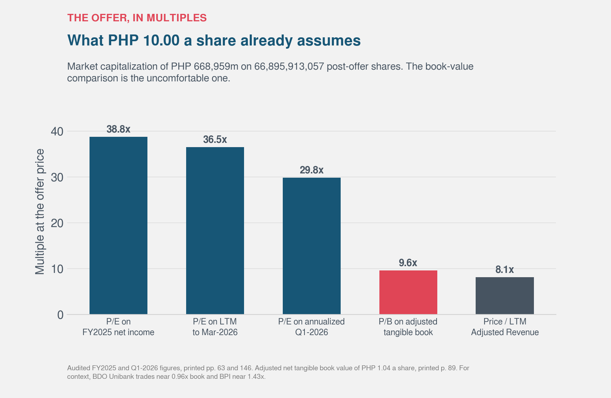

*Five ways of expressing the same price. The earnings multiples are defensible against a fintech peer set and indefensible against a bank one, which is the whole argument. The book multiple is the uncomfortable one: BDO Unibank trades near 1.0x book and BPI near 1.4x, and this is 9.6x. Some premium is clearly earned on a 32% return on equity. Whether it is nine times is a different question.*

Offer price context

Mynt Preliminary Prospectus, 27 June 2026 — 27 June 2026

Offer price

PHP 10.00

per share, preliminary prospectus

The anchor for every multiple below.

Walk-away price

PHP 5.02

best of 10,000 simulated outcomes

Even the most favorable simulation falls short by nearly half.

P/B at offer

9.6x

adjusted tangible book PHP 1.04 per share

Justified multiple sits between 1.56x and 2.05x.

EV/EBITDA at offer

31.7x

prospectus 2026E EBITDA PHP 12,273M

All four peers trade below this multiple.

## Putting the methods side by side

The point of a football field is that you stop defending one number. You lay the methods out together and look at where they cluster, and at where they do not.

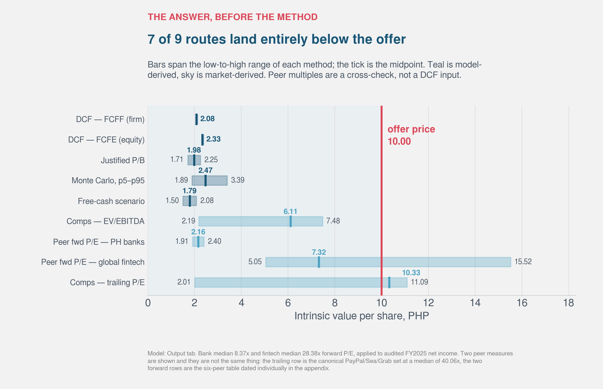

*The three cash-flow and book-based methods cluster within twelve percent of each other. The comparables are shown as ranges, because the peer set does not agree.*

| Method | Implied value per share | Distance from PHP 10.00 |
|---|---|---|
| FCFF, firm (wrong instrument, shown anyway) | PHP 2.08 | -79% |
| Justified price-to-book | PHP 1.71 to PHP 2.25 | -83% to -78% |
| FCFE, equity | PHP 2.33 | -77% |
| EV/EBITDA comps (median range) | PHP 2.19 to PHP 7.48 | -78% to -25% |
| P/E comps (median 40.06x; mean 30.28x) | PHP 2.01 to PHP 11.09 | -80% to +11% |
| **IPO offer price** | **PHP 10.00** | -- |

The comparables are ranges rather than points because the peer multiples span from PayPal at 6.1 times EBITDA to Grab at 23.5 times. In the earlier draft I collapsed that into a single average, which produced PHP 9.44 and made the comps look like the one method that supported the offer. They do not support it. They contain both the case for it and the case against it, and which one you get depends entirely on which peer you think Mynt resembles.

In the earlier draft I wrote that I had expected the offer to land somewhere inside my range, and that instead it sat at the top of it. With audited figures it sits further above the range than before. Every method moved down.

Two readings are available, and in the earlier draft I said both were partly right. I no longer think that is quite true, so let me take them in turn.

**The first reading is that the offer price is full.** The cash-flow and book-based methods cluster between PHP 1.71 and PHP 2.33. That clustering is worth more than any single figure: they run through different machinery and land inside a band a third as wide as the gap to the offer. The peer median on P/E at PHP 10.33 is the strongest counter-argument, and it requires you to value Mynt like Grab, a loss-making regional super-app, rather than like PayPal, whose multiple implies PHP 2.01. Even at the median, the comps contain both the case for the offer and the case against it.

**The second reading is that my methods are biased low for this kind of business.** This was the argument I leaned on last time, and parts of it survive. A five-year window truncates a long option. A borrowed beta of 1.6 may overstate the risk of a domestic franchise reaching 55 percent of adults. None of my methods can price a distribution moat, and Mynt's is genuinely rare.

But the prospectus took the strongest limb out from under that argument. I said the zero-debt assumption inflated my discount rate and that fixing it would raise the valuation. The debt was there, it was PHP 20.75 billion, and correcting for it moved the cost of capital by 41 basis points, because at the offer price the equity is 97 percent of market capital. The correction I was counting on turned out to be worth almost nothing.

And three corrections ran the other way, which I had not anticipated at all. Growth is decelerating faster than I modeled: 14.8 percent in the first quarter of 2026 against the 20 percent I assumed. Real cash conversion is about 46 percent, not the 85 percent I guessed, because the loan book eats the difference. And the peer multiple I had leaned on hardest, the one that produced PHP 9.44, turned out to be an unsourced average that dissolved the moment I checked it.

> **Key insight.** The football field does not say the market is wrong. It says the offer price sits at the very top of the widest method and above everything else, and that reaching it requires picking the single most generous peer in a set that spans from 6 to 43 times. That is a statement about how much has to go right.

There is one thing the chart cannot show, which is how confident I am in any of these bars. A single number for the FCFE implies a precision I do not have. So before drawing a conclusion I wanted the whole distribution rather than the midpoint.

## Ten thousand versions of the same model

This section exists because of Damodaran's SpaceX post. Faced with a company whose value depended on assumptions nobody could pin down, he did not defend a point estimate. He ran ten thousand simulations with the same expected values as his base case and reported the distribution.

My PHP 2.33 is not wrong so much as falsely precise. So I let the assumptions I am least sure about vary, and ran the FCFE model ten thousand times.

I got this badly wrong the first time, and the failure is more instructive than the fix.

My first simulation drew beta from a triangular distribution between 1.3 and 2.0. That looks like a wide range. It is not. It means the discount rate can only move up from a floor, and the floor was already high. A domestic franchise reaching 55 percent of Filipino adults could plausibly carry a beta near 1.0, and my simulation was never allowed to consider it. I had built a model that could discover bad news and could not discover good news, then reported the output as though the range had been explored.

Two smaller errors sat beside it. My guard on terminal growth, capping it at the discount rate minus two points, turned out to bind in exactly zero of ten thousand trials. It was decoration. The constraint that actually matters, that terminal growth cannot exceed the risk-free rate because the risk-free rate stands in for the growth of the whole economy, was not enforced at all, and 2.4 percent of my trials grew faster than the Philippine economy forever.

And the largest one: I varied six inputs while holding fixed the single assumption I had spent a section calling my biggest bias.

The corrected simulation centers every input on the base case it is meant to surround. That sounds obvious; it was not true of the first version, where beta had a mode of 1.4 against a base beta of 1.6, so the whole distribution sat above the model it was testing.

| Uncertain input | Distribution | Range |
|---|---|---|
| Revenue growth path | Triangular scalar on the whole 5-year path | 0.6x to 1.4x, mode 1.0x |
| Net margin | Normal shift | +/- 1.5 percentage points |
| Beta | Triangular | 0.9 to 2.0, mode 1.6 |
| Risk-free rate | Normal | 7.26%, standard deviation 0.4pp |
| Equity risk premium | Normal | 6.7%, standard deviation 0.5pp |
| Terminal growth | Triangular, capped at the risk-free rate | 3.0% to 6.0%, mode 4.5% |
| Loan intensity | Triangular | 40% to 62% of revenue, mode 51.8% |
| Debt-funded share of the book | Triangular | 30% to 55%, mode 42.5% |

The last two rows are new and they are the ones that matter for a lender. Loan intensity is how much book the business needs per peso of revenue, and the debt-funded share is how much of that book somebody else pays for. Neither existed in the first simulation, because without the prospectus I did not know either number.

The growth range is also wider than before, from 0.6x to 1.4x rather than 0.7x to 1.3x, because the first quarter of 2026 already came in below my base case and that is evidence my central path could be too optimistic.

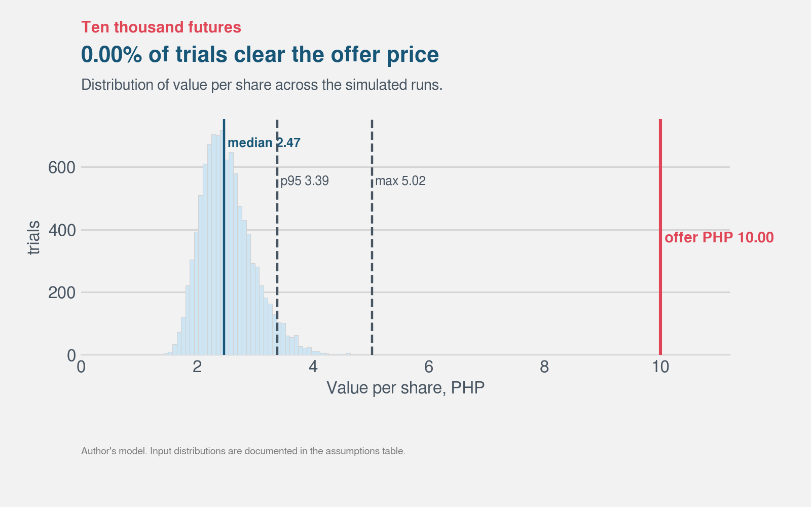

*Median PHP 2.47. Fifth to ninety-fifth percentile, PHP 1.89 to PHP 3.39. The offer price sits well off the right edge.*

| Statistic | Value |
|---|---|
| Median | PHP 2.47 |
| Interquartile range | PHP 2.29 to PHP 2.91 |
| 5th to 95th percentile | PHP 1.89 to PHP 3.39 |
| Single most favorable of 10,000 trials | PHP 5.02 |
| Trials clearing PHP 10.00 | **0 of 10,000** |

Zero. Not a low percentage.

I want to be careful about what that does and does not establish, because it is the most quotable number here and the most easily misread.

It does **not** mean there is no chance the shares are worth PHP 10. That would be a claim about the world, and this is a simulation of my model, not of reality. If the model is structurally wrong, running it ten thousand times produces ten thousand versions of the same structural error. Monte Carlo widens a model's error bars. It does not correct its foundations. My earlier draft demonstrated that rather neatly by widening the bars in only one direction.

What it does establish is narrower and still useful: **the gap is not an artifact of unlucky assumptions.** Ninety-five percent of draws land below PHP 3.39, and the single most favorable of ten thousand reaches PHP 5.02. The offer price sits above every one of them, with the cost of equity ranging from 14.4 to 20.1 percent across the middle ninety percent of trials.

So the disagreement is not about parameters. It is about structure. To justify PHP 10 you cannot adjust my inputs, and I have now spent real effort confirming that across two rounds of doing it wrong. You have to reject the frame: the five-year window, the loan book as reinvestment, the borrowed beta, or the idea that discounted cash flow is the right lens for a company whose value lives in optionality it has not yet exercised.

That is a defensible position. It is also a far more demanding claim than "the model is a bit conservative," and anyone buying at PHP 10 is implicitly making it.

> **Key insight.** The simulation did not soften the finding. It sharpened it twice. The question is no longer whether my assumptions were harsh, but whether any cash-flow model can reach this price.

Monte Carlo distribution

Mynt Preliminary Prospectus, 27 June 2026 — 10,000 trials, seed 42

Median outcome

PHP 2.47

50th percentile of 10,000 trials

Half the simulations land below PHP 2.47.

P5 outcome

PHP 1.89

5th percentile

Even pessimistic outcomes are bounded above zero.

P95 outcome

PHP 3.39

95th percentile

Only five percent of trials exceed PHP 3.39.

Trials clearing PHP 10

0

of 10,000

No combination of assumptions reaches the offer.

## The offer range and the walk-away price

This is the chart I learned to draw in Financial Management 2. It is simple and it is honest.

*The PHP 10 offer price sits above every valuation method in the analysis. The walk-away price, derived from the most favorable Monte Carlo trial, is PHP 5.02. No scenario reaches the offer. Base inputs from the prospectus; model assumptions documented in the assumptions table below.*

The horizontal bar shows the offer price at PHP 10. The walk-away price is PHP 5.02, which is the single most favorable outcome from ten thousand Monte Carlo simulations. Every other method lands below that:

| Method | Value per share |
|---|---|
| FCFF (firm) | PHP 2.08 |
| FCFE (equity) | PHP 2.33 |
| Justified P/B (high) | PHP 2.25 |
| Monte Carlo median | PHP 2.47 |
| Monte Carlo P95 | PHP 3.39 |
| Monte Carlo max | PHP 5.02 |

The purchasing offer should be based on the intrinsic value derived from the analysis, not the IPO offer price. Using the FCFE method as primary, that is PHP 2.33. Using the Monte Carlo median, that is PHP 2.47. Both are well below PHP 10.

This is what the Financial Management 2 toolkit teaches: the offer price is a starting point for negotiation, not a floor. The walk-away price is where your arithmetic tells you the asset stops being worth buying.

At PHP 10, you are paying four times what the median simulation produces and twice what the single most favorable one does. That is not a margin of safety. That is a margin of hope.

## What PHP 10 actually requires

Every section so far has run the model forwards: put assumptions in, get a price out. The last thing worth doing is running it backwards. Hold PHP 10.00 as the answer and solve for the input that produces it. Whatever comes back is what the offer price is asserting about the business, whether or not anyone has said it out loud.

I solved for four of them separately, each one holding everything else at base.

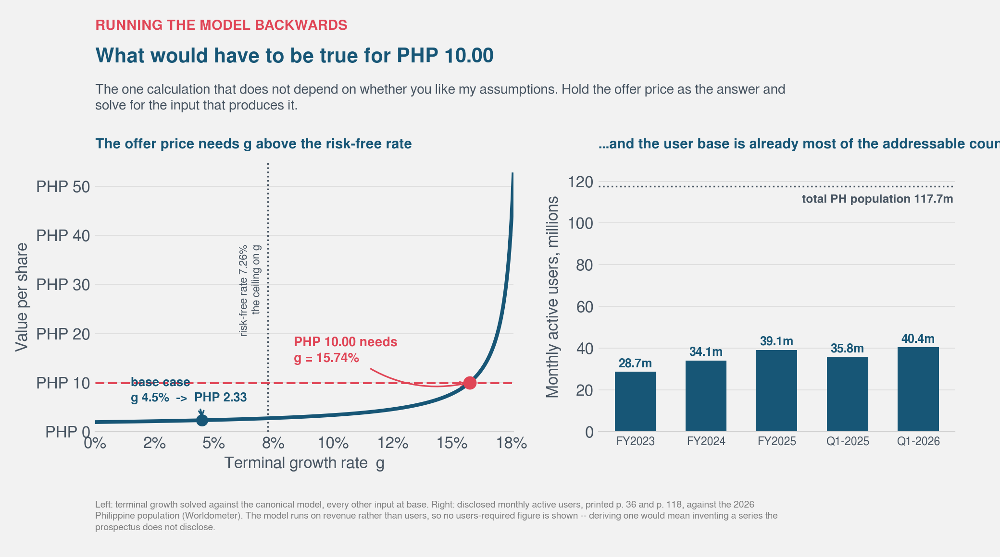

*Left: value per share as terminal growth varies, everything else held at base. The curve crosses PHP 10.00 only after it has passed the risk-free rate, which is the dotted line, and growth above that rate is not admissible in a Gordon terminal value. Right: what the user base already looks like against the country it sells into. These are not forecasts. They are the arithmetic of the offer price.*

**Terminal growth of 15.7 percent, forever.** The base case uses 4.5 percent, which is already below Philippine inflation. To reach PHP 10 the business has to grow faster than the whole economy in perpetuity, and 15.7 percent is more than double the 7.26 percent risk-free rate. The Gordon relation only requires growth below the discount rate, so this is not algebraically forbidden — an audit was right to pull me up on calling it inadmissible. It is economically indefensible, which is a different and slightly weaker claim. No company compounds at 15.7 percent forever without eventually becoming the whole economy.

**A beta of 0.08.** The base case uses 1.6, borrowed from listed payments and platform peers. A beta of 0.08 says Mynt's equity moves almost independently of the market. That is a description of a short-dated government bond, not of a consumer lender in an emerging market with a loan book growing faster than revenue.

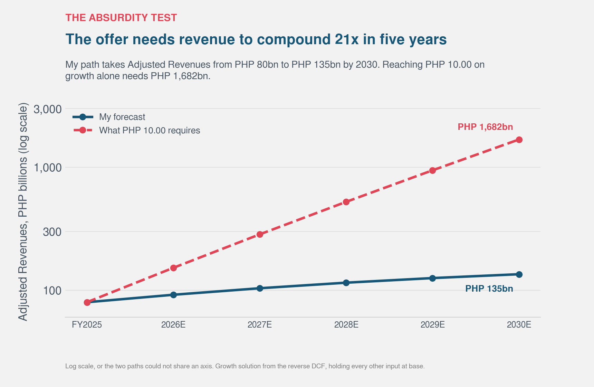

*My forecast against the one the offer needs, on a log scale because they will not share a linear axis. The gap is not a rounding difference.*

**A revenue path where every growth factor is multiplied by 1.66.** My path runs 15 percent in 2026 stepping down to 7.5 percent by 2030, anchored on the 14.8 percent Q1 2026 actually printed. The solver multiplies each year's growth *factor* by 1.658, which is not the same as raising each growth rate by 66 percent — it turns 15 percent growth into 91 percent, and 7.5 percent into 78 percent. I described this wrongly in an earlier draft and an audit caught it. That path implies FY2030 revenue of PHP 1.7 trillion against my PHP 135 billion, and against PHP 79.7 billion actually earned in 2025. Twenty-one times in five years.

There is a fourth solution the chart does not show, because my model does not run on users and I will not invent a series the prospectus does not disclose. But the shape of it is worth stating: any user-based path to PHP 10 has to keep adding Filipinos long after it has run out of them. GCash already reaches roughly half the adult population.

The point of this section is not that the offer is absurd. It is that the disagreement between my answer and the offer price is not a disagreement about parameters. I spent two rounds trying to move my inputs far enough to close it and could not do it from inside any range I would defend. To get to PHP 10 you have to reject the frame itself: the five-year window, the loan book as reinvestment, the borrowed beta, or the premise that discounted cash flow is the right lens for a company whose value may live in optionality it has not exercised yet.

That is a real argument and I am not in a position to win it. But it is the argument, and it should be made explicitly rather than smuggled in through a discount rate.

## So is PHP 10 the right price?

I said at the start that I would give an answer rather than hide behind a range. Before the prospectus was out, working from news coverage, I wrote that PHP 10 was a full price but not an unreasonable one.

Having read the audited accounts, I no longer think that is the right answer. It was too generous, and it was generous in the specific way that outsiders are usually generous, which is that I gave the benefit of the doubt to the assumptions I could not check.

**PHP 10 is a rich price. It requires you to value Mynt like a growth platform at the exact moment its numbers stopped looking like one.**

Here is what changed my mind, and none of it is a matter of taste.

I expected the debt discovery to close the gap. It moved my cost of capital by 41 basis points, because at the offer price equity is 97 percent of market capital. The correction I was counting on was worth almost nothing.

Two corrections ran the other way and were larger than anything I had anticipated. Real cash conversion is about 46 percent rather than the 85 percent I had assumed, because the loan book consumes the difference, and that is structural for a lender rather than a one-off. And growth is decelerating faster than I modeled: 14.8 percent in the first quarter of 2026 against the 20 percent in my forecast.

Then two facts I had no idea existed. Payment Solutions revenue **fell** 1.5 percent year on year in the most recent quarter, while volume grew 23.2 percent, after a regulatory directive removed in-app gambling access. And the lending spread has compressed from 31.5 percent to 23.4 percent in just over two years, when I had shown that last figure as a static moat.

So both halves of the business are under pressure at the moment of listing, and I could not see either from outside.

### What survives from the bull case

What survives from the bull case is real and I am not dismissing it. Mynt is more profitable than every regional peer, and the audited EBITDA margin of 25.6 percent confirms it. It reaches 40.4 million people. Its provisioning looks honest, with coverage of defaulted loans stable above 92 percent throughout. No competitor in the Philippines is close. If the CreditTech engine keeps compounding through a credit cycle nobody has tested, PHP 10 will look sensible in hindsight and this post will read as an engineer being too literal with a spreadsheet.

But that is a story about what might happen. The price is being paid now, against numbers that are visible now, and the numbers do not support it.

### What would have to be true

| Condition | Status after reading the prospectus |
|---|---|
| Growth reaccelerates above 20% | Q1 2026 came in at 14.8%. Currently failing. |
| Payment monetization recovers | Take rate fell from 0.31% to 0.25%; segment revenue is shrinking. Currently failing. |
| Lending spread stabilizes | NIMAL down eight points in two years and still falling. Currently failing. |
| Credit quality holds | The NPL fall is a write-off effect. On average balances, default and write-off intensity both rose in 2025. Cost of risk is 29-31% of the loan book and performing-loan cover went to 5.57%. Currently failing. |
| The market keeps paying ~37x for PH fintech | Outside anyone's control. |
| Cash conversion improves as growth slows | The one that plausibly works in the company's favor. Slower loan growth does free cash. |

Four are failing outright, one is outside anyone's control, and one plausibly helps. That is a materially worse picture than the one I drew from press coverage, where I could only list them as risks.

The credit row took me three attempts to get right, and the process is in the post because it is more useful than the answer. I first claimed default formation was accelerating, using a comparison between a quarter and a full year that is not permitted. I retracted that and replaced it with a full-year comparison measured against opening balances, which said credit was fine. That was also wrong, because a book that grows 173 percent in a year makes the opening balance a meaningless denominator. On average balances, which is the standard basis and the one the prospectus uses for its own margin metric, default inflow intensity rose from 22.6 to 35.3 percent and write-off intensity from 16.5 to 25.1 percent between 2024 and 2025.

### The transaction, not the company

Of the 8,027,409,600 shares in the base offer, gross proceeds split PHP 16,054.8 million primary and PHP 64,219.3 million secondary. So **80.0 percent of the money raised goes to existing shareholders**, principally Ant Group, Globe and Ayala, and 20 percent to the company. My earlier estimate from the share split was correct. [Prospectus, pp. 108-109]

There is also a dividend of PHP 5,001.2 million declared on 17 June 2026 and paid on 30 June, to holders of record before the offer. [Prospectus, p. 108]

None of this is improper and all of it is disclosed. But it changes what the transaction is. This is substantially a liquidity event for the existing shareholder base rather than a capital raise, and the growth story being sold alongside it will be funded from operations regardless. In the preliminary filing the use of proceeds table is still blank, with the amounts left unfilled against four categories, the largest named one being CreditTech growth. So the company will use its fifth of the money mostly to fund the loan book.

The float is 12.0 percent, against 88.0 percent retained.

> **Caution.** A 12 percent float means the post-listing price tells you less than you would think. Thin supply plus index-tracking funds required to buy on inclusion creates real demand unrelated to valuation. If the stock trades up on listing, that is not evidence the PHP 10 price was conservative. It is what scarcity does.

The existing shareholders are locked up for at least 180 days (365 for holders of 10 percent or more and shares issued below offer price within 180 days pre-offer). So the supply stays thin for a full year in the worst case, and the first genuine test of what the market will pay does not arrive until the lock-up expires. I would treat everything before that as close to uninformative about intrinsic value.

### What this does for the Philippine market

On the second question I set out to answer, I am more positive than the valuation work suggests, and the prospectus did not change this part.

It gives the PSE something it does not have. The exchange is concentrated in banks, conglomerates, property and utilities, with no listed Philippine technology franchise of consequence. That absence is part of why the market has struggled for relevance with younger domestic investors and foreign allocators.

It restarts a dormant pipeline. The largest IPO in the exchange's history, successfully absorbed, changes what the next company believes is possible.

It forces disclosure, and this post is the evidence. Everything I struggled with before the prospectus, the absent cash flow, the unknown capital structure, the opaque loan book, the regulatory hit nobody was writing about, is now public and auditable. A significant part of Philippine consumer credit sat inside a private company. Moving it into public view is a real gain for anyone trying to understand household leverage in this country, regulators included. I could not have written this post without it.

And it brings retail investors into an asset they already understand. Most PSE listings are abstractions to the average Filipino. This one is an app on their phone.

Set against that: a thinly floated stock is more of a price signal than a functioning market, most of the proceeds move to existing holders rather than funding investment, and a large index-weighted listing concentrated in consumer lending adds a risk to the domestic market that was not there before.

On balance the listing is good for the Philippine market, more clearly than it is good for anyone buying at PHP 10. Those are separate questions and they deserve separate answers.

### Where I land

Three methods running through different machinery land between PHP 1.71 and PHP 2.33. Ten thousand simulations put the median at PHP 2.47 and never once reach the offer. The comparables span PHP 2.01 to PHP 11.09, and where you land inside that range depends on whether you value Mynt like PayPal or like Grab. The peer median P/E of 40.06x lands at PHP 10.33, above the offer, but it requires you to believe Mynt deserves a Grab-like multiple. PayPal's multiples imply PHP 2.01 to PHP 2.19, which is where my cash-flow work already sits.

At PHP 10 you are paying 9.6 times adjusted tangible book for a business whose own return on equity justifies between 1.56 and 2.05 times, and 31.7 times EBITDA against peers ranging from 6.1 to 23.5 times. You are paying it for a lender whose payments arm is shrinking in revenue and whose own management has just increased its provisioning against loans that are still being repaid.

My answer is that the price is rich, and the margin of safety is not thin but absent. Whether it turns out to be a good investment depends on a credit cycle nobody has observed and on the market continuing to pay platform multiples for a business that is becoming a lender. On both of those my model has nothing to contribute, and I want to be clear that I am not predicting the share price. I am saying what the arithmetic supports, which is a different claim.

I said at the start that I am no Damodaran, and doing this twice has clarified exactly what that means. It is not that I cannot run the calculations. The calculations are the easy part and a script does them in a second. It is knowing which model fits which company, catching yourself when a correction happens to flatter the conclusion you already like, and recognizing that a five-year discounted cash flow on a consumer lender is the wrong instrument before you spend a week on the output rather than after.

I got all three of those wrong on the first pass. The prospectus caught me. That is what prospectuses are for.

I did the arithmetic. Twice, and the second time with audited numbers. The arithmetic says PHP 10 is rich. Read it as one input, from an engineer, with every assumption written down and every page cited.

---

If you want to argue with a specific cell rather than with the conclusion, the workbook is in the next section and every input in it is editable. I would rather be corrected than agreed with. I'm on [LinkedIn](https://www.linkedin.com/in/kennethvallespin/) and I read everything.

## The model, if you want to take it apart

Everything above comes out of one workbook. It is not a screenshot of a model, it is the model, and it is live: the blue cells are inputs, the black ones are formulas, and changing an input cascades through all thirteen tabs.

**[Download the workbook (.xlsx)](assets/an-engineers-valuation-of-the-mynt-gcash-ipo/mynt_gcash_valuation_model.xlsx)**

| Tab | What is in it |
|---|---|
| Assumptions | Every input in one place. Blue is editable, yellow marks the levers that matter most |
| Historicals | The audited figures, each with a printed prospectus page |
| Unit Economics | Loan intensity, debt funding, margins, ratios derived from the above |
| Forecast | FY2026 to FY2030, revenue through to both free cash flow lines |
| WACC | Cost of equity, after-tax cost of debt, market-value weights |
| DCF-FCFF, DCF-FCFE | The two discounted cash flow models, laid out year by year across the page |
| Justified Multiples | The Gordon relation, and what the offer price demands of return on equity |
| Comps | The peer table and what each multiple implies |
| Scenarios | The free-cash question at 100, 50 and 0 percent |
| Sensitivity | Value per share across cost of equity and terminal growth |
| Output | Everything on one page |

Three things worth knowing before you open it.

**The levers are marked.** The yellow cells are the four assumptions that move the answer most: beta, terminal growth, the debt-funded share of the loan book, and how much of the cash balance you treat as distributable. If you disagree with me, you probably disagree about one of those four, and you can settle it in about a minute.

**The guard rail is live.** There is a check that fails loudly if terminal growth is set above the risk-free rate, because a company cannot compound faster than the economy forever. My own first attempt at this violated it in 2.4 percent of simulated runs without telling me.

**Nothing is hardcoded downstream.** The charts in this post read from the same file. Change an assumption and the model, the charts and the numbers in the text all move together, which is the only way I know to stop a chart quietly contradicting the paragraph next to it.

## Then I had it torn apart

A model that only its author has checked is a model nobody has checked. So before publishing I packaged the whole thing, workbook and code and charts and prose and the prospectus extraction and pinned dependencies, and ran it through a mixture-of-agents review.

The setup is worth a sentence, because it is not the same as asking one model for an opinion. Three reference models read the package in parallel. Each produces its own analysis with no tools and no sight of the others. An aggregator then reads all three and writes the single reply. The reference models cannot argue with each other, which sounds like a limitation and is actually the point. Three independent readings landing on the same objection is evidence. One model talking itself into a position is not.

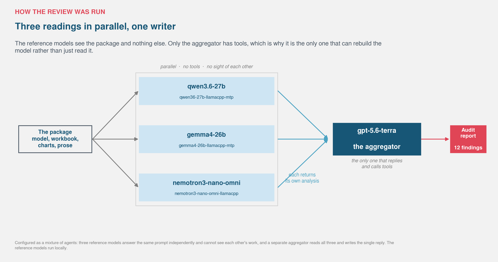

*Three readings in parallel, one writer. The reference models run locally. The aggregator is the only component with tools, which is why it is the only one that can rebuild the package rather than just read it.*

### What came back

It reproduced the build cleanly. Every check passed, and the post, the preview and the simulation array all came back byte-identical across two runs. Then it rebuilt the discounted cash flow from the prospectus instead of checking my arithmetic. It landed on the same firm and equity values I did, to the centavo, and set its own range at PHP 1.70 to PHP 3.40 against my PHP 2.33.

That is the most useful thing in the report. Two models built on different code, working from the same document, agreeing on the answer is worth more than either one alone.

Then it found twelve things. I accepted six, rejected one, and had already handled five.

**The one that cost me the most.** The prospectus states corporate cash outright. Printed page 35: of the total cash and equivalents, PHP 39.2 billion represents corporate cash at 31 March 2026, defined as balances not considered customer-related. I had derived my own figure instead, cash less the uncovered float, and got PHP 42.2 billion. I even labeled it in the text as my derivation rather than a disclosed line, which tells you I knew it was the weaker number and still did not go looking for the stronger one. It was three billion pesos too generous. The firm-side value falls from PHP 2.13 to PHP 2.08.

**A forecast that could not be true.** My 2026 loan book closed at PHP 47.5 billion. The company had already reported PHP 48.8 billion on 31 March 2026. A December balance below a March actual is not a forecast. It is what happens when you apply a ratio and never look at what comes out. The book is now floored at the reported figure. Equity value moves from PHP 2.33 to PHP 2.33, so the effect rounds away, which is exactly why I had not noticed it.

**Two sentences that overstated.** I wrote that terminal growth above the risk-free rate is "not admissible." The Gordon relation only requires growth below the discount rate. Growth above the risk-free rate is economically indefensible, which is a real argument, but it is not the algebraic impossibility I dressed it up as. I also described the reverse-DCF solution as "a growth path 66 percent above mine," when the solver multiplies each year's growth *factor* by 1.658. That turns 15 percent growth into 91 percent, not into 25 percent. The chart was right. The sentence explaining the chart was wrong.

**One I rejected.** The report flagged my 2026 payout ratio as internally contradictory, computing 105 percent where I claim about 80. Its arithmetic was correct on the numbers it used. Those numbers came from a superseded version of the loan-book base, two revisions old. The shipped package computes 80 percent. I checked this rather than accepting it, which is the whole reason to adjudicate a review instead of applying it.

The underlying point survived anyway. I had described the cash-conversion ratio and the retention rate implied by the justified multiple as two methods independently agreeing. They are not the same measure, so that convergence claim is gone.

**And one piece of plumbing.** The workbook was reproducible in content but not byte for byte, because the spreadsheet library rewrites a timestamp inside the file on every save. It now writes a fixed one. Trivial, and the sort of thing only an auditor bothers to check.

### What this does and does not establish

It does not make the analysis right. Three models reading the same package can share the same blind spot, and the largest question here is structural rather than arithmetic: whether lending growth really consumes equity the way I have modeled it. No amount of checking resolves that.

What it does establish is narrower. The arithmetic reproduces independently. The figures tie to the document. The two errors that survived my own verification were both found, both cost me value, and both are now fixed. The conclusion did not move. Every method still lands far below the offer price, and the one that clears it clears it for the same reason it did before.

I would rather publish a number that has been attacked than one that has only been admired.

---

### Assumptions, sources, and limitations

Everything above comes from the Mynt Preliminary Prospectus dated 27 June 2026, 593 pages, audited by Isla Lipana & Co., available via [mynt.com.ph/investor-relations/ipo-at-a-glance](https://mynt.com.ph/investor-relations/ipo-at-a-glance). The model, the simulation and all nine charts are reproducible from one Python script.

**Where each figure comes from.** Income statement, balance sheet, cash flow statement and key performance indicators: "Summary Financial Information," pp. 34-37. Capital structure and total debt: "Capitalization," p. 88. Share count, float and net tangible book value: "Dilution," p. 89. Offer size and split: "Use of Proceeds," pp. 79-81. Capital expenditure, indebtedness and cost of debt: "MD&A," p. 142. Segment revenues: "MD&A," pp. 113, 117, 122, 126-127. Non-performing loans and the expected credit loss movement schedule: pp. 98, 106, and financial statements p. F-48. Provision for credit losses: MD&A pp. 114, 118-119, 123-124. Related party transactions: "Related Party Transactions," pp. 297-298, with the associated risk factor on p. 80. Lock-up terms: pp. 50-51. The August 2025 BSP Directive: "Glossary," p. xii.

**Valuation inputs.** Risk-free rate 7.26 percent (PH FXTN 10-year government bond yield, 14 July 2026). Equity risk premium 6.7 percent (Damodaran, Philippines). Beta 1.6 in the base case, borrowed from listed peers, varied 0.9 to 2.0 in the simulation. Cost of equity 17.98 percent. After-tax cost of debt 4.31 percent. WACC 17.57 percent on market-value weights. Terminal growth 4.5 percent. Explicit forecast 2026 to 2030, with 2026 growth of 15 percent anchored on the actual Q1 2026 print of 14.8 percent.

**Known weaknesses**, in one place so they are not buried:

1. Beta is borrowed, not regressed. Mynt has never traded. The 1.6 is a midpoint of listed payment and platform betas from my sensitivity work.
2. The five-year forecast window is held fixed across every simulation. It is the assumption I am least able to defend and the one the simulation never questions.
3. FCFF discounted at WACC is the wrong instrument for a lender, by Damodaran's own rule. I report it, label it, and rely on the equity-side methods instead.
4. Peer multiples are imported from companies in other markets. No listed Philippine comparable exists.
5. Peer EBITDA margins and multiples are NOT from the prospectus. They were pulled in July 2026 from public data providers, each cited individually in the text and chart captions. Providers disagree materially on Sea (EV/EBITDA 19.34x to 26.27x) and GoTo (15.1x to 41.96x). They are a market snapshot, not audited figures, and they will be stale quickly.
6. The traditional bank net interest margin band is an illustrative reference, not an audited comparative.
7. The Monte Carlo distributions are my own design. Damodaran does not publish per-variable ranges in the SpaceX post.
8. Off-balance-sheet loan channeling exists, where partner institutions take ownership and generally bear the credit risk, so the disclosed non-performing loan ratio does not cover the whole lending operation.
9. The use of proceeds table in this preliminary filing is still blank, so I cannot say how the primary money is actually split.
10. About 7 percent of revenue comes from parties who own roughly two thirds of the company. The prospectus states these are arm's length and supported by a transfer pricing report, and the trend is improving, but I cannot independently verify the pricing.
11. The PHP 39.2 billion of cash treated as available to equity is the corporate cash balance the prospectus discloses at printed p. 35, defined there as balances not considered customer-related. An earlier draft used my own derivation instead — cash and equivalents less the portion of the e-money float not covered by trust cash — which came to PHP 42.2 billion, three billion too generous. Even the disclosed figure is not fully free: BSP Circular No. 1166 requires at least half the outstanding e-money balance to be held in trust. The 50% and 0% scenarios exist for that reason.
12. The loan book has not grown smoothly. It added PHP 22.2 billion in 2024, PHP 7.1 billion in 2025, and PHP 7.5 billion in the first quarter of 2026 alone. The model smooths this into a constant ratio, which no year actually resembles.
13. Loan intensity is held at 51.8 percent of revenue, the 2025 figure. The actual series is volatile: 35.6, 63.1, 51.8, and about 58.8 percent implied by the first quarter of 2026. The base case therefore sits below the most recent observation, which flatters the valuation slightly. The simulation varies it from 40 to 62 percent.

**A note on the peer multiples.** My earlier draft used a "peer average" of 19x EV/EBITDA and 36.6x P/E taken from press coverage. Neither traced to a source. Pulled individually they run from PayPal at 6.1x and 7.8x to Grab at 23.5x and 43.0x, a dispersion wide enough that no average is meaningful. This post reports each peer and the resulting range instead. The P/E median of 40.06x (PayPal 7.79x, Sea 40.06x, Grab 43.00x) implies PHP 10.33 per share, above the PHP 10 offer. This is the strongest counter-argument to the conclusion, and it is shown rather than buried.

**Peer multiple sources**, all pulled in July 2026, none of them from the prospectus, and all of them a market snapshot rather than an audited figure.

- **PayPal**: EV/EBITDA 6.12x ([valueinvesting.io](https://valueinvesting.io/PYPL/valuation/ev_ebitda-multiples), 15 July 2026); P/E 7.79x ([public.com](https://public.com/stocks/pypl/pe-ratio), 12 June 2026); EBITDA margin 20.85% ([macrotrends](https://www.macrotrends.net/stocks/charts/PYPL/paypal-holdings/ebitda-margin), quarter to 30 September 2025).
- **Sea Limited**: EV/EBITDA 19.34x ([stockanalysis](https://stockanalysis.com/stocks/se/statistics/)) to 26.27x ([financecharts](https://www.financecharts.com/stocks/SE/value/ev-to-ebitda), 6 July 2026); P/E 38.97x ([fullratio](https://fullratio.com/stocks/nyse-se/pe-ratio), 17 July 2026) to 41.14x ([public.com](https://public.com/stocks/se/pe-ratio), 18 July 2026). Midpoints used.
- **Grab**: P/E 42-44x, EBITDA US\$469 million on enterprise value of about US\$11.0 billion, EBITDA margin 11.25% ([stockanalysis](https://stockanalysis.com/stocks/grab/), [TOPONE Markets](https://www.top1markets.com/news/grab-stock-forecast-2026-profitability-q2-earnings), July 2026).
- **GoTo**: EV/EBITDA 15.1x and EBITDA margin 12% ([multiples.vc](https://multiples.vc/public-comps/goto-gojek-tokopedia-valuation-multiples), 21 July 2026), against 41.96x reported by [Alpha Spread](https://www.alphaspread.com/security/idx/goto/relative-valuation/ratio/enterprise-value-to-ebitda). I used the lower figure and flagged the spread.

I could not source a comparable EBITDA margin for Sea Limited, so it is absent from the margin chart rather than estimated.

**A denominator audit.** After making the same class of mistake twice, I went through every ratio in the post and asked what its denominator was doing. The results, so a reader can check my working:

| Ratio | Denominator | Verdict |
|---|---|---|
| Revenue growth, margins, segment mix | Adjusted Revenues; quarters compared to quarters | Sound. Matches the prospectus's own definitions. |
| Payment take rate | Payment Solutions GTV | Sound, prospectus definition |
| NIMAL | Average on-book gross loans | Sound, and the prospectus already uses average balances |
| NPL ratio, stage coverage, allowance ratios | Point-in-time balances | Sound, no normalization needed |
| Default and write-off intensity | Was opening book, now **average** book | **Corrected.** Opening balances reversed the conclusion. |
| Provisions | Was % of revenue, now **% of average gross loans** | **Corrected.** Percent of revenue partly measured business mix, not credit. |
| Justified P/B | Was average-equity ROE on ending book | **Corrected** to a range, PHP 1.71 to PHP 2.25 |
| WACC weights | Was tempted by book, used **market** | Sound |
| Loan book reinvestment | Change in **net** loan receivables | Sound. Checked against the cash identity: net change equals gross lending less collections less the provision add-back, and the two agree to within PHP 241 million of recoveries. |
| Cash conversion | FCFF over net income | Sound, but the numerator excludes a working capital release that will not repeat |
| Loan intensity | Net loans over Adjusted Revenues; Q1 annualized by four | Weakest. Q1 may be seasonally strong, which would lower the implied intensity further. |
| P/E, EV/EBITDA, P/B at the offer | Market capitalization, with cash and debt adjusted | Sound after the cash correction |
| Peer EBITDA margins | Each company's own revenue, three different providers | **Not strictly comparable.** Definitions differ; noted in the text. |

**Three attempts at the credit numbers**, since the body only reports the surviving one.

*Attempt one.* I measured new default formation as transfers into the default stage, annualized, and found 16.0 percent of the opening book in 2024, 19.1 in 2025 and 25.0 in the first quarter of 2026, and called it acceleration. Wrong twice over. The default bucket also receives direct additions, which were PHP 3,724.0 million in 2024 and PHP 7,892.7 million in 2025 and **zero** in the quarter, so I had counted one inflow channel and ignored another. And a quarter cannot be compared with a full year at all, because default means ninety days past due and a loan written inside a three-month window cannot reach it.

*Attempt two.* I compared full year against full year, which is legitimate, but normalized against the **opening** book. That gave inflow of 42.1 percent falling to 39.4, and write-offs of 30.7 falling to 28.0, and said credit was fine. Also wrong: the book grew 173 percent in 2024, so the opening balance bears almost no relation to the exposure that actually generated the losses.

*Attempt three*, in the body: full years, average balances, which is the standard basis and the one the prospectus uses for its own margin metric. Inflow 22.6 to 35.3 percent, write-offs 16.5 to 25.1. Credit intensity rose.

Both discarded versions happened to support whatever I was arguing at the time. That is the part worth noticing.

**Two corrections worth noting.**

Before the prospectus, working from press coverage and a podcast, the analysis got the share count right to 0.001 percent, the market capitalization right, the float right, the 80 percent cash-out right, and EBITDA right to within one percent. It got four things wrong: it assumed no debt, it reported Adjusted Revenues while calling them revenue, it assumed 20 percent growth for 2026 when the quarter had already printed 14.8 percent, and it assumed cash conversion of about 85 percent when the real figure is about 46 percent.

The Monte Carlo simulation was separately defective. It floored beta at 1.3, which made the optimistic half of the discount-rate space unreachable; it applied a terminal-growth guard that bound in none of ten thousand trials; and it held the cash-flow proxy fixed while varying everything else. All three are corrected here.

I have left both sets of errors described in the text rather than quietly fixing them, because how a model fails is more useful than what it concludes.

I am not a financial adviser and this is not investment advice. If you are deciding whether to participate in this offering, read the prospectus and talk to someone qualified.

## Assumptions used in the analysis

The table below lists every figure in this post that was not read directly from the prospectus. Each entry shows the value, why I chose it, and whether it is an assumption or a computation from prospectus figures.

### Valuation inputs

| Input | Value | Source type | Rationale |
|---|---|---|---|
| Risk-free rate | 7.26% | Assumption | PH FXTN 10-year government bond yield, 14 July 2026 (Trading Economics) |
| Equity risk premium | 6.7% | Assumption | Damodaran country premium for Philippines |
| Beta | 1.6 (base) | Assumption | Midpoint of Sea, PayPal and Adyen. Mynt has never traded, so there is no beta to regress. |
| Beta range | 0.9 to 2.0 | Assumption | Plausible range for a domestic consumer platform. Varies in Monte Carlo. |
| Cost of equity | 17.98% | Computed | 7.26% + 1.6 x 6.7% |
| After-tax cost of debt | 4.31% | Computed | 5.75% midpoint x (1 - 25%) |
| WACC | 17.57% | Computed | Market-value weights: 97% equity at PHP 10 offer, 3% debt |
| Terminal growth | 4.5% | Assumption | Below PHP inflation, conservative for a mature consumer platform |
| Growth path 2026-2030 | 15%, 13%, 11%, 9%, 7.5% | Assumption | Anchored on Q1 2026 actual of 14.8%, declining gradually |
| EBIT margin forecast | 24.8% held flat | Assumption | 2025 actual from prospectus. Held roughly flat through the forecast. |
| Tax rate | 25% | Assumption | CREATE Act corporate income tax rate |
| Loan-to-revenue ratio | 51.8% | Prospectus-derived | 2025 actual: net loans PHP 41,264M / adj revenue PHP 79,671M |
| Debt funding ratio | 42.5% | Computed | Total debt PHP 20,750M / loan book PHP 48,793M at Q1 2026 |

### Derived figures

| Figure | Value | Source type | Formula |
|---|---|---|---|
| Corporate cash | PHP 39,211M | Prospectus p. 35 | Disclosed as cash balances not considered customer-related, at 31 Mar 2026 |
| Float shortfall | PHP 25,580M | Computed | Float liabilities PHP 99,612M minus cash in trust PHP 74,032M |
| Market capitalization | PHP 668,959M | Computed | 66,896M shares x PHP 10 |
| Cash conversion (sustainable) | 46% | Computed | Sustainable FCFF PHP 7,917M / net income PHP 17,249M |
| EV/EBITDA at offer | 31.7x | Computed | (Market cap + debt - free cash) / EBITDA |
| P/E at offer | 38.8x | Computed | Market cap / net income 2025 |
| P/B at offer | 9.6x | Computed | Market cap / adjusted NTBV PHP 1.04 per share |

### Monte Carlo distributions

| Input | Distribution | Range | Mode |
|---|---|---|---|
| Revenue growth scalar | Triangular | 0.6x to 1.4x | 1.0x |
| Net margin shift | Normal | +/- 1.5pp | 0 |
| Beta | Triangular | 0.9 to 2.0 | 1.4 |
| Risk-free rate | Normal | 7.26% +/- 0.4pp | 7.26% |
| Equity risk premium | Normal | 6.7% +/- 0.5pp | 6.7% |
| Terminal growth | Triangular, capped at r_f | 3.0% to 6.0% | 4.5% |
| Loan intensity | Triangular | 40% to 62% of revenue | 51.8% |
| Debt-funded share | Triangular | 30% to 55% of book | 42.5% |

### Peer multiple sources

| Peer | P/E | EV/EBITDA | EBITDA margin | Provider and date |
|---|---|---|---|---|
| PayPal | 7.79x | 6.12x | 20.85% | public.com Jun 12; valueinvesting.io Jul 15; macrotrends Q3 2025 |
| GoTo | N/A | 15.10x | 12.0% | multiples.vc Jul 21 |
| Sea Limited | 40.06x | 22.81x | N/A | midpoint of stockanalysis/financecharts Jul 6; fullratio Jul 17 |
| Grab | 43.00x | 23.45x | 11.25% | stockanalysis/TOPONE Jul 21 |

All peer multiples were pulled in July 2026 from public data providers. They are a market snapshot, not audited figures, and they will be stale quickly. Providers disagree materially on Sea and GoTo; midpoints were used and spreads are noted in the text.

## Sources

### Primary source

**Mynt Preliminary Prospectus, 27 June 2026**, 593 pages, audited by Isla Lipana & Co.

This is the authoritative source for all Mynt-specific figures in this analysis. Every figure about revenues, margins, the loan book, debt, working capital, credit quality, and key performance indicators traces to a page of this document. I cite the document page for each.

Available at: [mynt.com.ph/investor-relations/ipo-at-a-glance](https://mynt.com.ph/investor-relations/ipo-at-a-glance)

### IPO coverage and announcements

- **Globe GCash Mint IPO announcement** — Official listing announcement on the Philippine Stock Exchange. Available at [mynt.com.ph](https://mynt.com.ph) and [globe.com.ph](https://www.globe.com.ph)
- **PSE listing announcement** — Philippine Stock Exchange listing notice for Mynt, the largest IPO in PSE history at PHP 80.3 billion base size.
- **MUFG subscription** — MUFG Bank subscribed to 64,205,070 shares for US\$160 million in September 2024, implying a pre-IPO valuation of approximately US\$4.91 billion. [Prospectus, p. 85]

### Peer multiple sources

All peer multiples were pulled in July 2026 from public data providers. They are NOT from the prospectus.

| Peer | Metric | Value | Provider | Date |
|---|---|---|---|---|
| PayPal | P/E | 7.79x | public.com | 12 Jun 2026 |
| PayPal | EV/EBITDA | 6.12x | valueinvesting.io | 15 Jul 2026 |
| PayPal | EBITDA margin | 20.85% | macrotrends | Q3 2025 |
| Sea Limited | P/E | 40.06x | fullratio / public.com | 17-18 Jul 2026 (midpoint) |
| Sea Limited | EV/EBITDA | 22.81x | stockanalysis / financecharts | 6 Jul 2026 (midpoint) |
| Grab | P/E | 43.00x | stockanalysis / TOPONE | 21 Jul 2026 |
| Grab | EV/EBITDA | 23.45x | stockanalysis | Jul 2026 |
| Grab | EBITDA margin | 11.25% | stockanalysis | TTM Jul 2026 |
| GoTo | EV/EBITDA | 15.10x | multiples.vc | 21 Jul 2026 |
| GoTo | EBITDA margin | 12.0% | multiples.vc | Latest fiscal year |

### Regulatory sources

- **BSP Memorandum M2025-029** — August 2025 directive requiring removal of in-app gambling access. Defined in the prospectus as "Affected Revenues." [Prospectus, Glossary, p. xii]
- **CREATE Act** — Corporate recovery and economic acceleration tax rate of 25%. Used for after-tax cost of debt calculations. [Assumption]

### Valuation methodology references

- Damodaran, Aswath. Country risk premiums and equity risk premium data. New York University Stern School of Business. Used for Philippine ERP of 6.7 percent.
- Philippine Fixed Rate Treasury Notes 10-year benchmark. Used for risk-free rate of 5.9 percent. [Assumption]

### Limitations

This is not financial advice. It is one model built in the open, with its failure modes labeled. If you are deciding whether to participate in this offering, read the prospectus and talk to someone qualified.

