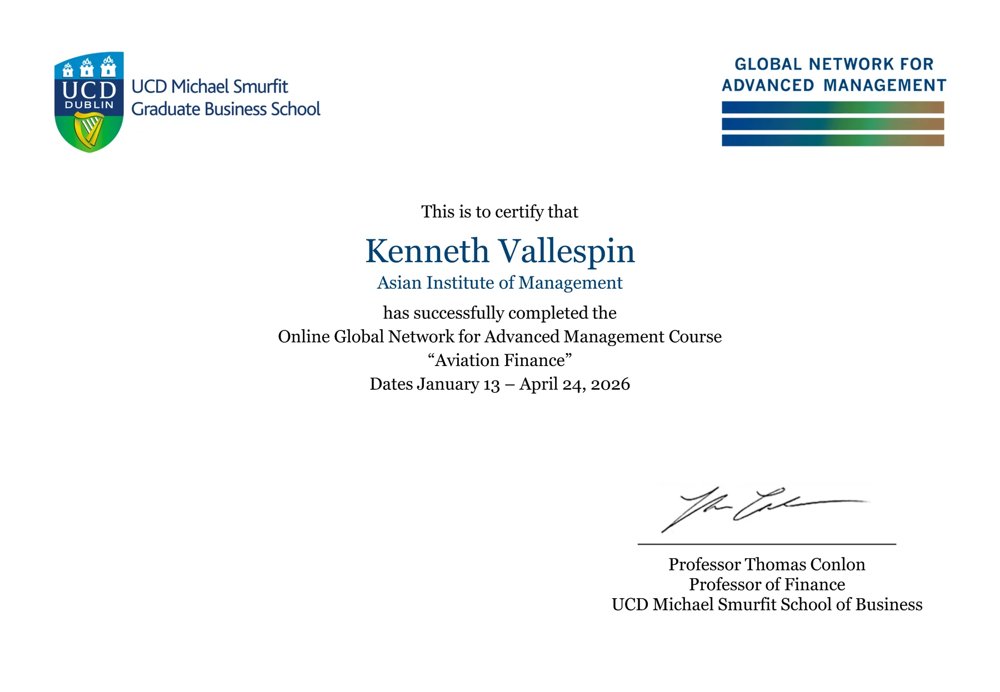
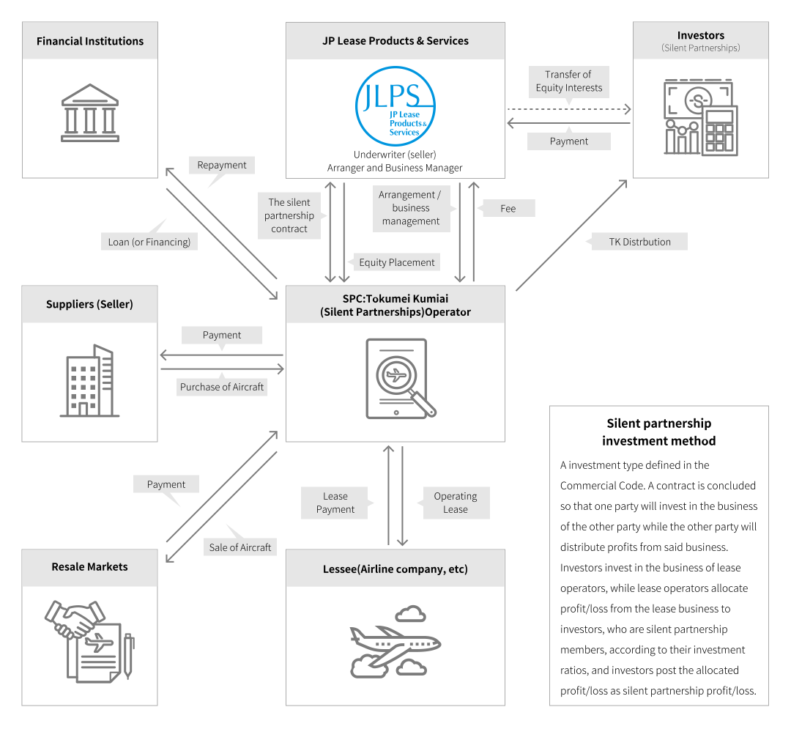
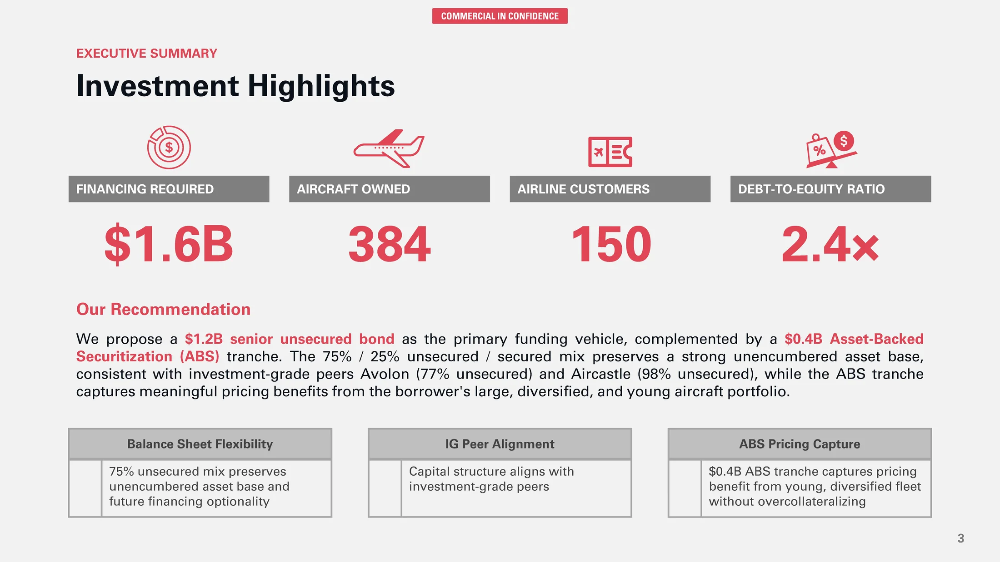
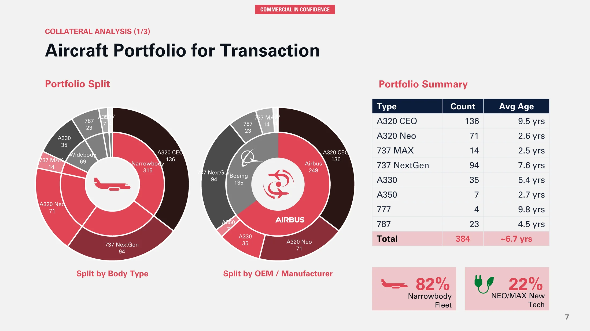
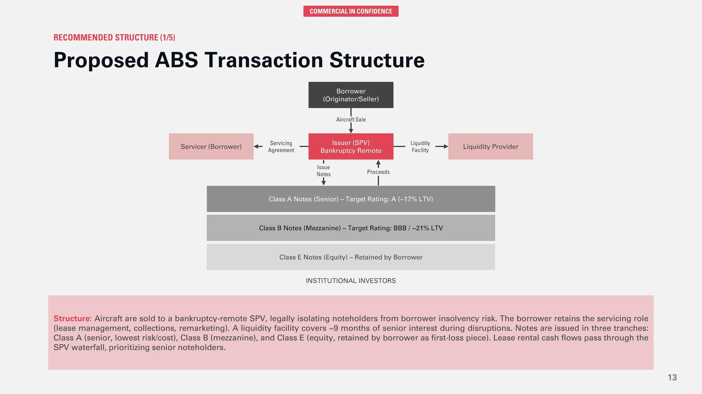
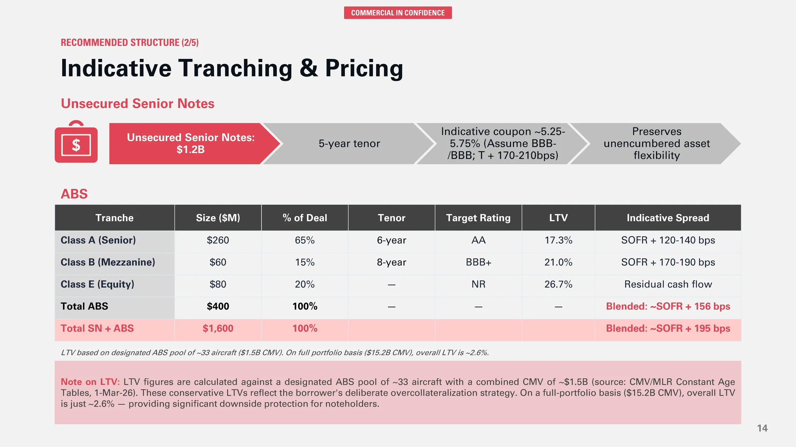

# Ten weeks inside UCD Smurfit aviation finance: what I learned in GNAM 2026

*GNAM Aviation Finance completion certificate.*

Earlier this year I enrolled in the **GNAM Aviation Finance SNOC**, taught by **Professor Tom Conlon** at **UCD Michael Smurfit Graduate Business School**, as part of my MBA at the **Asian Institute of Management**. Aviation leasing is the direction I have been steering toward for some time, with target markets in the Philippines and Saudi Arabia. AviLease sits inside the PIF portfolio, and a sister company gives me a useful line of sight into the industry. This course is where the theory finally met the structure I needed.

This post walks through what the course is, what it covered, the ideas that stayed with me, and the final project where I pitched a **\$1.6 billion funding strategy**. PDF copies of the pitch deck and my full learning journal are embedded at the end.

## What the course is

GNAM Aviation Finance is a ten-week Small Network Online Course delivered by UCD Smurfit and offered across the **Global Network for Advanced Management**. It is built around one question: how do aircraft, which are mobile, depreciating, multi-million dollar assets, actually get financed across airlines, lessors, banks, and capital markets?

The format combines weekly lectures, industry panels, breakout discussions, a learning journal, and a capstone project that accounts for 50% of the final mark.

## The course content

Ten weeks, building from first principles toward the most complex transactions in the industry:

1. What is aviation finance
2. The business of leasing
3. Operations, law, and economics of aviation
4. Aircraft as an asset
5. Financing the asset
6. Structured finance in aviation
7. Bank and capital markets for aviation
8. Leading an aircraft lessor
9. Financing aviation sustainably
10. M&A in aviation finance

Each topic compounded on the previous one. By the time we reached EETCs, ABS structures, and the AerCap acquisition of GECAS, the earlier sessions on residual value, Cape Town, and credit spreads were doing real analytical work in the background.

## Insights that stayed with me

A few ideas shifted how I think about the industry.

**Leasing is credit arbitrage.** A BBB- lessor borrows at roughly LIBOR plus 2.75%, while a B+ airline pays close to LIBOR plus 5.5%. Lessors monetize that spread by absorbing residual value risk that airlines do not want.

**An aircraft is a measurable physical asset, not just a cash flow.** Maintenance utility value, with engines at 40 to 50 percent of total value, makes residual value a function of remaining component life. The AVITAS regression shows age explains about 83% of value variance, with an R-squared of 0.8251, but the scatter is where standard configurations and clean maintenance records earn their premium.

**Structured finance can manufacture investment-grade credit.** The BOC Aviation SLVRR 2019-1 deal pooled 17 aircraft into an SPV and issued A-rated notes at \$443M, BBB notes at \$73M, BB notes at \$32M, and equity at \$120M, with a liquidity facility covering 18 months of senior interest. The structure, not the borrower’s standalone rating, drove the pricing.

**Scale and rating quality unlock better economics.** SMBC Aviation Capital issued \$8.8 billion in unsecured investment-grade bonds in 2026 year-to-date. AerCap permanently financed its \$30.2B GECAS acquisition with approximately \$21B in unsecured bonds across 11 tranches at an average cost near 2.6%. That kind of access is what every emerging lessor is building toward.

## The topics that stayed with me most: JOLCO and sustainability financing

Two topics from the course kept working on me after the lectures ended.

The first is the **Japanese Operating Lease with Call Option**, or **JOLCO**. What makes it memorable is how cleanly it shows that aviation finance is as much about tax structure and investor segmentation as it is about aircraft. Japanese equity investors take the residual position for domestic tax reasons, the airline gets off-balance-sheet treatment and a call option at a lower effective rate, and the whole structure depends on an investor base that does not really exist anywhere else.

For me, the takeaway is that financing innovation tends to come from finding a mispriced investor class, not from inventing a new credit instrument.

*Source: JP Lease Products & Services Co., Ltd. and JLPS Ireland Limited, [JOL/JOLCO business](https://www.jlps.co.jp/en/business/jol/).*

The second is **sustainability financing**. The relevance is not that it sits next to the conventional toolkit as a separate channel. It is that definitional discipline, especially around SAF versus LCAF and the lack of standardized KPIs, will determine which lessors retain access to mainstream capital markets as investor mandates harden. For AviLease under Vision 2030, treating sustainability as a governance and data problem early is the first-mover advantage.

## The final project: Option 2, \$1.6 billion funding strategy

The capstone asked me to pitch a funding strategy for an upper-tier Irish-based lessor. The borrower had **384 owned aircraft**, an order book of **225 aircraft**, leases to **150 airlines across 62 countries**, a **debt-to-equity ratio of 2.4**, and an unencumbered portfolio of **69 widebodies and 315 narrowbodies**. They wanted to raise **\$1.6 billion** to fund new deliveries.

I framed the pitch from the perspective of an investment bank with both capital markets and corporate lending capabilities. Below is a short discussion of four pages that anchor the recommendation.

### Investment highlights

This is where the headline recommendation lives: a **\$1.2B senior unsecured bond** as the primary vehicle, with a **\$0.4B Asset-Backed Securitization tranche** alongside it.

The 75/25 unsecured-to-secured mix was the central design choice. It preserves a strong unencumbered asset base, consistent with investment-grade peers like Avolon at 77% unsecured and Aircastle at 98% unsecured, while the ABS tranche captures meaningful pricing benefits from the borrower’s large, diversified, and young portfolio.

This page is doing two jobs at once: signaling that the borrower belongs in the IG peer group on funding mix, and showing that the collateral is being used selectively rather than over-encumbering the balance sheet.

### Aircraft portfolio for transaction

This is the collateral page. All 384 aircraft are laid out by type, count, and average age: 136 A320 CEO at 9.5 years, 71 A320 Neo at 2.6, 14 737 MAX at 2.5, 94 737 NextGen at 7.6, 35 A330 at 5.4, 7 A350 at 2.7, 4 777 at 9.8, and 23 787 at 4.5, for a weighted average age of about 6.7 years.

The narrowbody-to-widebody mix and the share of latest-technology types, including Neo, MAX, A350, and 787 aircraft, are what make this portfolio a credible ABS pool. Liquid aircraft types with deep operator bases hold remarketing value through the cycle, and this portfolio is the evidence base for everything I claim later about LTV resilience.

### Proposed ABS transaction structure

Here the mechanics get spelled out. Aircraft are sold to a bankruptcy-remote SPV, legally isolating noteholders from borrower insolvency. The borrower retains the servicer role for lease management, collections, and remarketing. A liquidity facility covers around 9 months of senior interest to absorb temporary cash flow disruptions without forcing distressed sales.

Notes are issued in three tranches: Class A senior, Class B mezzanine, and Class E equity retained by the borrower as the first-loss piece. Lease rental cash flows pass through the SPV waterfall, with senior noteholders served first.

The point is that the credit quality of the ABS does not depend on the borrower’s standalone rating but on the cash flow architecture around the assets.

### Indicative tranching and pricing

This is where the structure meets the spreads. Class A, the senior AA target tranche with a 6-year tenor and 17.3% LTV, prices at SOFR + 120 to 140 bps. Class B, the BBB+ target mezzanine tranche with an 8-year tenor and 21.0% LTV, prices at SOFR + 170 to 190 bps. Class E equity, at 26.7% LTV, absorbs residual cash flow.

The blended ABS cost is roughly **SOFR + 156 bps**, and the blended cost of the full **\$1.6B** raise, including senior notes and ABS, is around **SOFR + 195 bps**. The conservative LTVs are deliberate. The designated ABS pool of about 33 aircraft has a combined CMV of **\$1.5B**, and on a full-portfolio basis, with **\$15.2B CMV**, the overall LTV drops to roughly **2.6%**. That overcollateralization is what supports the AA target on Class A and the durability of pricing through the cycle.

## Reflections

What this course gave me, beyond the technical vocabulary, was a sense of sequencing. Aviation finance is not a single discipline but a stack: an aircraft is first a physical asset with a maintenance lifecycle, then a leased cash flow stream, then a financed obligation, and eventually, sometimes, a tranched security inside a structured deal.

Each layer assumes the one below it is solid. For an emerging market or a newer platform, the path I would defend is to get the fundamentals right at each stage rather than skip ahead to sophistication the operating base cannot yet support.

The other thread runs closer to my professional self-image. I have spent my career managing programs where matching contract type to project risk profile is the daily work. Aviation finance does the same thing at much larger scale, matching funding instrument to asset profile, borrower credit, market cycle, and route economics.

That alignment logic is what I want to bring into a lessor environment, particularly in the Philippines and Saudi Arabia where local market knowledge has to carry equal weight with the financial structuring. Building platforms, rather than managing assets alone, is where I see the next several years going. This course was one of the more useful steps in that direction.

The next step for me is to move from this qualitative understanding to a quantitative one. I want to model an aircraft-backed transaction end-to-end: forecast default probabilities, aircraft value distributions, and interest rate paths; map them to payoff functions for loans and leases; and produce an NPV-implied probability distribution across scenarios. I am working from Nils Hallerstrom's *Modelling Aircraft Loans & Leases* as the technical backbone for that effort. The goal is to build a reusable structuring and pricing model that captures the same relationships this course described qualitatively but now with explicit assumptions, scenario trees, and cross-collateralization effects.

---

*PDF copies of the final pitch deck and the full ten-week learning journal are embedded below.*

## Final pitch deck

<iframe src="assets/aviation-finance-gnam-2026/snoc-final-project-k-vallespin.pdf" width="100%" height="760" title="SNOC Final Project Pitch Deck"></iframe>

[Download the final pitch deck](assets/aviation-finance-gnam-2026/snoc-final-project-k-vallespin.pdf)

## Learning journal

<iframe src="assets/aviation-finance-gnam-2026/gnam-learning-journal-2026-kenneth-vallespin.pdf" width="100%" height="760" title="GNAM Learning Journal 2026"></iframe>

[Download the learning journal](assets/aviation-finance-gnam-2026/gnam-learning-journal-2026-kenneth-vallespin.pdf)

---

Sources

- KPMG, *Financial modelling: Aviation finance*, January 2016. [PDF](https://assets.kpmg.com/content/dam/kpmg/pdf/2016/03/financial-modelling-for-aviation-jan-2016.pdf)
