# The world’s largest LBO: why PIF wanted Electronic Arts

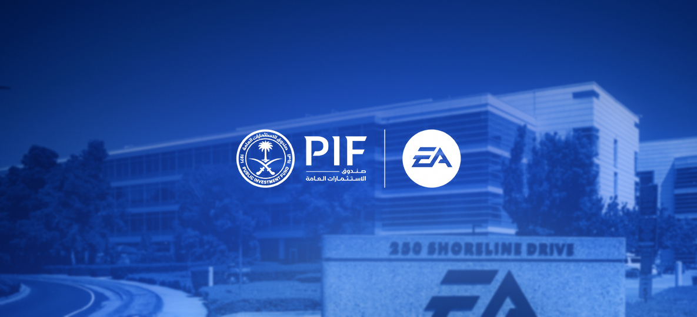

Image credit: AI-generated image based on PIF's Electronic Arts acquisition announcement <a href="https://www.pif.gov.sa/en/news-and-insights/newswire/2026/electronic-arts-announces-completion-of-acquisition-by-pif-silver-lake-and-affinity-partners/">https://www.pif.gov.sa/en/news-and-insights/newswire/2026/electronic-arts-announces-completion-of-acquisition-by-pif-silver-lake-and-affinity-partners/</a>

<strong>Disclaimer.</strong> THIS IS AN ACADEMIC EXERCISE, not investment advice or a fairness opinion. Every input is drawn from public sources, EA filings, and a model you can trace line by line. All company names, trademarks, and logos referenced are the property of their respective owners.

I work at one of PIF's portfolio companies, so this acquisition effectively made EA our sister company overnight. That got my attention fast, and my engineer brain immediately wanted to know whether the numbers actually made sense.

There was also a more personal reason. My final exam in Financial Management 2, during my MBA, was an oral exam on leveraged buyouts, and the prep for it traumatized me more than I'd like to admit. So when the largest gaming LBO in history landed inside PIF's orbit, it triggered both genuine professional curiosity and a mild academic flashback.

The short thesis is this: EA was not cheap. EA was financeable, scarce, and strategically useful. The debt looks serviceable, but it is not casual. The model works only if EA remains a recurring cash-flow machine and if private ownership improves discipline without damaging the creative system that produces the franchises.

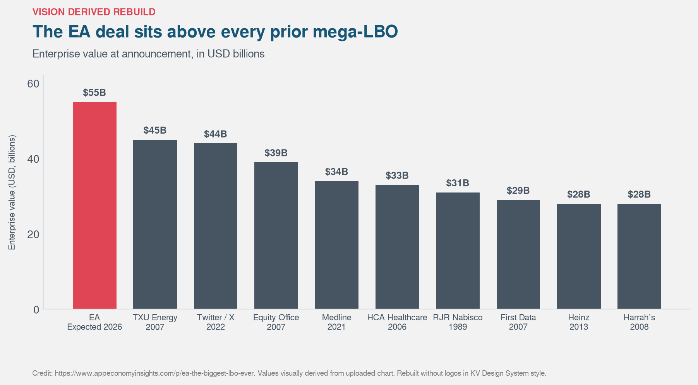

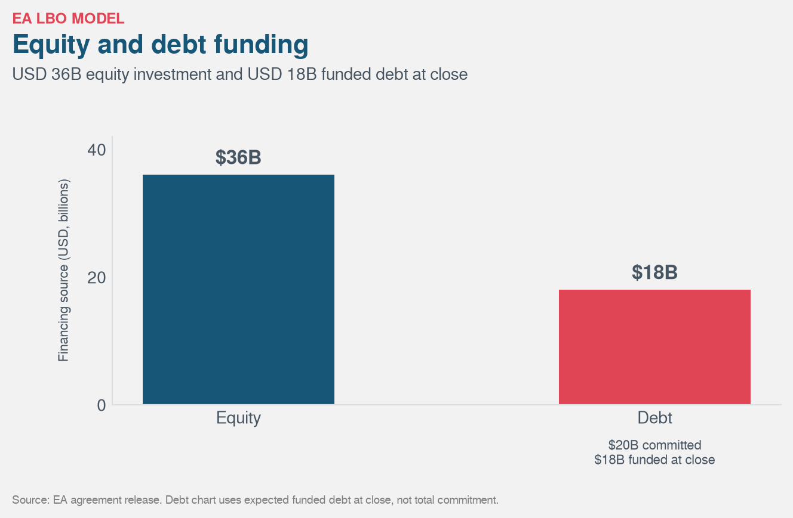

## What an LBO is, in plain English

A leveraged buyout is an acquisition where the buyer uses a large amount of borrowed money to buy a company. The acquired company then has to carry that debt. The buyer hopes that the business can generate enough cash to pay interest, repay debt, improve operations, and eventually create a return on the equity invested.

A simple way to think about it is a house purchase with a mortgage, except the house is a company and the mortgage is serviced by the company's own cash flows. If the company is stable, cash-generative, and not too capital intensive, the debt can magnify returns. If the business weakens, the same debt magnifies pain.

LBOs work better with durable revenue, predictable margins, modest capital expenditure, and management teams that can operate under pressure. The debt does not create value by itself. It only sharpens the consequences of value creation or value destruction.

EA is a useful case because it is not a factory, a toll road, or a boring software company. It is a creative business with sports licenses, live services, studios, franchises, and players who can leave if the product gets worse. That makes the financing question more interesting.

## EA, the company being bought

EA Sports is the anchor, but Electronic Arts is larger than that. The target includes EA Sports FC, Madden NFL, College Football, F1, Battlefield, Apex Legends, The Sims, studios, data, publishing infrastructure, and live-service economies built around long-running franchises.

The attraction is the revenue mix. In FY26, EA reported USD 7.531 billion of net revenue and USD 8.026 billion of net bookings. Live services and other revenue were USD 5.383 billion, or 71.5 percent of net revenue. Full game revenue was USD 2.148 billion, or 28.5 percent. A lender looking at this does not see one annual launch cycle. It sees a player base that keeps spending after the initial sale.

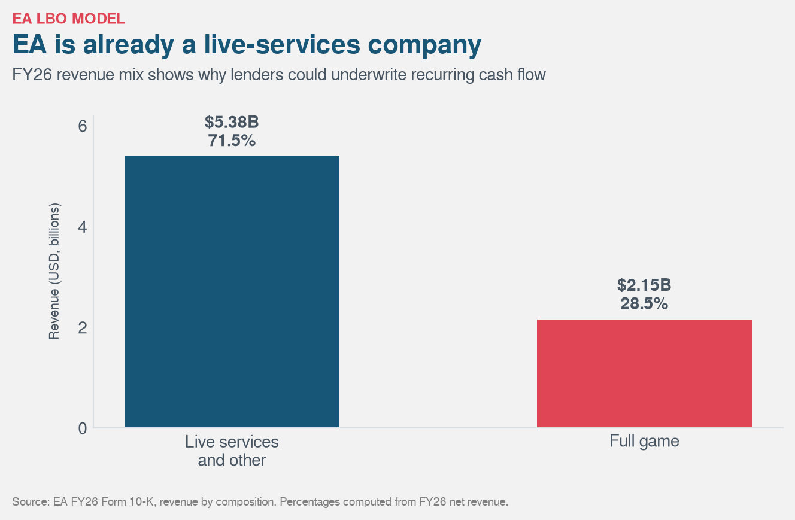

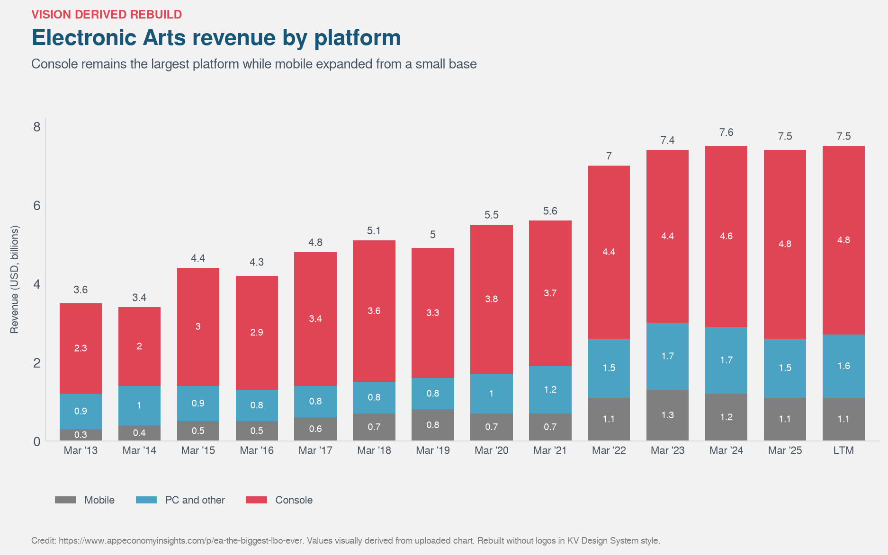

The strongest business-model point from the outside commentary is the mix: annual sports franchises, digital distribution, subscriptions, scale, and live services. That mix is financeable. Lenders and sponsors are not underwriting one game launch. They are underwriting recurring player behavior across a portfolio.

But stable is not the same as fast-growing. EA's net bookings were USD 7.515 billion in FY22, USD 7.426 billion in FY23, USD 7.430 billion in FY24, USD 7.355 billion in FY25, and USD 8.026 billion in FY26. The FY26 rebound helps, but the years before it were mostly flat. A good LBO model cannot draw an upward line and call it strategy.

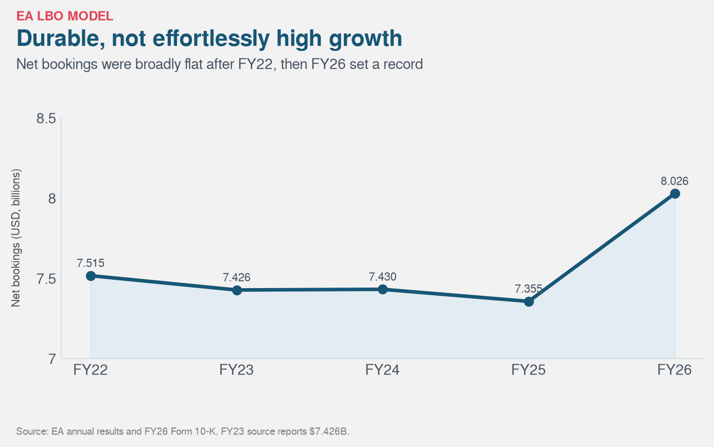

The other caveat is cost. FY26 research and development was USD 2.828 billion. Marketing and sales were USD 1.128 billion. Cost of revenue was USD 1.584 billion. Cut those lines blindly and the model gets worse, not better. A private owner can remove waste, cancel weak projects earlier, and centralize tooling. A bad owner can cut the muscle and keep the fat.

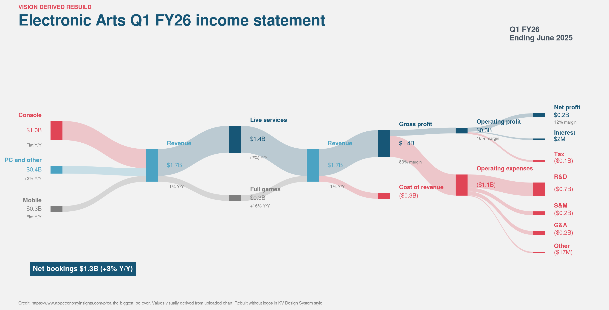

## The acquirers: PIF, Silver Lake, and Affinity

The deal is best described as a PIF-led consortium take-private with Silver Lake and Affinity Partners. EA's announcement named all three buyers. It also said PIF would roll its existing 9.9 percent stake. Shareholders would receive USD 210 per share in cash, a 24.8 percent premium to the unaffected price of USD 168.32. The transaction valued EA at about USD 55 billion.

The ownership change is more interesting than the old public-private line. Before the take-private, EA's listed holder base was spread across passive asset managers, PIF, event-driven funds, and everyone else. The top listed holders I found were BlackRock at 9.95 percent, PIF at 9.83 percent, Vanguard at 6.13 percent, State Street at 5.60 percent, and Pentwater at 5.07 percent, with the remaining 63.42 percent under others. After the LBO, one reported ownership split puts PIF at 93.4 percent, Silver Lake at 5.5 percent, and Affinity Partners at 1.1 percent.

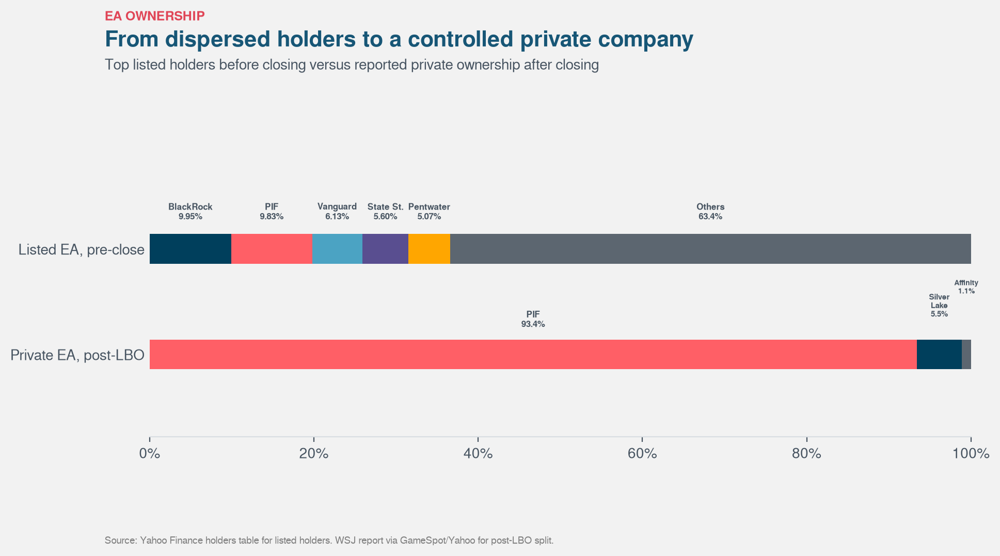

That is not a cosmetic change. A listed company with a fragmented shareholder base became a controlled private company. Silver Lake brings technology sponsor experience. Affinity is part of the capital group. PIF changes the objective function.

For a normal private-equity buyer, the model is mostly entry value, debt, EBITDA growth, debt paydown, and exit value. PIF can think with a longer horizon. EA sits naturally inside Saudi Arabia's push into gaming, esports, entertainment, sports, and digital fan engagement. That does not make price irrelevant. It means the strategic value is broader than a five-year sponsor exit.

This is why I do not see the acquisition as a normal LBO. It is a sovereign-led strategic take-private financed with LBO tools.

## The LBO model and the thesis

The transaction math starts with the USD 210 per share offer. Using 250.751 million shares outstanding, the implied equity value is about USD 52.66 billion. PIF's 9.9 percent rollover is worth about USD 5.21 billion at the offer price, leaving about USD 47.44 billion of cash consideration to non-PIF shareholders. The announced financing included about USD 36 billion of equity investment and USD 20 billion of debt commitments, with USD 18 billion expected to fund at close.

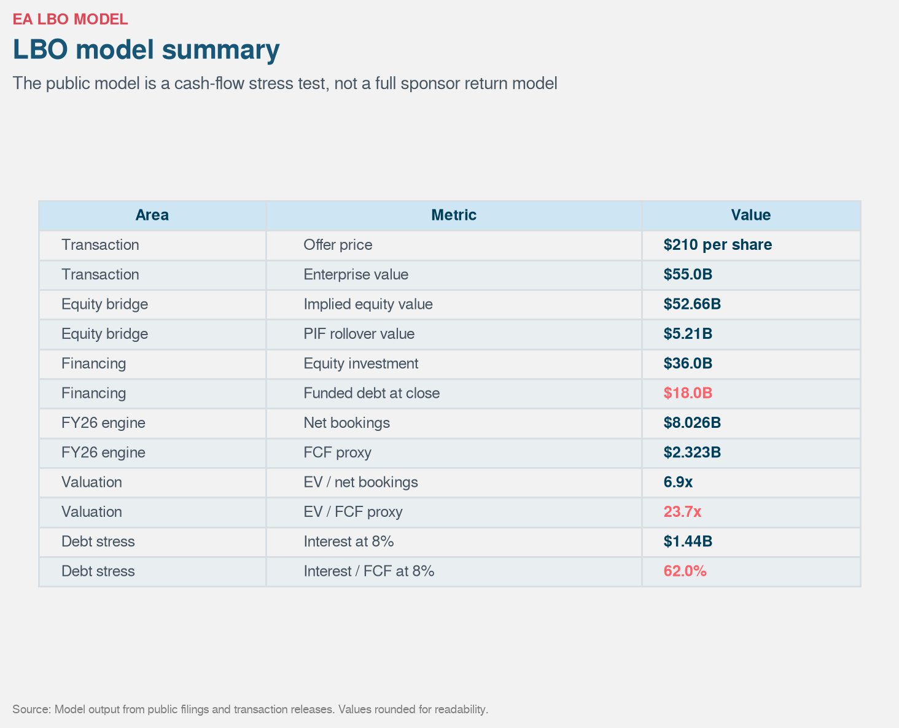

### Assumptions

The model uses public, rounded inputs. It assumes USD 55.0 billion of enterprise value, USD 210 per share of offer price, 250.751 million diluted shares outstanding, and a 9.9 percent PIF rollover valued at the offer price. It uses USD 36.0 billion of equity investment, USD 20.0 billion of committed acquisition debt, and USD 18.0 billion of debt expected to fund at close.

For operating performance, the model uses EA's FY26 net revenue of USD 7.531 billion, FY26 net bookings of USD 8.026 billion, FY26 operating cash flow of USD 2.553 billion, and USD 230 million of capital expenditures. Free cash flow is a simple proxy: operating cash flow less capital expenditures. It is not a full sponsor model with tax shields, debt amortization, refinancing fees, management equity, transaction fees, or exit multiple sensitivity.

For the cash-flow table, I use a seven-year horizon because it is a familiar private-equity hold-period frame, even if PIF may hold longer. Revenue grows at 3.5 percent per year. Free cash flow margin stays at the FY26 proxy level of 30.8 percent. Interest is 8 percent on beginning debt. All post-interest free cash flow is swept to debt repayment. This is intentionally simple. It is a debt-service sketch, not a full valuation model.

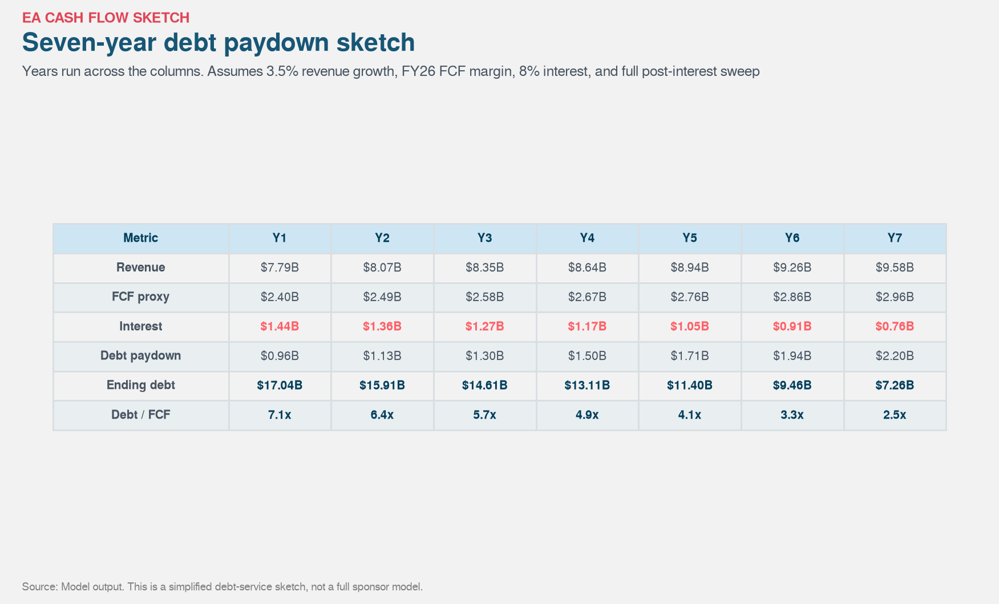

The headline valuation is high. At about USD 55 billion of enterprise value, the buyers paid 6.9 times FY26 net bookings and 23.7 times the FY26 free cash flow proxy. The debt still bites. At USD 18 billion of funded debt, a 7 percent interest rate implies about USD 1.26 billion of annual interest. At 8 percent, it is USD 1.44 billion. At 9 percent, it is USD 1.62 billion. Against the FY26 free cash flow proxy, that consumes roughly 54.2 percent, 62.0 percent, and 69.7 percent of free cash flow before tax shield.

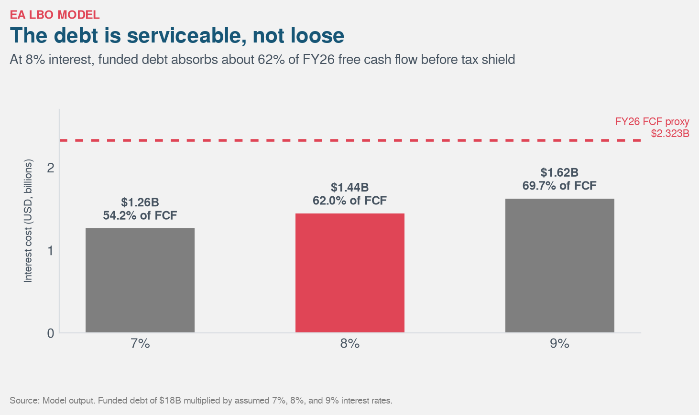

That is serviceable, not loose. At 8 percent, EA still has room after interest, but not much. Product misses, licensing shocks, weaker live-service engagement, or a failed release cycle would show up faster under this capital structure.

The hardest number to discuss is EBITDA. One credit-market lens puts the deal at about 18 times EV to EBITDA and about 6 times gross leverage using an FY27E EBITDA estimate of about USD 3.1 billion. That is a credible credit framing, but it is not the same as a trailing GAAP proxy. If I use FY26 operating income of USD 1.162 billion plus depreciation, amortization, accretion, and impairment of USD 323 million, the proxy is only USD 1.485 billion. On that basis, the deal looks like 37.0 times EV to EBITDA and 12.1 times gross leverage on USD 18 billion of funded debt.

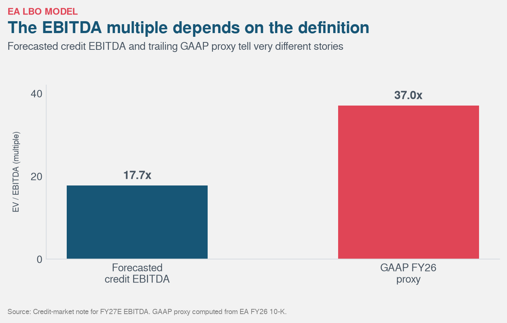

Those figures are not contradictions. They are different definitions. I would not hide this model behind a loose EBITDA label. Bookings and cash flow are easier to trace from public sources, so those are the anchor.

The credit-market angle also belongs in the model. This was a financing story as much as a gaming acquisition. EA moved from a modest balance sheet into a leveraged capital structure, which raised questions around existing notes, change-of-control protections, ratings events, and defeasance. That bondholder mechanics story is not a legal footnote. It is part of why the transaction was difficult.

My base case is that the LBO works if EA protects live services, keeps sports franchises healthy, improves project discipline, and uses private ownership to reduce short-term public-market noise. It breaks if debt service pushes management into blunt cost cuts, heavier monetization, weaker creative output, or franchise underinvestment.

## PIF strategy angle

The attached PIF Strategy 2026-2030 helps explain why EA fits better under PIF than under a normal sponsor-only LBO story.

The strategy says PIF is moving from rapid scale-building to value realization. The language is about integration, performance, long-term durability, active ownership, and private-sector participation. It also organizes capital into three portfolios: a Vision Portfolio for domestic ecosystems, a Strategic Portfolio for key Saudi holdings and high-conviction international investments, and a Financial Portfolio for diversified returns.

EA sits across those lines. It is an international investment, but the strategic logic connects back to the Vision Portfolio's Tourism, Travel & Entertainment ecosystem, where the document specifically includes sports, entertainment venues and events, aviation, connectivity, and supporting services. A global game publisher with sports franchises, live services, fan data, and digital communities is a useful asset if the aim is to build an entertainment ecosystem rather than own isolated companies.

Control is the point here. PIF already knew EA as a shareholder. The take-private moves it from exposure to ownership. That gives PIF more room to align EA with sports, gaming, fan engagement, and long-term entertainment infrastructure. The LBO debt still has to be serviced, so the strategy does not make the price easy. It only explains why PIF might accept a price that a pure financial buyer would struggle to justify.

For me, this makes the deal less mysterious. It is expensive if viewed only as a spreadsheet. It is more understandable if viewed as a strategic platform purchase with LBO financing attached.

## My final opinion

I understand why PIF would want EA. It is one of the few global assets that connects gaming, sport, entertainment, data, fandom, and recurring digital monetization. EA Sports FC alone touches global football culture. Madden and College Football touch American football. F1 touches motorsport. The Sims, Battlefield, and Apex extend the portfolio beyond sports.

I also understand why the price looks uncomfortable. A USD 55 billion enterprise value is not a bargain against current public numbers. Even with the forecasted EBITDA framing, the entry multiple is rich. Against trailing free cash flow, it is plainly expensive.

So the honest answer is not that the deal is cheap. It is that the deal can be rational for a buyer whose strategy is wider than financial engineering. PIF gets a global digital sports and entertainment platform. Silver Lake gets a rare technology and media asset with cash-flow characteristics that can support leverage. EA gets away from public-market pressure at a time when creative investment and franchise management require patience.

The danger is that leverage makes patience harder. Debt can discipline management. It can also make a creative company too afraid to take creative risk. That is the line this deal has to walk.

## Key insights

1. EA was not bought because it was cheap. It was bought because it was financeable, scarce, and strategically useful.

2. The ownership change is the story. EA moved from a dispersed listed holder base to a private company where PIF is the controlling owner.

3. The LBO is serviceable but constraining. At 8 percent interest, USD 18 billion of funded debt consumes about 62.0 percent of FY26 free cash flow before tax shield.

4. The seven-year cash-flow sketch shows why this is doable but not relaxed. Even with all post-interest cash swept to debt, leverage stays in the room deep into the hold period.

5. The EBITDA multiple depends on the definition. The forecasted credit-market lens gives about 18 times EV to EBITDA. A GAAP FY26 proxy gives about 37 times.

6. This is best understood as a sovereign-led strategic take-private financed with LBO tools. It is not a textbook sponsor buyout.

7. The deal works only if private ownership improves discipline without damaging the creative engine.

I'd love to be challenged on this.

If you have deal experience, credit-market context, or just a strong opinion on whether this LBO makes sense, let's talk in the comments.
## Sources

### Electronic Arts agreement announcement
[https://news.ea.com/press-releases/press-releases-details/2025/EA-Announces-Agreement-to-be-Acquired-by-PIF-Silver-Lake-and-Affinity-Partners-for-55-Billion/default.aspx](https://news.ea.com/press-releases/press-releases-details/2025/EA-Announces-Agreement-to-be-Acquired-by-PIF-Silver-Lake-and-Affinity-Partners-for-55-Billion/default.aspx)

### PIF acquisition completion announcement
[https://www.pif.gov.sa/en/news-and-insights/newswire/2026/electronic-arts-announces-completion-of-acquisition-by-pif-silver-lake-and-affinity-partners/](https://www.pif.gov.sa/en/news-and-insights/newswire/2026/electronic-arts-announces-completion-of-acquisition-by-pif-silver-lake-and-affinity-partners/)

### PIF Strategy 2026-2030
[https://www.pif.gov.sa/en/strategy-and-impact/our-strategy/](https://www.pif.gov.sa/en/strategy-and-impact/our-strategy/)

Direct PDF:
[https://www.pif.gov.sa/-/media/project/pif-corporate/pif-corporate-site/strategy-and-impact/our-strategy/pif-strategy-2026-2030-en.pdf](https://www.pif.gov.sa/-/media/project/pif-corporate/pif-corporate-site/strategy-and-impact/our-strategy/pif-strategy-2026-2030-en.pdf)

### Electronic Arts acquisition completion announcement
[https://www.ea.com/news/ea-announces-completion-of-acquisition](https://www.ea.com/news/ea-announces-completion-of-acquisition)

### Electronic Arts FY26 Form 10-K
[https://www.sec.gov/Archives/edgar/data/712515/000162828026033617/ea-20260331.htm](https://www.sec.gov/Archives/edgar/data/712515/000162828026033617/ea-20260331.htm)

### Electronic Arts Q4 FY26 earnings release
[https://s202.q4cdn.com/886473115/files/doc_financials/2026/q4/Q4-FY26-Earnings-Release_FINAL.pdf](https://s202.q4cdn.com/886473115/files/doc_financials/2026/q4/Q4-FY26-Earnings-Release_FINAL.pdf)

### Listed holder table
[https://finance.yahoo.com/quote/EA/holders/](https://finance.yahoo.com/quote/EA/holders/)

### Public holder cross-check
[https://bullfincher.io/companies/electronic-arts/ownership](https://bullfincher.io/companies/electronic-arts/ownership)

### Reported private ownership split
[https://finance.yahoo.com/news/majority-control-ea-could-shift-091000747.html](https://finance.yahoo.com/news/majority-control-ea-could-shift-091000747.html)

### Debt-market coverage and covenant discussion
[https://www.9fin.com/insights/electronic-arts-coverage](https://www.9fin.com/insights/electronic-arts-coverage)

### Business-model and gaming-market commentary
[https://www.appeconomyinsights.com/p/ea-the-biggest-lbo-ever](https://www.appeconomyinsights.com/p/ea-the-biggest-lbo-ever)

### Credit-market leverage note
[https://know.creditsights.com/insights/electronic-arts-record-setting-55bn-lbo/](https://know.creditsights.com/insights/electronic-arts-record-setting-55bn-lbo/)

### Global games market estimate
[https://newzoo.com/articles/global-games-market-189-billion-2025](https://newzoo.com/articles/global-games-market-189-billion-2025)

### Gaming industry transaction analysis
[https://www.gamesindustry.biz/why-the-55bn-acquisition-of-electronic-arts-isnt-your-usual-leveraged-buyout](https://www.gamesindustry.biz/why-the-55bn-acquisition-of-electronic-arts-isnt-your-usual-leveraged-buyout)
