# The world's largest LBO: why PIF wanted Electronic Arts

*USD 36 billion of equity behind USD 18 billion of debt. The leverage is inverted, and the inversion is the point*

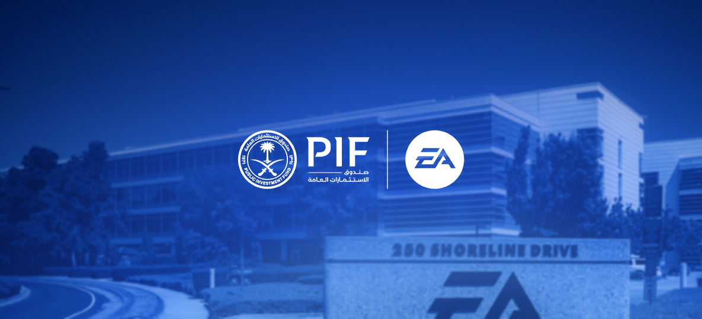
*Image credit: AI-generated image based on PIF's Electronic Arts acquisition announcement*
<https://www.pif.gov.sa/en/news-and-insights/newswire/2026/electronic-arts-announces-completion-of-acquisition-by-pif-silver-lake-and-affinity-partners/>

> **Disclosure:** I use AI as a writing partner to refine my prose and structure, but the ideas, analysis, and first drafts originate entirely with me.

**Disclaimer.** This is an academic exercise, not investment advice or a fairness opinion. Every input comes from public sources, EA filings, and a model I built that you can trace line by line.

Every leveraged buyout you have ever read about has the same skeleton. Thin equity, a tower of debt, and a clock. The equity exists to absorb one rough quarter, nothing more, and the rest of the structure assumes the business grows into the debt on schedule or goes to the hammer.

Electronic Arts was bought the other way around.

The Public Investment Fund of Saudi Arabia, with Silver Lake and Affinity Partners alongside, put USD 36 billion of equity into the transaction and borrowed USD 18 billion against it. The equity is double the debt. In a classic PE buyout the equity might be USD 2 billion, and one bad quarter forces a sale. Here the cushion is deeper than the borrowing.

At USD 55 billion of enterprise value, this is the largest leveraged buyout ever recorded. By a wide margin.

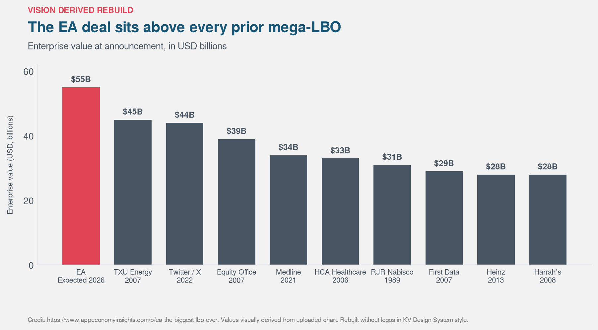
*EA at USD 55 billion is now the largest private-equity LBO ever. By a wide margin.*

That inversion, big equity, modest debt, is not a footnote in this transaction. It is the transaction. The price, the hold period, the risk profile all follow from it. So does the reason PIF bothered at all.

## The shareholder register tells the story in five lines

Three weeks ago, EA shares traded on the New York Stock Exchange. The top holders were BlackRock at 9.95 percent, PIF at 9.83, Vanguard at 6.13, State Street at 5.60, and Pentwater at 5.07. The remaining 63.42 percent sprawled across a long tail of institutional and retail accounts, about sixty thousand other accounts.

Today, one entity owns 93.4 percent of the company: PIF. Silver Lake sits at 5.5 percent, Affinity Partners at 1.1. Token stakes for the financial partners.

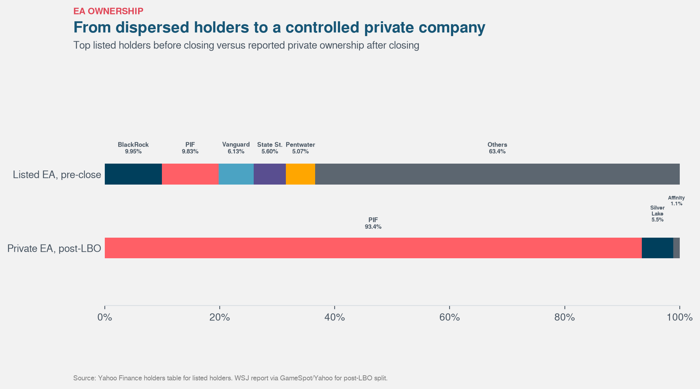
*The top chart shows the pre-deal dispersed public ownership. The bottom chart shows what PIF, Silver Lake, and Affinity now hold. Public market ownership is gone.*

That is not an investment. That is control.

The terms: USD 210 per share in cash, a 24.8 percent premium over the last unaffected price of USD 168.32. PIF rolled its existing stake into the transaction. Implied equity value: roughly USD 52.66 billion across 250.751 million shares.

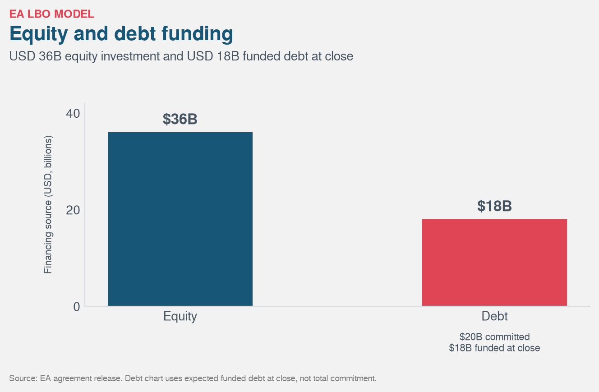
*USD 36 billion of equity investment. USD 18 billion of funded debt. The capital is deep; the debt is serviceable.*

## Read the price the way a credit desk reads it

At that price, the deal prints like this:

- 6.9x FY26 net bookings of USD 8.026 billion
- 23.7x FY26 free cash flow proxy of USD 2.32 billion
- 37.0x FY26 GAAP trailing EBITDA of USD 1.485 billion

Expensive multiples for a business whose revenue went flat. Bookings sat at USD 7.515 billion in FY22, slipped to 7.426, drifted to 7.430, dipped to 7.355 in FY25, and jumped to 8.026 only in FY26.

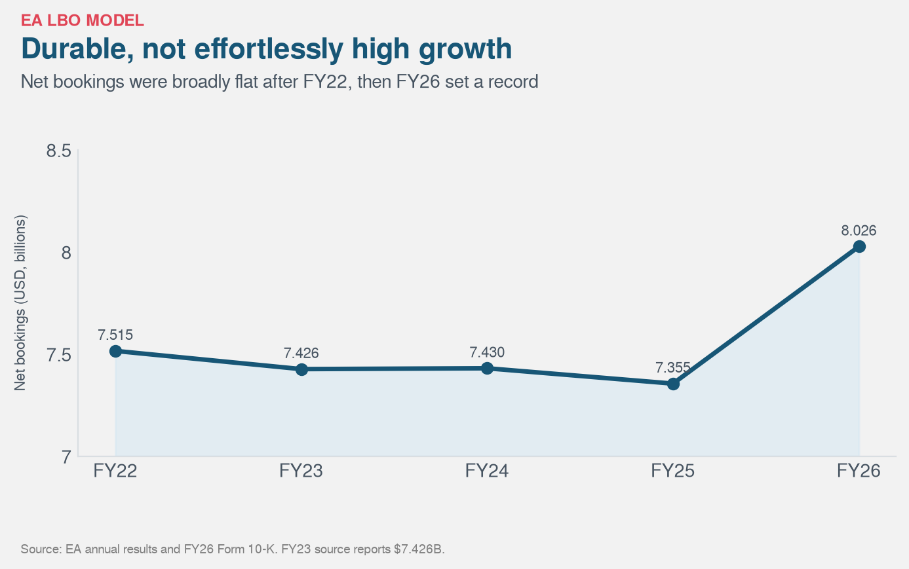
*EA's net bookings were flat from FY22 to FY25 before the FY26 rebound. This is why the forward-looking framing matters.*

So why did a rational sovereign fund pay that?

## Because the alternative cost more

PIF published its 2026-2030 strategy in the same window this deal was negotiated. It describes a fund in transition, finished with rapid scale-building, now in value-realization mode. Its capital runs through three portfolios: Vision, for domestic ecosystem building; Strategic, for high-conviction international holdings; Financial, for diversified returns. The Vision Portfolio's Tourism, Travel and Entertainment section lists sports, entertainment venues and events, aviation, connectivity, and supporting services.

Read EA against that list. It owns EA Sports FC in global football, Madden NFL and College Football in American football, F1 in motorsport, Battlefield and Apex Legends in shooter IP, and The Sims in simulation. On top of that sits the player data, the live-service infrastructure, and the digital communities built around all of it.

And look at what the revenue is made of. Live services and recurring revenue accounted for USD 5.383 billion of FY26 revenue, 71.5 percent of it. Full game revenue was USD 2.148 billion, 28.5 percent. A buyer that needs cash flows it can plan around cares about that split.

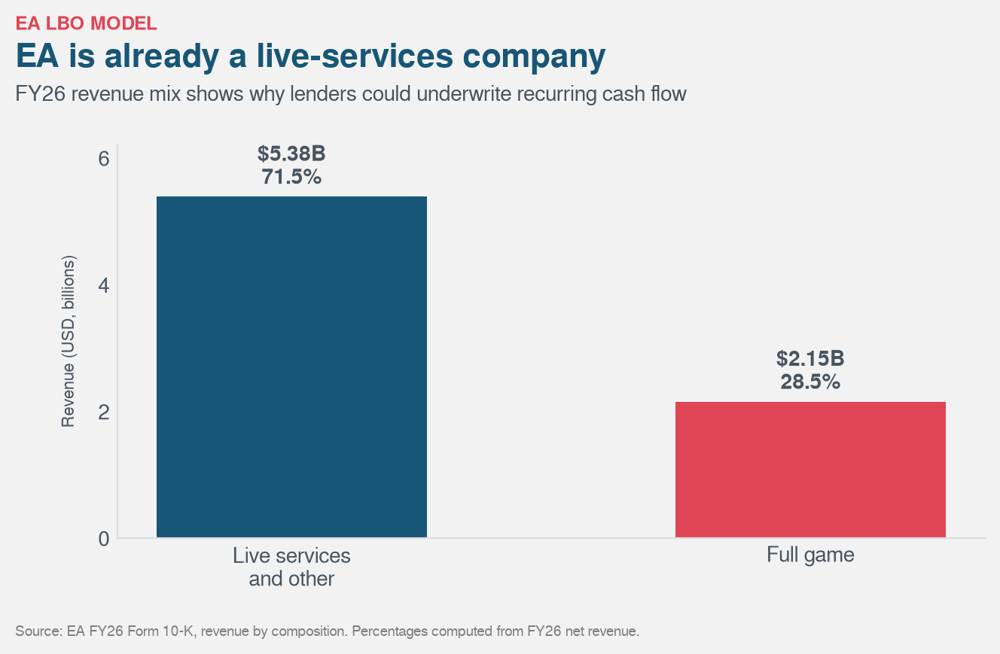
*Live services and recurring revenue: 71.5 percent of FY26 revenue. This is the financeable part.*

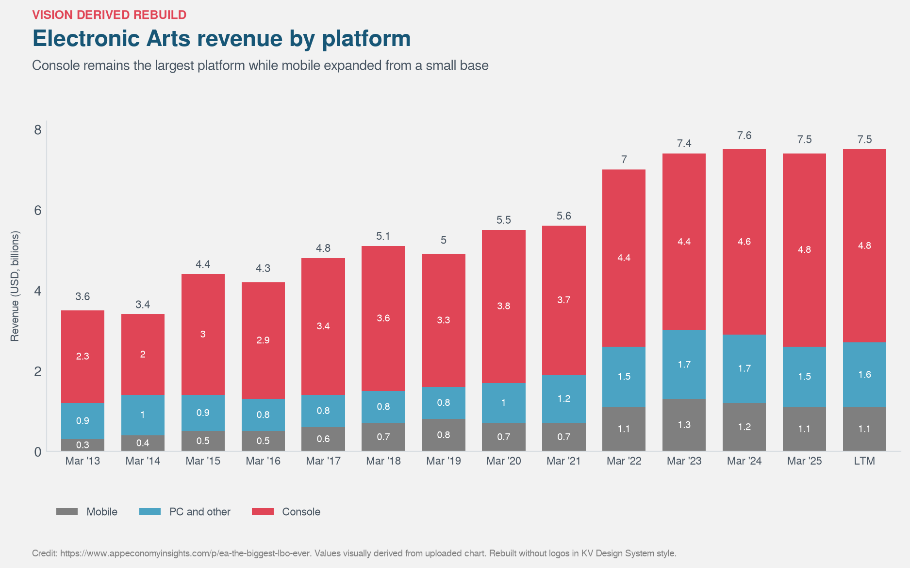
*Console still dominates, but PC and mobile are growing. Platform risk is real but manageable.*

If you are standing up an entertainment and sports ecosystem in the Gulf and you want digital fan engagement at global scale, EA is one of maybe three companies on Earth that can hand it to you. Disney owns the sports media. Amazon is buying into sports broadcasting. Nobody else owns the interactive properties where fans actually spend eight hours a week.

PIF could have kept its nine percent stake and enjoyed the dividend yield. It bought ownership instead because alignment cannot be negotiated from the outside: franchise investment, sports licensing, fan data integration, regional content.

Here is the comparison that makes the price sane. USD 55 billion could have bought stadiums, esports arenas, a league structure, content production, a regional game development ecosystem. It would not have bought global interactive IP. It would have bought dependency on EA's licenses. The deal is not expensive against the alternative, building the same platform from scratch for more money over more years.

## The debt, checked honestly

This is the part I examined first. USD 18 billion of funded debt at roughly 8 percent costs about USD 1.44 billion a year in interest. EA generated USD 2.553 billion of operating cash flow in FY26. Subtract USD 230 million of capex and the free cash flow proxy lands near USD 2.32 billion.

The interest eats about 62 percent of that.

Stress the pricing and the picture tightens: at 7 percent, interest takes 54.2 percent of FCF. At 9 percent, 69.7. Serviceable at every level, comfortable at none of them.

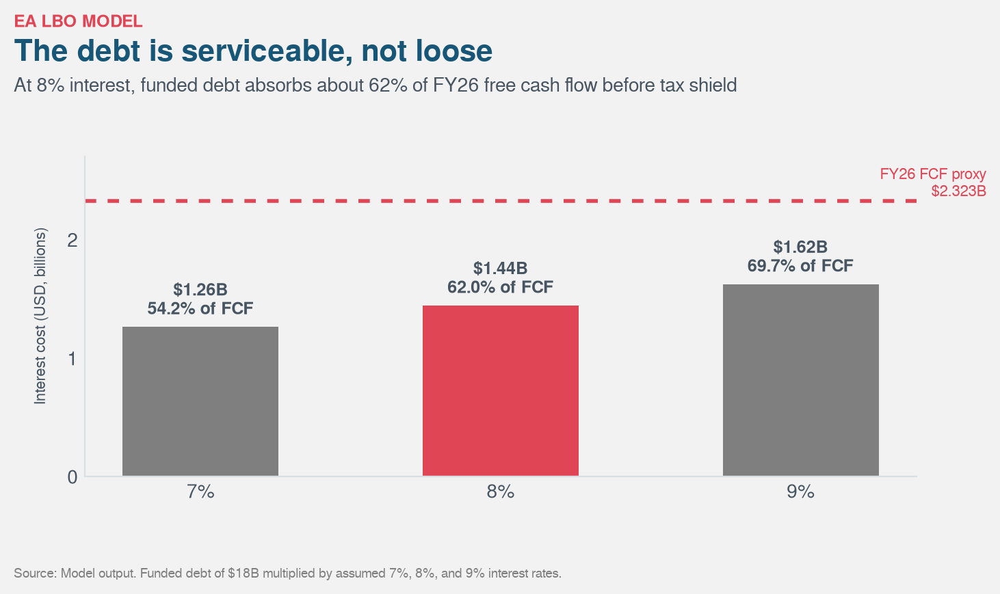
*At 7 percent: 54.2 percent of FCF. At 8 percent: 62.0 percent. At 9 percent: 69.7 percent. Serviceable, but not loose.*

That is a company that cannot miss on its next few release cycles. A weak EA Sports FC, a Madden licensing dispute, an Apex slide, and the debt service stops being a footnote.

Then look at what sits behind it. USD 36 billion of PIF equity. If the debt markets reprice, there is no margin of call on this structure. No USD 2 billion equity check waiting to break.

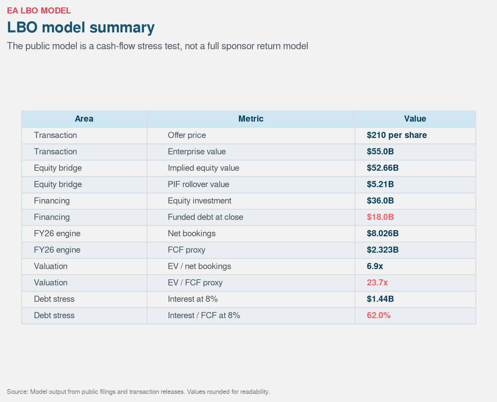
*Key metrics at a glance. The USD 36 billion of equity is the safety net that makes this different from a classic PE LBO.*

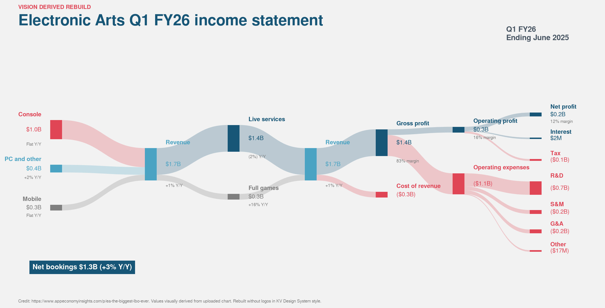
*Q1 FY26 income statement. This is what generates the free cash flow that services the debt.*

I modeled a seven-year paydown: revenue growing 3.5 percent a year, free cash flow margin holding at FY26's 30.8 percent, all post-interest FCF directed at the debt, interest at 8 percent on the beginning balance. The debt comes down substantially over the hold period and never disappears.

That is not a defect. Delever to zero in seven years and you are running an exit clock. Stay levered through the hold and you are holding the company.

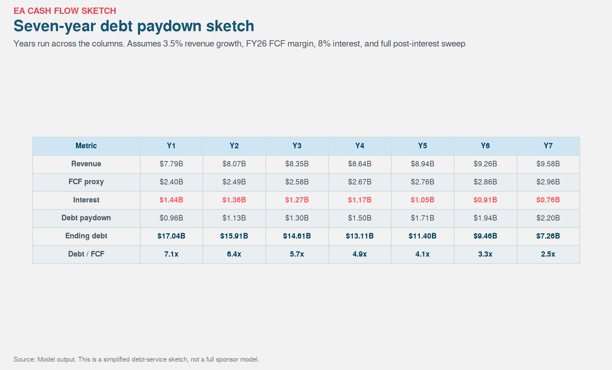
*Seven-year debt paydown schedule at 8 percent interest. Debt falls but never fully disappears, consistent with a long-horizon hold.*

One more sentence on the multiples. Credit markets underwrite forward, and one credit analysis puts the deal at about 18x forward EBITDA, reasonable for this asset. My 37x GAAP trailing number measures the current earnings trough, not the run rate the deal was underwritten against.

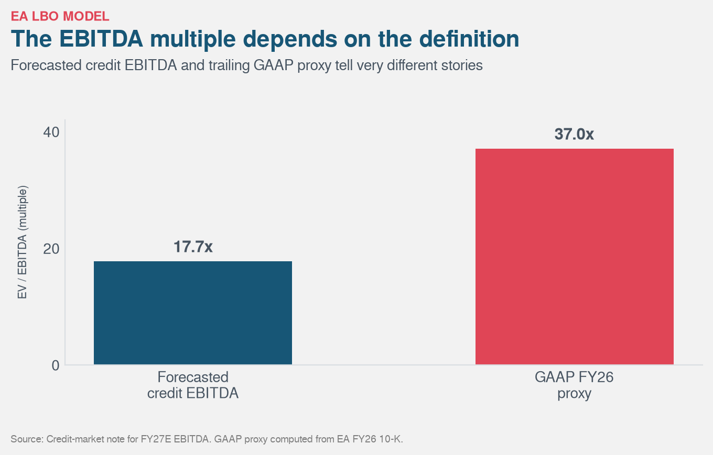
*The 17.7x multiple uses forecasted EBITDA. The 37.0x multiple uses FY26 GAAP operating income plus a limited addback. Both are right; they answer different questions.*

## Three ways this breaks

1. EA cuts creative investment to service the debt. Franchises weaken, players leave, revenue lands below modeled growth, and the debt service becomes unmanageable.
2. Licensing costs spiral. Football and NFL rights get renegotiated upward, margins compress, free cash flow shrinks.
3. The Saudi entertainment ecosystem never comes together. PIF pays for platform access that never gets plugged in.

The deal does its job if PIF spends the ownership doing what a public company cannot: invest in franchise IP on a ten-year horizon, absorb creative risk that would crater a quarterly print, and weld EA into a broader sports and entertainment ecosystem so the portfolio is worth more than its pieces alone.

## The thing nobody is talking about

EA is one of the last major global entertainment companies still owned by public market shareholders. Disney has been through several ownership upheavals and is now controlled by Bob Iger and the Disney board. Warner Bros. Discovery is a joint venture nobody can draw on a napkin. Netflix is still public but founder-led.

When PIF takes EA private, it joins a small club of sovereign and private owners of global media and entertainment assets. That is not an outlier move. It is a pattern completing itself.

Public markets are not structured to value creative franchises with ten-year development cycles. The quarterly earnings call is an anti-innovation mechanism, and taking these companies private removes that pressure for good. It is expensive. It is also, arguably, necessary if the next generation of interactive entertainment is going to get made at all.

## Where I land

I work at a PIF portfolio company. EA is now our sister company, which gave me a professional and a personal reason to check whether the numbers add up. If the debt structure fails, the broader portfolio feels it.

They add up. The debt is serviceable at current rates, the equity cushion is massive, the strategic logic holds. The one real risk left is execution: does PIF manage EA like an investment, or like a strategic asset?

Like an investment, this is an expensive buyout of a mature software business that will disappoint over the next five years. Like a strategic asset, it is one of the most consequential entertainment transactions of the decade. The strategy document and the size of the commitment both point at the latter.

I would welcome pushback, especially from anyone in credit markets who thinks I underweighted the debt.

---

## Sources

- EA Announces Agreement to be Acquired by PIF, Silver Lake and Affinity Partners: <https://news.ea.com/press-releases/press-releases-details/2025/EA-Announces-Agreement-to-be-Acquired-by-PIF-Silver-Lake-and-Affinity-Partners-for-55-Billion/default.aspx>
- PIF Electronic Arts Acquisition Completion: <https://www.pif.gov.sa/en/news-and-insights/newswire/2026/electronic-arts-announces-completion-of-acquisition-by-pif-silver-lake-and-affinity-partners/>
- PIF Strategy 2026-2030: <https://www.pif.gov.sa/en/strategy-and-impact/our-strategy/>
- PIF Strategy 2026-2030 PDF: <https://www.pif.gov.sa/-/media/project/pif-corporate/pif-corporate-site/strategy-and-impact/our-strategy/pif-strategy-2026-2030-en.pdf>
- Electronic Arts FY26 Form 10-K: <https://www.sec.gov/Archives/edgar/data/712515/000162828026033617/ea-20260331.htm>
- Electronic Arts Q4 FY26 Earnings Release: <https://s202.q4cdn.com/886473115/files/doc_financials/2026/q4/Q4-FY26-Earnings-Release_FINAL.pdf>
- EA Listed Holder Data: <https://finance.yahoo.com/quote/EA/holders/>
- EA Public Ownership Cross-check: <https://bullfincher.io/companies/electronic-arts/ownership>
- Private Ownership Split Reporting: <https://finance.yahoo.com/news/majority-control-ea-could-shift-091000747.html>
- Credit Market Debt Coverage Analysis: <https://www.9fin.com/insights/electronic-arts-coverage>
- CreditSights LBO Analysis: <https://know.creditsights.com/insights/electronic-arts-record-setting-55bn-lbo/>
- App Economy Insights LBO Commentary: <https://www.appeconomyinsights.com/p/ea-the-biggest-lbo-ever>
- GamesIndustry.biz Acquisition Analysis: <https://www.gamesindustry.biz/why-the-55bn-acquisition-of-electronic-arts-isnt-your-usual-leveraged-buyout>
- Newzoo Global Games Market 2025: <https://newzoo.com/articles/global-games-market-189-billion-2025>
