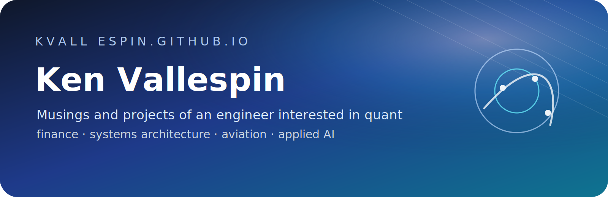

> Musings and projects of an engineer interested in quant, finance, systems architecture, aviation, and applied AI.

## Published notes and projects

### [[fm2-reviewer|FINMA202 Oral Exam Master Reviewer]]

Financial Management 2 reviewer for the AIM OMBA FINMA202 oral exam. Covers WACC, relevant cashflows, real options, distribution policy, capital structure, M&A, and LBOs.

[Open the FM2 reviewer](./fm2-reviewer)

---

This home page is the top-level layer for the site. Course reviewers and other project notes sit underneath it as subpages.
