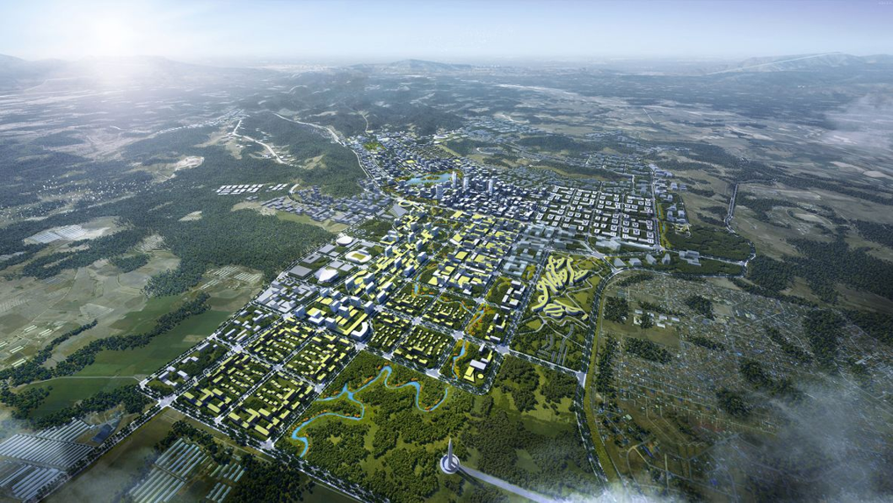
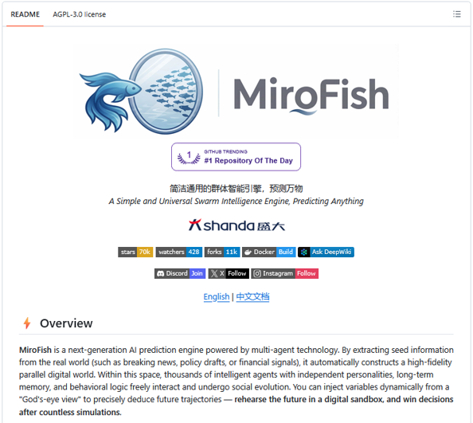
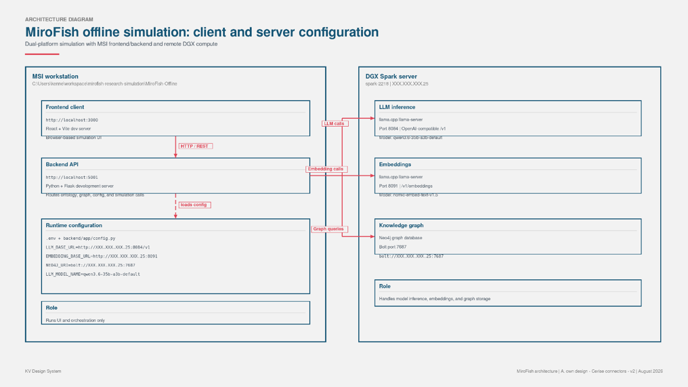
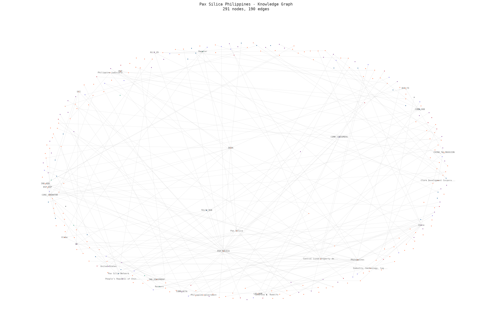

# The Philippines under Pax Silica: a 10-year simulation

_Image credit: The Philippines is building a green, disaster-resilient city (2018), CNN._

On April 16, 2026, the United States and the Philippines announced plans for a 4,000-acre (roughly 1,600 hectares) Economic Security Zone inside the Luzon Economic Corridor: the first AI-native industrial acceleration hub under the U.S.-led Pax Silica Initiative, which the Philippines joined as the coalition's thirteenth signatory. Reporting points to New Clark City in Tarlac as the site, with the Bases Conversion and Development Authority (BCDA) assessing land availability.

What does not yet exist is a project. There is no signed lease, no disclosed CAPEX, no named anchor tenants, no construction timeline, no resolved utility plan. Philippine Defense Secretary Gilberto Teodoro Jr. has said there are no firm documents yet. What exists is a political and economic framework. A U.S.-led effort to distribute semiconductor, critical-minerals, and advanced-manufacturing capacity across trusted partner economies rather than reshore it into one. A Philippine hub scoped around AI and data infrastructure meant to position the country as a regional digital hub. Because there is no concrete build yet, we can still ask the hard questions.

Over the weekend, I ran a forty-round quarterly simulation of this framework using an engine called MiroFish, from the third quarter of 2026 to the second quarter of 2036. I did not invent favorable election results or fabricate capital costs. The setup was defined as follows: 239 nodes representing key actors and assets, 353 relationships, 17 domain hubs spanning energy, water, policy, logistics, and geopolitics. The rules were tight. The output was not what the hype machine wants you to believe. The underlying [seed document](assets/pax-silica-philippines-10y-mirofish-seed.md), [simulation prompt](assets/pax-silica-philippines-mirofish-prompt.txt), and [agent manifest](assets/pax-silica-agent-manifest.md) are linked here for auditability.

MiroFish is an agent-based, swarm-simulation engine. If you have seen a flock of birds turn in unison without a leader, or ants coordinate to move something large, you have seen swarm intelligence. Simple rules applied by many agents create complex behavior. That is useful for policy and megaprojects because it models how thousands of decisions by regulators, contractors, households, foreign governments, and markets interact over time, not in a static spreadsheet.

_Figure 1 MiroFish Github Repo: [https://github.com/666ghj/MiroFish](https://github.com/666ghj/MiroFish)._

This YouTube video is a great primer on how MiroFish and swarm intelligence emergent behavior works.

<iframe width="100%" height="420" src="https://www.youtube.com/embed/EA_ZFbwMtMs" title="MiroFish swarm intelligence demo" frameborder="0" allowfullscreen></iframe>

_Figure 2 Offline simulation setup._

The engine creates role-based agents that share a knowledge and relationship graph. Each agent follows its own incentives and constraints. Scenario branching lets shocks flow through: a drought hits, a tariff changes, agents react, the system evolves. Every state change is logged in a continuous ledger. We can trace how a decision in one quarter ripples through the system ten years later. It stress-tests a framework against reality instead of a pitch deck. The reconstructed [knowledge graph](assets/pax-silica-knowledge-graph.png) and [standalone simulation report](assets/pax-silica-standalone-simulation-report.html) are also linked directly from the body.

_Figure 3 Actual agent interaction knowledge graph. This is animated when you run the actual simulation, I swear._

The high-level result is **conditionally beneficial**. That means it can work, but only under narrow conditions. The simulation showed macroeconomic gains: GDP bumps, job creation, foreign investment. These came at a real, localized cost. The framework survives only if we accept strict renegotiation and synchronized supporting infrastructure. Without those, it collapses.

Resource stress is the binding constraint. Water availability, not electricity, emerged as the critical bottleneck. Data centers are thirsty. Current water allocation in the target regions cannot absorb the load without displacing existing users. Costs socialize upward into household utility bills. Households that benefit least from the digital hub end up paying the most for its water and power.

Indigenous rights and land displacement surfaced as major friction points. Agents representing local communities and legal watchdogs did not accept land acquisition. They contested it, delayed permits, and triggered legal reviews that stalled construction. This is not a glitch. It reflects current law and social realities. Ignoring it in the planning phase is a recipe for failure.

The framework is exposed geopolitically. The simulation tested external shocks: tensions in the South China Sea, coercion scenarios involving Taiwan, Middle East energy shocks, potential US tariffs. Because Pax Silica relies on global supply chains and foreign investment, it is highly sensitive to disruption. A major shock could cut off critical hardware or deter investors. This is a primary risk, not background noise.

Three gates effectively failed. First, social license and Indigenous rights. The current framework does not provide an early-stage mechanism for consent and benefit-sharing. Second, water resource stress. There is no viable plan to secure the necessary water without harming local agriculture or communities. Third, household utility affordability. The cost structure pushes bills up for regular families and creates political backlash.

Fixing this requires concrete redesign. Water security must be a primary design constraint. National, provincial and local government units need a transparent, legally binding process for Indigenous and local community engagement. Household utilities must be insulated from the cost pressures of industrial-scale data center operations through targeted subsidies or separate billing structures.

Pax Silica is not an automatic win. The economic benefits are tangible but extremely fragile. As a self-proclaimed expert on conditionality (post completion of my MBA capstone research), I for one can attest to the importance of a disciplined investment under uncertainty, especially in high value, high risk, and high return situations. The project works only if strict conditions on governance, environment, and social impact are met. Households are the ultimate check, that is, if the average Filipino family is worse off because of this project, it has failed, regardless of GDP statistics. Water is the binding constraint. We cannot build a digital hub on a dry foundation. Regional instability can (and will) impact the project's viability. Geopolitics is not background noise.

> **Final takeaway:** The risk-taker in me tells me this: proceed with Pax Silica only under strict renegotiation of terms, full transparency on costs and risks, and synchronized development of the water, power, and community safeguards the current framework assumes away. If we are not willing to do that, we should slow down, fix the design, or walk away.

## Seed and output artifacts

- [Seed document](assets/pax-silica-philippines-10y-mirofish-seed.md)
- [Simulation prompt](assets/pax-silica-philippines-mirofish-prompt.txt)
- [Agents manifest](assets/pax-silica-agent-manifest.md)
- [Knowledge Graph reconstructed from Neo4j](assets/pax-silica-knowledge-graph.png)
- [Standalone simulation report](assets/pax-silica-standalone-simulation-report.html)

## Sources

- BCDA letter to US Dept of State re Pax Silica proposal (9 Apr 2026) + diplomatic transmittal (16 Apr 2026)
- US conditional acceptance letter (16 Apr 2026)
- Signed Pax Silica declaration (PH-US, 16 Apr 2026, names redacted)
- PH-US AI Opportunity Joint Statement signing declaration (25 Jun 2026)
- US State Department: pax-silica page, [state.gov](https://www.state.gov/releases/office-of-the-spokesperson/2025/12/pax-silica-initiative/)
- US Embassy Philippines press note (16 Apr 2026), [ph.usembassy.gov](https://ph.usembassy.gov/the-united-states-and-the-philippines-launch-plans-for-4000-acre-economic-security-zone-to-shore-up-supply-chains/)
- BOI webpage on Pax Silica and AI Native Industrial Acceleration Hub, [boi.gov.ph](https://boi.gov.ph/discussion-on-pax-silica-and-the-ai-native-industrial-acceleration-hub/)
- Rappler feature: "Things to know: Pax Silica Philippines – goals, concerns", [rappler.com](https://www.rappler.com/technology/features/things-to-know-pax-silica-philippines-goals-concerns/)
- Rappler opinion: "Opinion: Pax Silica – will Philippines build future or for others?", [rappler.com](https://www.rappler.com/voices/thought-leaders/opinion-pax-silica-will-philippines-build-future-or-for-others/)
- Inquirer analysis: "Pax Silica brings promise but at what cost", [newsinfo.inquirer.net](https://newsinfo.inquirer.net/2274123/pax-silica-brings-promise-but-at-what-cost)
- Reuters (20 Jul 2026): Second Thomas Shoal encounter, [reuters.com](https://www.reuters.com/world/china/chinese-coast-guard-struck-navy-sailor-south-china-sea-encounter-says-philippine-2026-07-20/)
- BusinessWorld/Inquirer (27 Jul 2026): DTI on US tariff exemptions, [business.inquirer.net](https://business.inquirer.net/602438/dti-over-60-of-ph-exports-exempt-from-12-5-us-tariff)
- IMF April 2026 World Economic Outlook (PHL profile), [imf.org](https://www.imf.org/external/datamapper/profile/PHL)
- World Bank API: GNI per capita for Philippines, [api.worldbank.org](https://api.worldbank.org/v2/country/PHL/indicator/NY.GNP.PCAP.CD?format=json)
- BSP/market references: USD/PHP spot via Yahoo Finance (61.24 on 1 Aug 2026), [finance.yahoo.com](https://finance.yahoo.com/quote/PHP=X/)
- IEA: "The Middle East and global energy markets", [iea.org](https://www.iea.org/topics/the-middle-east-and-global-energy-markets)
- Brent futures via Yahoo Finance (~USD 90.12/bbl on 31 Jul 2026), [finance.yahoo.com](https://finance.yahoo.com/quote/BZ=F/)
- Meralco (May 2026): residential rate PHP 14.3345/kWh, [company.meralco.com.ph](https://company.meralco.com.ph/news-and-advisories/lower-residential-rates-may-2026)
- Manila Water (2026 Standard Rates Tariff Table), [mediafiles.manilawater.com](https://mediafiles.manilawater.com/public/pages/671b900c531a3dbe8f0608a2/bill-info/2026-Standard-Rates-Tariff-Table-Original-Signed.pdf)
- RA 7227 (Bases Conversion and Development Act of 1992) via Lawphil, [lawphil.net](https://lawphil.net/statutes/repacts/ra1992/ra_7227_1992.html)
